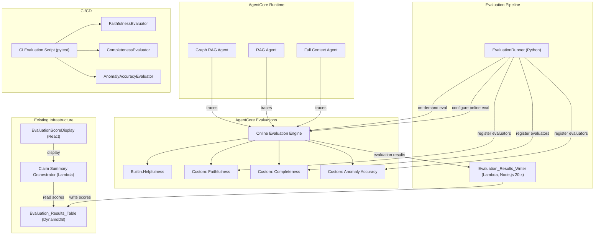

# Design Document: AgentCore Evaluations Integration

## Overview

This design covers integrating Amazon Bedrock AgentCore Evaluations into the existing insurance claim summary system. Three Strands SDK agents (Full Context, RAG, Graph RAG) already produce claim summaries via AgentCore Runtime. The frontend `EvaluationScoreDisplay` component and the `claim-summary-orchestrator` Lambda already read from the `Evaluation_Results_Table` DynamoDB table. However, no evaluation pipeline currently exists to score agent outputs and populate that table.

This feature closes the gap by:

1. Creating an `EvaluationRunner` Python module that registers custom evaluators (Faithfulness, Completeness, Anomaly Accuracy) with the AgentCore Evaluations API and configures online evaluation for all three agents
2. Adding an `Evaluation_Results_Writer` Lambda (Node.js 20.x) that receives evaluation result events from AgentCore Evaluations and writes them to the existing `Evaluation_Results_Table`
3. Implementing on-demand evaluation via the `EvaluationRunner` for targeted assessment of specific traces
4. Adding OpenTelemetry span attributes (`claim.id`, `claim.strategy`, `claim.chunking_method`) to agent entry points so evaluation results can be associated with the correct claim and strategy
5. Creating a CI/CD evaluation script that runs evaluators offline against a fixed test dataset, executable via `pytest`

### Key Design Decisions

- **Reuse existing evaluator prompts**: The `FAITHFULNESS_PROMPT` and `COMPLETENESS_PROMPT` from `evaluators/faithfulness_evaluator.py` and `evaluators/completeness_evaluator.py` are used as the evaluation criteria when registering custom evaluators with AgentCore. This ensures identical scoring behavior between online evaluation and offline CI/CD testing.
- **Evaluation_Results_Writer is a separate Lambda**: Rather than having agents write their own scores, a dedicated Lambda receives events from AgentCore Evaluations. This decouples evaluation from agent execution and allows the evaluation pipeline to evolve independently.
- **Offline CI/CD evaluators call Bedrock directly**: The CI/CD script invokes the existing `FaithfulnessEvaluator`, `CompletenessEvaluator`, and a new `AnomalyAccuracyEvaluator` class directly (no AgentCore Evaluations service dependency), making tests runnable in any environment with Bedrock access.
- **Agent trace metadata via OpenTelemetry**: Strands SDK agents emit OpenTelemetry traces automatically. We add custom span attributes at the `@app.entrypoint` level to carry claim context through to evaluation results.

### What Does NOT Change

- `EvaluationScoreDisplay` React component (already renders scores)
- `claim-summary-orchestrator` Lambda read path (already queries `Evaluation_Results_Table`)
- `EvaluationScores` TypeScript interface
- Existing `Evaluation_Results_Table` schema (partition key `claimId`, sort key `strategyKey`)
- Existing evaluator class interfaces (`FaithfulnessEvaluator.evaluate()`, `CompletenessEvaluator.evaluate()`)

## Architecture



### Data Flow: Online Evaluation

1. Agent processes a claim → Strands SDK emits OpenTelemetry trace with `claim.id`, `claim.strategy`, `claim.chunking_method` span attributes
2. AgentCore Evaluations online engine picks up the trace
3. All four evaluators (Helpfulness built-in + 3 custom) score the trace
4. AgentCore Evaluations sends evaluation result event to the `Evaluation_Results_Writer` Lambda
5. Writer extracts `claimId` and `strategyKey` from trace span attributes, writes scores to `Evaluation_Results_Table`
6. Existing orchestrator reads scores on next request; existing frontend displays them

### Data Flow: On-Demand Evaluation

1. `EvaluationRunner.evaluate_trace(trace_id)` calls AgentCore Evaluations API with the trace ID and evaluator ARNs
2. AgentCore Evaluations scores the trace
3. `EvaluationRunner` returns scores dict directly to the caller
4. Optionally, caller can write results to `Evaluation_Results_Table` via `EvaluationRunner.store_results()`

### Data Flow: CI/CD Offline Evaluation

1. `pytest` runs `unit_tests/test_evaluation_ci.py`
2. Test loads fixed test dataset from `evaluators/test_data/` (claim summaries + source documents + expected quality ranges)
3. Test invokes `FaithfulnessEvaluator`, `CompletenessEvaluator`, `AnomalyAccuracyEvaluator` directly against Bedrock
4. Test asserts scores meet configurable thresholds
5. Test produces JSON report with per-test-case scores

## Components and Interfaces

### EvaluationRunner (`evaluators/evaluation_runner.py`)

Orchestrates evaluator registration, online evaluation configuration, and on-demand evaluation.

| Method | Input | Output | AWS Dependency |
|---|---|---|---|
| `register_evaluators()` | None | `dict[str, str]` mapping evaluator name → ARN | `bedrock-agentcore:CreateEvaluator`, `bedrock-agentcore:GetEvaluator` |
| `configure_online_evaluation(agent_id: str)` | Agent runtime identifier | `str` configuration ID | `bedrock-agentcore:CreateEvaluationConfig` |
| `evaluate_trace(trace_id: str)` | OpenTelemetry trace ID | `dict` with scores | `bedrock-agentcore:StartEvaluation` |
| `evaluate_direct(summary: str, source_documents: str, anomalies: list)` | Summary text, source docs, anomaly list | `dict` with scores | Bedrock `InvokeModel` (via evaluator classes) |
| `store_results(claim_id: str, strategy: str, chunking_method: str, scores: dict)` | Claim context + scores | None | DynamoDB `PutItem` |

### AnomalyAccuracyEvaluator (`evaluators/anomaly_accuracy_evaluator.py`)

New custom evaluator that scores the accuracy of detected anomalies against source document content.

| Method | Input | Output | AWS Dependency |
|---|---|---|---|
| `evaluate(anomalies: list[dict], source_documents: str)` | Anomaly list + source text | `dict` with `score`, `reasoning`, `false_positives`, `missed_anomalies` | Bedrock `InvokeModel` |

### Evaluation_Results_Writer (`src/lambda/evaluation-results-writer.ts`)

Lambda function that receives evaluation result events from AgentCore Evaluations and writes to DynamoDB.

| Handler | Input | Output | AWS Dependency |
|---|---|---|---|
| `handler(event)` | AgentCore Evaluations event with scores + trace metadata | `{ statusCode, body }` | DynamoDB `PutItem` |

Key responsibilities:
- Extract `claim.id`, `claim.strategy`, `claim.chunking_method` from trace span attributes in the event
- Construct `strategyKey` as `{strategy}#{chunkingMethod}` (using `none` for non-RAG strategies)
- Write `helpfulness`, `faithfulness`, `completeness`, `anomalyAccuracy`, `evaluatedAt` to `Evaluation_Results_Table`
- Overwrite existing records for the same `claimId`/`strategyKey` combination
- Log errors with `claimId`, `strategyKey`, and error details on write failure
- Skip writing and log warning if `claim.id` is missing from trace attributes

### Evaluation Configuration (`evaluators/evaluation_config.py` — updated)

The existing `EvaluationConfig` class is extended with methods for AgentCore registration. The existing `evaluate_summary()` method remains for backward compatibility.

| New Method | Purpose |
|---|---|
| `get_evaluator_definitions()` | Returns evaluator name, prompt, scoring schema for all custom evaluators |
| `get_score_thresholds()` | Returns configurable pass/fail thresholds for CI/CD |

### Agent Entry Point Changes

Each agent's `@app.entrypoint` function adds OpenTelemetry span attributes:

```python
from opentelemetry import trace

@app.entrypoint
def invoke(payload):
    span = trace.get_current_span()
    claim_id = payload.get("claim_id")
    strategy = "full-context"  # or "rag" or "graph-rag"
    chunking_method = payload.get("chunking_method", "none")

    span.set_attribute("claim.id", claim_id or "")
    span.set_attribute("claim.strategy", strategy)
    span.set_attribute("claim.chunking_method", chunking_method)
    # ... rest of handler
```

## Data Models

### Evaluator Registration Request (to AgentCore API)

```python
{
    "evaluatorName": "Faithfulness",
    "evaluationCriteria": "<FAITHFULNESS_PROMPT text>",
    "scoringSchema": {
        "scoreFieldName": "score",
        "reasoningFieldName": "reasoning",
        "minScore": 0.0,
        "maxScore": 1.0,
    },
    "evaluatorModelId": "amazon.nova-pro-v1:0",
}
```

### Online Evaluation Configuration (to AgentCore API)

```python
{
    "agentId": "<agent-runtime-identifier>",
    "evaluators": [
        {"evaluatorArn": "arn:aws:bedrock-agentcore:::evaluator/Builtin.Helpfulness"},
        {"evaluatorArn": "<faithfulness-evaluator-arn>"},
        {"evaluatorArn": "<completeness-evaluator-arn>"},
        {"evaluatorArn": "<anomaly-accuracy-evaluator-arn>"},
    ],
}
```

### Evaluation Results Table Record (DynamoDB — unchanged schema)

```typescript
{
    claimId: string,           // Partition key
    strategyKey: string,       // Sort key: "{strategy}#{chunkingMethod}"
    helpfulness: number,       // 0-1 from Builtin.Helpfulness
    faithfulness: number,      // 0-1 from custom Faithfulness evaluator
    completeness: number,      // 0-1 from custom Completeness evaluator
    anomalyAccuracy?: number,  // 0-1 from custom Anomaly Accuracy evaluator
    evaluatedAt: string,       // ISO 8601 timestamp
    // Additional metadata fields written by Evaluation_Results_Writer:
    faithfulnessReasoning?: string,
    completenessReasoning?: string,
    anomalyAccuracyReasoning?: string,
    traceId?: string,          // OpenTelemetry trace ID for provenance
}
```

### Anomaly Accuracy Evaluator Response

```python
{
    "score": 0.85,
    "reasoning": "Detected 3 of 4 actual anomalies. One false positive flagged.",
    "false_positives": ["Service date 2024-01-15 flagged but is valid"],
    "missed_anomalies": ["Conflicting provider NPIs not detected"],
}
```

### CI/CD Test Dataset Entry (`evaluators/test_data/test_cases.json`)

```json
{
    "test_cases": [
        {
            "id": "tc-001",
            "claim_id": "CLM-TEST-001",
            "strategy": "full-context",
            "source_documents": "--- Document: claim_form.pdf ---\n...",
            "summary": "This claim contains...",
            "anomalies": [{"description": "...", "severity": "critical", ...}],
            "expected_score_ranges": {
                "faithfulness": {"min": 0.7, "max": 1.0},
                "completeness": {"min": 0.6, "max": 1.0},
                "anomaly_accuracy": {"min": 0.5, "max": 1.0}
            }
        }
    ]
}
```

### CI/CD Score Thresholds (from `evaluators/evaluation_config.py`)

```python
DEFAULT_SCORE_THRESHOLDS = {
    "helpfulness": 0.6,
    "faithfulness": 0.7,
    "completeness": 0.6,
    "anomaly_accuracy": 0.5,
}
```

### Evaluation_Results_Writer Event Schema (from AgentCore Evaluations)

```typescript
interface EvaluationResultEvent {
    traceId: string;
    spanAttributes: {
        "claim.id"?: string;
        "claim.strategy"?: string;
        "claim.chunking_method"?: string;
    };
    evaluationResults: {
        evaluatorName: string;
        evaluatorArn: string;
        score: number;
        reasoning?: string;
        additionalFields?: Record<string, unknown>;
    }[];
    evaluatedAt: string;
}
```


## Correctness Properties

*A property is a characteristic or behavior that should hold true across all valid executions of a system — essentially, a formal statement about what the system should do. Properties serve as the bridge between human-readable specifications and machine-verifiable correctness guarantees.*

### Property 1: Evaluator registration payload correctness

*For any* custom evaluator definition (name, prompt, scoring schema) from the evaluation configuration module, calling `register_evaluators()` shall produce a registration payload that (a) uses the exact prompt string from the corresponding evaluator module (`FAITHFULNESS_PROMPT`, `COMPLETENESS_PROMPT`, or `ANOMALY_ACCURACY_PROMPT`), (b) specifies `amazon.nova-pro-v1:0` as the evaluator model, (c) includes a scoring schema with `minScore` 0.0 and `maxScore` 1.0, and (d) stores the returned ARN in the configuration keyed by evaluator name.

**Validates: Requirements 1.1, 1.2, 1.3, 1.4, 1.5, 10.1, 10.2, 10.5**

### Property 2: Evaluator registration idempotency

*For any* custom evaluator name, calling `register_evaluators()` twice shall return the same Evaluator ARN both times and shall not create a duplicate evaluator (the second call retrieves the existing ARN).

**Validates: Requirements 1.6**

### Property 3: Evaluation configuration includes all evaluators

*For any* set of registered custom evaluator ARNs, the online evaluation configuration and on-demand evaluation request shall include exactly those ARNs plus the built-in Helpfulness evaluator ARN (`arn:aws:bedrock-agentcore:::evaluator/Builtin.Helpfulness`), totaling 4 evaluators.

**Validates: Requirements 2.2, 4.2**

### Property 4: Evaluation Results Writer produces correct DynamoDB records

*For any* valid evaluation result event containing span attributes `claim.id`, `claim.strategy`, `claim.chunking_method` and evaluation scores for all evaluators, the `Evaluation_Results_Writer` shall write a DynamoDB record where (a) the partition key equals the `claim.id` value, (b) the sort key equals `{claim.strategy}#{claim.chunking_method}`, (c) the record contains numeric fields `helpfulness`, `faithfulness`, `completeness`, and `evaluatedAt` as an ISO 8601 string, and (d) `anomalyAccuracy` is present when the anomaly accuracy evaluator produced a score.

**Validates: Requirements 2.4, 3.2, 3.3, 3.4, 6.5, 9.4**

### Property 5: All evaluation scores are clamped to [0, 1]

*For any* evaluation result event where raw scores may be outside the [0, 1] range, the `Evaluation_Results_Writer` shall clamp each score (`helpfulness`, `faithfulness`, `completeness`, `anomalyAccuracy`) to the range [0.0, 1.0] before writing to DynamoDB.

**Validates: Requirements 6.1, 6.2, 6.3, 6.4**

### Property 6: Strategy key format correctness

*For any* strategy value from `{full-context, rag, graph-rag}` and any optional chunking method value, the constructed `strategyKey` shall equal `{strategy}#{chunkingMethod}` where `chunkingMethod` is `none` when the strategy is not `rag` or when no chunking method is provided.

**Validates: Requirements 6.6**

### Property 7: Evaluation write-then-read round trip

*For any* evaluation scores written to the `Evaluation_Results_Table` by the `Evaluation_Results_Writer`, querying the table with the same `claimId` and `strategyKey` shall return a record that satisfies the `EvaluationScores` TypeScript interface (numeric `helpfulness`, `faithfulness`, `completeness`, optional numeric `anomalyAccuracy`, string `evaluatedAt`).

**Validates: Requirements 6.7**

### Property 8: CI/CD pass/fail decision correctness

*For any* set of evaluation scores and configurable thresholds, the CI evaluation script shall report a failing status if and only if at least one score is strictly below its corresponding threshold.

**Validates: Requirements 7.3**

### Property 9: CI/CD report structure completeness

*For any* set of test case evaluation results, the CI evaluation script's JSON report shall contain (a) an entry for every test case with its individual scores, and (b) an `overall_status` field that is `"pass"` when all test cases pass and `"fail"` when any test case fails.

**Validates: Requirements 7.5**

### Property 10: Agent span attributes correctness

*For any* agent entry point payload containing `claim_id`, the agent shall set OpenTelemetry span attributes where (a) `claim.id` equals the payload's `claim_id`, (b) `claim.strategy` is one of `full-context`, `rag`, or `graph-rag` matching the agent type, and (c) `claim.chunking_method` equals the payload's `chunking_method` for RAG agents or `none` for non-RAG agents.

**Validates: Requirements 9.1, 9.2, 9.3**

## Error Handling

### Evaluation_Results_Writer Errors

| Condition | Behavior | Log Content |
|---|---|---|
| Missing `claim.id` in span attributes | Skip writing, return 200 (no-op) | Warning with trace ID and available attributes |
| Missing `claim.strategy` in span attributes | Default to `unknown`, still write | Warning with trace ID |
| DynamoDB `PutItem` fails | Return 500, do not retry (AgentCore will retry delivery) | Error with `claimId`, `strategyKey`, error message |
| Score value outside [0, 1] | Clamp to [0.0, 1.0] before writing | Info log noting clamped value |
| Malformed event payload (not JSON) | Return 400 | Error with raw event snippet |

### EvaluationRunner Errors

| Condition | Behavior |
|---|---|
| AgentCore `CreateEvaluator` fails | Raise `EvaluatorRegistrationError` with evaluator name and API error |
| Evaluator already exists (409 conflict) | Call `GetEvaluator` to retrieve existing ARN |
| `CreateEvaluationConfig` fails | Raise `EvaluationConfigError` with agent ID and API error |
| `StartEvaluation` fails (on-demand) | Return error dict `{"error": message, "evaluator": name}` |
| Bedrock `InvokeModel` fails (offline evaluator) | Return `{"score": 0.0, "reasoning": "Evaluation failed: {error}"}` (existing pattern) |

### AnomalyAccuracyEvaluator Errors

| Condition | Behavior |
|---|---|
| Empty anomalies list | Return `{"score": 0.0, "reasoning": "No anomalies to evaluate"}` |
| Empty source documents | Return `{"score": 0.0, "reasoning": "No source documents for anomaly evaluation"}` |
| LLM response not valid JSON | Return `{"score": 0.0, "reasoning": "Failed to parse: {snippet}"}` (matches existing evaluator pattern) |

### CI/CD Script Errors

| Condition | Behavior |
|---|---|
| Test data file not found | `pytest` raises `FileNotFoundError`, test fails |
| Bedrock invocation fails during CI | Individual test case fails with error message, other test cases continue |
| Score below threshold | Test assertion fails with message: `"{metric} score {actual} below threshold {threshold}"` |

## Testing Strategy

### Dual Testing Approach

Testing uses both unit tests (specific examples and edge cases) and property-based tests (universal properties across generated inputs). Both are required for comprehensive coverage.

### Property-Based Testing Configuration

- **Library (Python)**: `hypothesis` for `EvaluationRunner`, evaluator classes, and CI script logic
- **Library (TypeScript)**: `fast-check` for `Evaluation_Results_Writer` Lambda
- **Minimum iterations**: 100 per property test (`@settings(max_examples=100)` / `fc.assert(..., { numRuns: 100 })`)
- **Test location**: `unit_tests/` directory
- **Each property test MUST reference its design property via comment tag**
- **Tag format**: `Feature: agentcore-evaluations, Property {number}: {property_text}`
- **Each correctness property MUST be implemented by a SINGLE property-based test**

### Test File Organization

| Test File | Tests | Language |
|---|---|---|
| `unit_tests/test_evaluation_runner.py` | Properties 1, 2, 3 + unit tests for registration, on-demand eval | Python |
| `unit_tests/test_evaluation_results_writer.test.ts` | Properties 4, 5, 6, 7 + unit tests for event parsing, error handling | TypeScript |
| `unit_tests/test_evaluation_ci.py` | Properties 8, 9 + CI script logic, threshold checking | Python |
| `unit_tests/test_agent_span_attributes.py` | Property 10 + unit tests for span attribute setting | Python |
| `unit_tests/test_anomaly_accuracy_evaluator.py` | Unit tests for AnomalyAccuracyEvaluator + edge cases | Python |

### What to Test with Property-Based Tests

Each of the 10 correctness properties maps to a single test function. Tests call the business logic functions directly, mocking AWS service calls (AgentCore API, DynamoDB, Bedrock).

- **Properties 1-3** (Python/hypothesis): Generate random evaluator definitions, verify registration payloads and configuration structures
- **Properties 4-7** (TypeScript/fast-check): Generate random evaluation events with random claim IDs, strategies, chunking methods, and scores; verify DynamoDB record structure, score clamping, key format, and round-trip compatibility
- **Properties 8-9** (Python/hypothesis): Generate random score sets and thresholds; verify pass/fail decisions and report structure
- **Property 10** (Python/hypothesis): Generate random payloads with claim IDs and strategies; verify span attributes are set correctly

### What to Test with Unit Tests (Examples)

- `EvaluationRunner` initialization creates correct AWS clients (Req 1.1)
- `AnomalyAccuracyEvaluator` returns 0.0 for empty anomalies list (Req 1.3, edge case)
- `Evaluation_Results_Writer` skips writing when `claim.id` is missing (Req 9.5, edge case)
- `Evaluation_Results_Writer` logs error on DynamoDB write failure (Req 3.6, edge case)
- CDK stack defines writer Lambda with Node.js 20.x runtime (Req 5.1)
- CDK stack grants writer Lambda DynamoDB write access (Req 5.2)
- CDK stack sets correct environment variables on writer Lambda (Req 5.4)
- CDK stack creates AgentCore IAM policies (Req 5.6)
- Evaluation config module exports all three evaluator prompts (Req 8.1)
- Evaluation config module exports default thresholds in valid range (Req 8.3)
- Existing `FaithfulnessEvaluator` and `CompletenessEvaluator` remain importable and callable (Req 10.3)
- On-demand evaluation returns error dict with evaluator name on failure (Req 4.5, edge case)

### What NOT to Test

- AgentCore Evaluations service behavior (third-party service)
- Full agent orchestration with real LLM calls (integration test)
- Docker container builds (deployment pipeline)
- Strands SDK or OpenTelemetry internals (third-party libraries)
- Actual LLM scoring accuracy (non-deterministic)

### Hypothesis Strategies (Python tests)

- `claim_id_strategy`: Random alphanumeric strings prefixed with `CLM-`
- `strategy_strategy`: `sampled_from(["full-context", "rag", "graph-rag"])`
- `chunking_method_strategy`: `sampled_from(["full-document", "semantic", "none"])`
- `score_strategy`: `floats(min_value=0.0, max_value=1.0)`
- `out_of_range_score_strategy`: `floats(min_value=-1.0, max_value=2.0)`
- `evaluator_name_strategy`: `sampled_from(["Faithfulness", "Completeness", "AnomalyAccuracy"])`
- `iso_timestamp_strategy`: `datetimes().map(lambda dt: dt.isoformat() + "Z")`

### fast-check Arbitraries (TypeScript tests)

- `evaluationEventArb`: Generates valid `EvaluationResultEvent` objects with random span attributes and scores
- `claimIdArb`: `fc.stringOf(fc.alphaNumeric(), { minLength: 1, maxLength: 20 })`
- `strategyArb`: `fc.constantFrom("full-context", "rag", "graph-rag")`
- `scoreArb`: `fc.double({ min: 0, max: 1, noNaN: true })`
- `outOfRangeScoreArb`: `fc.double({ min: -1, max: 2, noNaN: true })`
