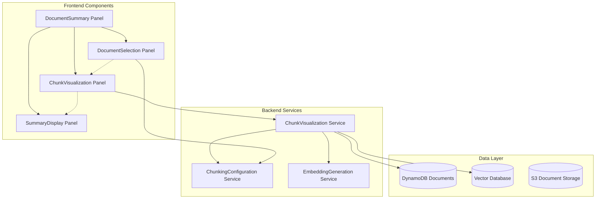

# Design Document

## Overview

The chunk visualization feature enhances the document summary interface by adding a middle column that displays document chunks in real-time. This provides users with immediate visual feedback on how their documents are being processed and chunked for AI summarization, enabling them to optimize chunking methods for better results.

The feature integrates seamlessly with the existing two-column layout (document selection and summary display) and leverages the current chunking infrastructure to provide real-time chunk previews.

## Architecture

### High-Level Architecture



### Component Interaction Flow

1. **User Selection**: User selects documents and chunking method in DocumentSelectionPanel
2. **Configuration Change**: ChunkingMethodSelector triggers chunking method update
3. **Chunk Request**: ChunkVisualizationPanel requests chunks for selected documents
4. **Chunk Generation**: ChunkVisualizationService generates chunks using current method
5. **Real-time Display**: Chunks are displayed immediately in the middle column
6. **Summary Integration**: Selected chunks inform the summary generation process

## Components and Interfaces

### Frontend Components

#### ChunkVisualizationPanel Component

**Purpose**: Main component for displaying document chunks in the middle column

**Props Interface**:
```typescript
interface ChunkVisualizationPanelProps {
  selectedDocuments: Set<string>;
  documents: DocumentSummaryItem[];
  chunkingMethod: ChunkingMethod;
  customerUUID: string;
  tenantId: string;
  isLoading: boolean;
  onChunkSelect?: (chunkId: string) => void;
}
```

**State Management**:
```typescript
interface ChunkVisualizationState {
  chunks: DocumentChunk[];
  isLoadingChunks: boolean;
  chunkError: string | null;
  selectedChunks: Set<string>;
  expandedChunks: Set<string>;
}
```

#### ChunkItem Component

**Purpose**: Individual chunk display component with metadata and content

**Props Interface**:
```typescript
interface ChunkItemProps {
  chunk: DocumentChunk;
  isSelected: boolean;
  isExpanded: boolean;
  onSelect: (chunkId: string) => void;
  onToggleExpand: (chunkId: string) => void;
}
```

#### ChunkMetadata Component

**Purpose**: Display chunk technical information (tokens, characters, source)

**Props Interface**:
```typescript
interface ChunkMetadataProps {
  chunk: DocumentChunk;
  showDetailed: boolean;
}
```

### Backend Services

#### ChunkVisualizationService

**Purpose**: Generate and manage chunks for visualization without storing embeddings

**Key Methods**:
```typescript
class ChunkVisualizationService {
  async generateChunksForVisualization(
    documents: DocumentRecord[],
    chunkingMethod: ChunkingMethod
  ): Promise<DocumentChunk[]>;
  
  async getChunksForDocuments(
    documentIds: string[],
    customerUUID: string,
    tenantId: string
  ): Promise<DocumentChunk[]>;
  
  private estimateTokenCount(text: string): number;
  private validateChunkData(chunks: DocumentChunk[]): boolean;
}
```

#### Lambda Function: chunk-visualization-get

**Purpose**: API endpoint to retrieve chunks for selected documents

**Request Interface**:
```typescript
interface ChunkVisualizationRequest {
  customerUUID: string;
  documentIds: string[];
  chunkingMethod?: ChunkingMethod; // Optional override
}
```

**Response Interface**:
```typescript
interface ChunkVisualizationResponse {
  chunks: DocumentChunk[];
  totalChunks: number;
  chunkingMethod: ChunkingMethod;
  processingTime: number;
  generatedAt: string;
}
```

## Data Models

### DocumentChunk Interface

```typescript
interface DocumentChunk {
  id: string;
  text: string;
  metadata: ChunkMetadata;
  tokenCount: number;
  characterCount: number;
  sourceDocument: {
    documentId: string;
    fileName: string;
    pageNumber?: number;
    sectionTitle?: string;
  };
}

interface ChunkMetadata {
  chunkIndex: number;
  totalChunks: number;
  chunkingMethod: string;
  overlapStart?: number;
  overlapEnd?: number;
  confidence?: number;
  semanticBoundary?: boolean;
}
```

### Frontend Types Extension

```typescript
// Extension to existing frontend types
interface DocumentSummaryItem {
  // ... existing fields
  chunks?: DocumentChunk[]; // Cached chunks for visualization
  chunkingStatus?: 'none' | 'generating' | 'ready' | 'error';
}

interface ChunkVisualizationError {
  documentId: string;
  fileName: string;
  errorMessage: string;
  errorType: 'chunking' | 'processing' | 'network';
  isRetryable: boolean;
}
```

## Correctness Properties

*A property is a characteristic or behavior that should hold true across all valid executions of a system-essentially, a formal statement about what the system should do. Properties serve as the bridge between human-readable specifications and machine-verifiable correctness guarantees.*

After analyzing the acceptance criteria, I've identified the following testable properties. Some redundant properties have been consolidated for efficiency:

### Property 1: Responsive Layout Consistency
*For any* viewport size change, the three-column layout should maintain proportional widths and proper component placement
**Validates: Requirements 1.2**

### Property 2: Chunk Display Updates with Selection Changes
*For any* document selection change (select/deselect), the chunk visualization panel should display chunks only from currently selected documents
**Validates: Requirements 2.1, 3.2**

### Property 3: Chunk Metadata Completeness
*For any* displayed chunk, the visualization should show all required metadata fields: chunk index, token count, character count, and source document name
**Validates: Requirements 2.4, 5.1, 5.2, 5.3, 5.4**

### Property 4: Chunking Method Change Updates
*For any* chunking method change, the chunk visualization panel should refresh to display chunks generated using the new method
**Validates: Requirements 3.1, 8.2**

### Property 5: Chunk Display State Management
*For any* UI interaction that changes document selection, the system should maintain consistent chunk display state and clear display when no documents are selected
**Validates: Requirements 3.4, 3.5**

### Property 6: Text Formatting Preservation
*For any* chunk text content, the display should preserve proper formatting including line breaks and whitespace
**Validates: Requirements 4.2**

### Property 7: Long Content Handling
*For any* chunk with text length exceeding display limits, the system should provide expand/collapse functionality
**Validates: Requirements 4.3**

### Property 8: Source Information Display
*For any* chunk, the visualization should display complete source information including document name and section details when available
**Validates: Requirements 4.5**

### Property 9: Overlap Region Indication
*For any* chunking method that produces overlapping chunks, the visualization should indicate overlap regions appropriately
**Validates: Requirements 5.5**

### Property 10: Error Input Handling
*For any* invalid or empty document input, the system should handle the error gracefully without breaking the chunk display
**Validates: Requirements 6.4**

### Property 11: Chunk Data Validation
*For any* chunk data received from the backend, the system should validate the data structure before attempting to render
**Validates: Requirements 6.5**

### Property 12: Lazy Loading Performance
*For any* large collection of chunks (>100), the visualization should implement lazy loading to maintain performance
**Validates: Requirements 7.2**

### Property 13: Component Integration Consistency
*For any* change in the DocumentSelectionPanel or ChunkingMethodSelector, the ChunkVisualizationPanel should respond appropriately
**Validates: Requirements 8.3**

### Property 14: Existing Functionality Preservation
*For any* user interaction with the chunk visualization feature, existing document selection and summary panel functionality should continue to work unchanged
**Validates: Requirements 8.5**

<function_calls>
<invoke name="prework">
<parameter name="featureName">chunk-visualization

## Error Handling

### Frontend Error Handling

#### Chunk Loading Errors
- **Network Failures**: Display retry button with exponential backoff
- **Invalid Chunk Data**: Show validation error with technical details
- **Timeout Errors**: Provide timeout message with manual retry option
- **Empty Results**: Display informative message explaining no chunks were generated

#### Component Error Boundaries
```typescript
class ChunkVisualizationErrorBoundary extends React.Component {
  componentDidCatch(error: Error, errorInfo: React.ErrorInfo) {
    // Log error details
    console.error('ChunkVisualization Error:', error, errorInfo);
    
    // Update state to show fallback UI
    this.setState({ hasError: true, error: error.message });
  }
  
  render() {
    if (this.state.hasError) {
      return <ChunkVisualizationFallback error={this.state.error} />;
    }
    return this.props.children;
  }
}
```

#### Graceful Degradation
- **API Unavailable**: Show cached chunks if available, otherwise display service unavailable message
- **Partial Failures**: Display successfully loaded chunks with error indicators for failed ones
- **Performance Issues**: Automatically enable lazy loading and reduce chunk preview length

### Backend Error Handling

#### ChunkVisualizationService Error Handling
```typescript
class ChunkVisualizationService {
  async generateChunksForVisualization(
    documents: DocumentRecord[],
    chunkingMethod: ChunkingMethod
  ): Promise<DocumentChunk[]> {
    const results: DocumentChunk[] = [];
    const errors: ChunkVisualizationError[] = [];
    
    for (const document of documents) {
      try {
        const chunks = await this.chunkDocument(document, chunkingMethod);
        results.push(...chunks);
      } catch (error) {
        errors.push({
          documentId: document.id,
          fileName: document.fileName,
          errorMessage: error.message,
          errorType: this.categorizeError(error),
          isRetryable: this.isRetryableError(error)
        });
      }
    }
    
    // Return partial results with error information
    return results;
  }
}
```

#### Lambda Function Error Responses
```typescript
// Standardized error response format
interface ChunkVisualizationErrorResponse {
  error: {
    code: string;
    message: string;
    details: ChunkVisualizationError[];
    timestamp: string;
    requestId: string;
  };
  partialResults?: DocumentChunk[];
}
```

## Testing Strategy

### Unit Testing Approach

#### Frontend Component Testing
- **Component Rendering**: Test that components render correctly with various props
- **User Interactions**: Test click handlers, selection changes, and expand/collapse functionality
- **State Management**: Test component state updates and prop changes
- **Error Boundaries**: Test error handling and fallback UI rendering

#### Backend Service Testing
- **Chunking Logic**: Test different chunking strategies with various document types
- **Data Validation**: Test input validation and error handling
- **Performance**: Test chunking performance with large documents
- **Integration**: Test service integration with existing chunking infrastructure

### Property-Based Testing Configuration

**Testing Framework**: Jest with @fast-check/jest for property-based testing

**Test Configuration**:
- **Iterations**: Minimum 100 iterations per property test
- **Timeout**: 30 seconds per property test
- **Generators**: Custom generators for documents, chunks, and UI states

**Property Test Examples**:

```typescript
// Property 2: Chunk Display Updates with Selection Changes
describe('Chunk Display Updates', () => {
  it('should display chunks only from selected documents', 
    fc.property(
      fc.array(documentGenerator, { minLength: 1, maxLength: 10 }),
      fc.set(fc.string(), { minLength: 0, maxLength: 5 }),
      (documents, selectedIds) => {
        // Feature: chunk-visualization, Property 2: Chunk Display Updates with Selection Changes
        const component = render(
          <ChunkVisualizationPanel 
            documents={documents}
            selectedDocuments={selectedIds}
            {...defaultProps}
          />
        );
        
        const displayedChunks = component.getAllByTestId('chunk-item');
        const expectedDocuments = documents.filter(doc => selectedIds.has(doc.documentId));
        
        // All displayed chunks should belong to selected documents
        displayedChunks.forEach(chunkElement => {
          const chunkDocumentId = chunkElement.getAttribute('data-document-id');
          expect(selectedIds.has(chunkDocumentId)).toBe(true);
        });
      }
    )
  );
});

// Property 3: Chunk Metadata Completeness
describe('Chunk Metadata Display', () => {
  it('should display all required metadata for every chunk',
    fc.property(
      fc.array(chunkGenerator, { minLength: 1, maxLength: 20 }),
      (chunks) => {
        // Feature: chunk-visualization, Property 3: Chunk Metadata Completeness
        const component = render(
          <ChunkVisualizationPanel 
            chunks={chunks}
            {...defaultProps}
          />
        );
        
        chunks.forEach((chunk, index) => {
          const chunkElement = component.getByTestId(`chunk-${chunk.id}`);
          
          // Check all required metadata fields are present
          expect(chunkElement).toHaveTextContent(chunk.metadata.chunkIndex.toString());
          expect(chunkElement).toHaveTextContent(chunk.tokenCount.toString());
          expect(chunkElement).toHaveTextContent(chunk.characterCount.toString());
          expect(chunkElement).toHaveTextContent(chunk.sourceDocument.fileName);
        });
      }
    )
  );
});
```

### Integration Testing

#### API Integration Tests
- **Chunk Generation**: Test end-to-end chunk generation and retrieval
- **Real-time Updates**: Test chunk updates when chunking methods change
- **Error Scenarios**: Test API error handling and recovery

#### Component Integration Tests
- **Three-Column Layout**: Test layout integration and responsive behavior
- **Cross-Component Communication**: Test communication between panels
- **State Synchronization**: Test state consistency across components

### Performance Testing

#### Frontend Performance
- **Rendering Performance**: Test rendering time with large numbers of chunks
- **Memory Usage**: Test memory consumption with extended usage
- **Scroll Performance**: Test smooth scrolling with 1000+ chunks

#### Backend Performance
- **Chunking Speed**: Test chunking performance with various document sizes
- **Concurrent Requests**: Test handling multiple simultaneous chunk requests
- **Memory Efficiency**: Test memory usage during chunk generation

### Test Data Generators

```typescript
// Custom generators for property-based testing
const documentGenerator = fc.record({
  documentId: fc.string(),
  fileName: fc.string(),
  extractedText: fc.string({ minLength: 100, maxLength: 10000 }),
  processingStatus: fc.constantFrom('completed', 'processing', 'failed'),
  textLength: fc.integer({ min: 100, max: 10000 })
});

const chunkGenerator = fc.record({
  id: fc.uuid(),
  text: fc.string({ minLength: 50, maxLength: 2000 }),
  tokenCount: fc.integer({ min: 10, max: 500 }),
  characterCount: fc.integer({ min: 50, max: 2000 }),
  metadata: fc.record({
    chunkIndex: fc.integer({ min: 0, max: 100 }),
    totalChunks: fc.integer({ min: 1, max: 100 }),
    chunkingMethod: fc.constantFrom('default', 'fixed_size_512', 'semantic')
  }),
  sourceDocument: fc.record({
    documentId: fc.string(),
    fileName: fc.string()
  })
});

const chunkingMethodGenerator = fc.constantFrom(
  ...SUPPORTED_CHUNKING_METHODS
);
```

This comprehensive testing strategy ensures that the chunk visualization feature works correctly across all scenarios while maintaining high performance and reliability.