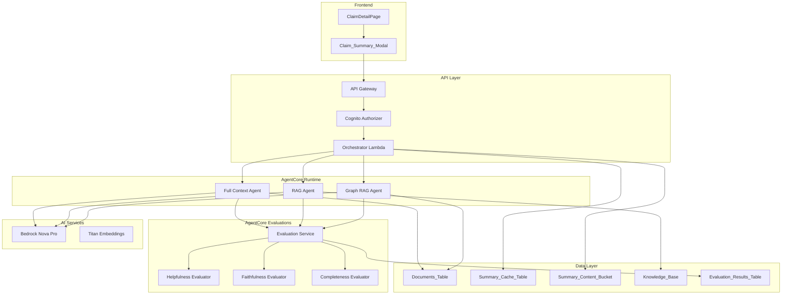
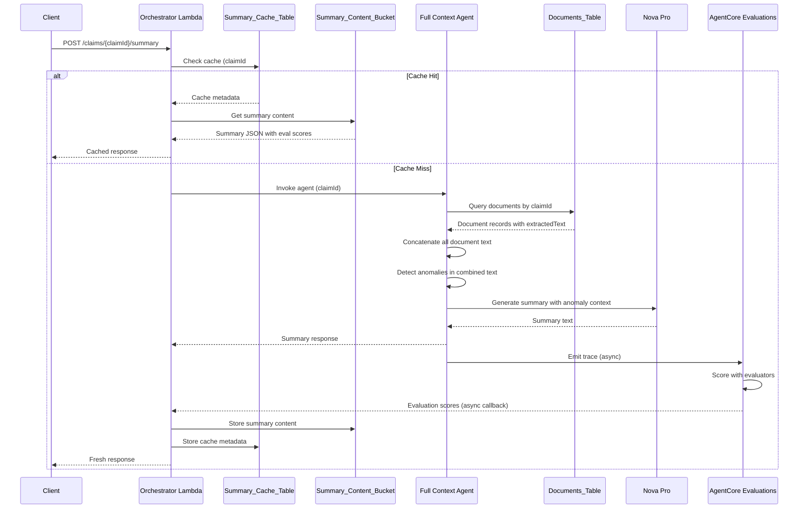
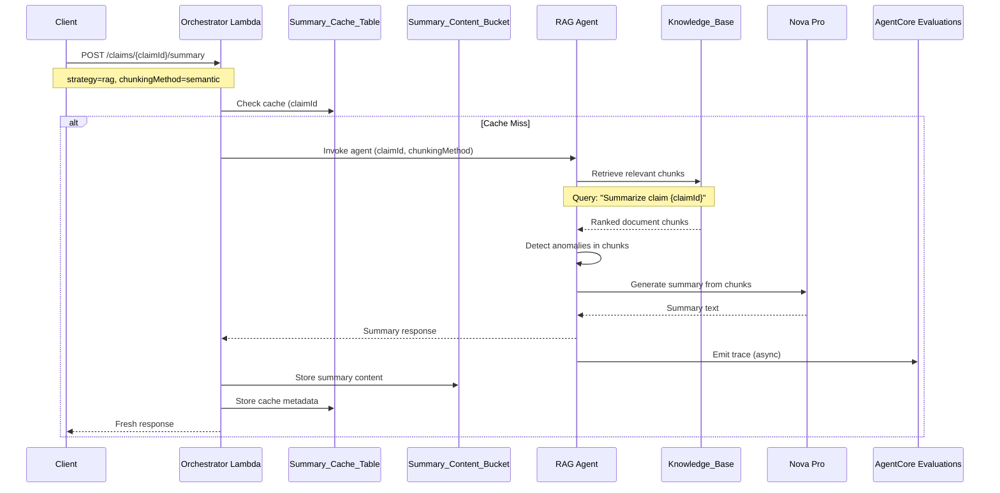
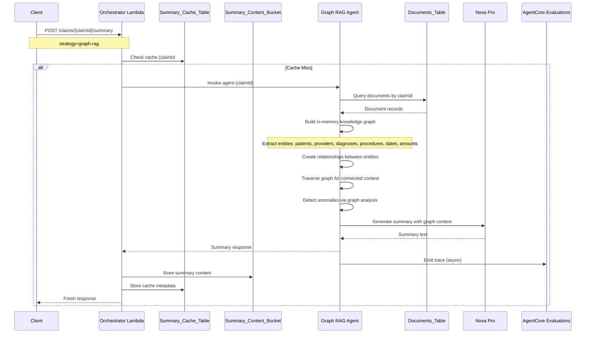

# Design Document: Claim Summary Feature

## Overview

The Claim Summary feature extends the Insurance Claim Portal with AI-powered claim summarization capabilities, offering three distinct summarization strategies for comparison: Full Context, RAG-based, and Graph RAG. This enables claims reviewers to evaluate different AI approaches and select the most effective method for their use case.

The feature introduces:
- **Amazon Bedrock AgentCore** with three specialized agents (one per summarization strategy)
- **AgentCore Evaluations** for automated quality assessment and strategy comparison
- A hybrid caching architecture using DynamoDB for metadata and S3 for content storage
- Data anomaly detection to identify inconsistencies in claim documents
- Frontend components for strategy selection, summary display, and evaluation metrics

### Key Design Decisions

1. **AgentCore Multi-Agent Architecture**: Each summarization strategy is implemented as a separate AgentCore agent, enabling:
   - Independent scaling and optimization per strategy
   - Built-in evaluation framework via AgentCore Evaluations
   - LLM-as-a-Judge scoring for summary quality comparison
   - Standardized tracing and observability via OpenTelemetry

2. **AgentCore Evaluations for Quality Comparison**: Use AgentCore's built-in and custom evaluators to score summaries on:
   - Helpfulness (built-in evaluator)
   - Faithfulness to source documents (custom evaluator)
   - Anomaly detection accuracy (custom evaluator)
   - Completeness of claim coverage (custom evaluator)

3. **In-Memory Graph for Graph RAG MVP**: Start with an in-memory graph implementation using a lightweight library (e.g., graphology) rather than Neptune. This reduces infrastructure complexity and cost while validating the approach. Neptune can be added later if graph persistence or complex traversals become necessary.

4. **Hybrid Caching (DynamoDB + S3)**: DynamoDB stores cache metadata for fast lookups while S3 stores the actual summary content. This optimizes for both query performance and cost-effective storage of potentially large summary texts.

## Architecture

### High-Level Architecture



### AgentCore Components

#### 1. Orchestrator Lambda
A lightweight Lambda function that:
- Receives API requests and validates input
- Checks cache for existing summaries
- Routes requests to the appropriate AgentCore agent based on strategy
- Collects evaluation results and returns unified response

#### 2. AgentCore Agents (3 agents)

| Agent | Strategy | Description |
|-------|----------|-------------|
| `full-context-summary-agent` | Full Context | Retrieves all documents, concatenates text, generates summary |
| `rag-summary-agent` | RAG | Uses Knowledge Base for chunk retrieval, supports full-document and semantic chunking |
| `graph-rag-summary-agent` | Graph RAG | Builds in-memory knowledge graph, extracts entities and relationships |

Each agent:
- Is deployed to AgentCore Runtime
- Emits OpenTelemetry traces for evaluation
- Includes anomaly detection in its summarization prompt
- Returns structured `ClaimSummaryResponse`

#### 3. AgentCore Evaluations

**Built-in Evaluators:**
- `Builtin.Helpfulness` - Measures how helpful the summary is for claims review

**Custom Evaluators:**
- `claim-summary.Faithfulness` - Scores how accurately the summary reflects source documents (no hallucinations)
- `claim-summary.Completeness` - Measures coverage of key claim elements (patient, diagnosis, procedures, amounts)
- `claim-summary.AnomalyAccuracy` - Validates that detected anomalies are real issues in the documents

**Evaluation Flow:**
1. Agent generates summary and emits trace
2. Online evaluation configuration processes trace
3. Evaluators score the summary (0-1 scale)
4. Scores stored in `Evaluation_Results_Table`
5. Frontend displays scores alongside summary

### Data Flow by Strategy

#### Full Context Agent Flow



#### RAG Agent Flow



#### Graph RAG Agent Flow



## Components and Interfaces

### Backend Components

#### 1. Orchestrator Lambda

The lightweight Lambda function that handles API requests and routes to AgentCore agents.

```typescript
// src/lambda/claim-summary-orchestrator.ts

interface ClaimSummaryRequest {
  strategy: 'full-context' | 'rag' | 'graph-rag';
  chunkingMethod?: 'full-document' | 'semantic';
  forceRegenerate?: boolean;
  includeEvaluation?: boolean;  // Request evaluation scores
}

interface ClaimSummaryResponse {
  summary: string;
  anomalies: DataAnomaly[];
  strategy: string;
  chunkingMethod?: string;
  documentCount: number;
  processingTime: number;
  generatedAt: string;
  cached: boolean;
  cachedAt?: string;
  // AgentCore Evaluation scores
  evaluation?: EvaluationScores;
}

interface EvaluationScores {
  helpfulness: number;      // 0-1 scale
  faithfulness: number;     // 0-1 scale
  completeness: number;     // 0-1 scale
  anomalyAccuracy?: number; // 0-1 scale (if anomalies detected)
  evaluatedAt: string;
}

interface DataAnomaly {
  description: string;
  severity: 'critical' | 'warning' | 'info';
  sourceDocument: string;
  dataValues: Record<string, string>;
}
```

#### 2. AgentCore Agent Implementations

Each agent is a Python application deployed to AgentCore Runtime using the Starter Toolkit.

```python
# agents/full_context_agent/agent.py
from bedrock_agentcore.runtime import Agent
from opentelemetry import trace

class FullContextSummaryAgent(Agent):
    """Agent that summarizes claims using full document context."""
    
    async def invoke(self, claim_id: str) -> dict:
        tracer = trace.get_tracer(__name__)
        with tracer.start_as_current_span("full_context_summary") as span:
            # 1. Retrieve all documents for claim
            documents = await self.get_claim_documents(claim_id)
            span.set_attribute("document_count", len(documents))
            
            # 2. Concatenate extracted text
            combined_text = self.combine_document_text(documents)
            
            # 3. Detect anomalies
            anomalies = await self.detect_anomalies(documents)
            span.set_attribute("anomaly_count", len(anomalies))
            
            # 4. Generate summary with Bedrock Nova Pro
            summary = await self.generate_summary(combined_text, anomalies)
            
            # 5. Return structured response (trace auto-captured for evaluation)
            return {
                "summary": summary,
                "anomalies": anomalies,
                "documentCount": len(documents),
                "strategy": "full-context"
            }
```

```python
# agents/rag_agent/agent.py
from bedrock_agentcore.runtime import Agent

class RAGSummaryAgent(Agent):
    """Agent that summarizes claims using RAG retrieval."""
    
    async def invoke(self, claim_id: str, chunking_method: str = "semantic") -> dict:
        # 1. Query Knowledge Base for relevant chunks
        chunks = await self.retrieve_chunks(claim_id, chunking_method)
        
        # 2. Detect anomalies in retrieved chunks
        anomalies = await self.detect_anomalies_from_chunks(chunks)
        
        # 3. Generate summary from chunks
        summary = await self.generate_summary(chunks, anomalies)
        
        return {
            "summary": summary,
            "anomalies": anomalies,
            "documentCount": len(set(c.document_id for c in chunks)),
            "strategy": "rag",
            "chunkingMethod": chunking_method
        }
```

```python
# agents/graph_rag_agent/agent.py
from bedrock_agentcore.runtime import Agent
import networkx as nx  # or graphology equivalent

class GraphRAGSummaryAgent(Agent):
    """Agent that summarizes claims using knowledge graph."""
    
    async def invoke(self, claim_id: str) -> dict:
        # 1. Retrieve documents
        documents = await self.get_claim_documents(claim_id)
        
        # 2. Build in-memory knowledge graph
        graph = self.build_knowledge_graph(documents)
        
        # 3. Extract entities and relationships
        entities = self.extract_entities(graph)
        
        # 4. Detect anomalies via graph analysis
        anomalies = self.detect_graph_anomalies(graph)
        
        # 5. Generate summary with graph context
        summary = await self.generate_summary_with_graph(graph, anomalies)
        
        return {
            "summary": summary,
            "anomalies": anomalies,
            "documentCount": len(documents),
            "strategy": "graph-rag",
            "entityCount": len(entities)
        }
```

#### 3. Custom Evaluators

```python
# evaluators/faithfulness_evaluator.py
"""
Custom evaluator for summary faithfulness to source documents.
Uses LLM-as-a-Judge to verify no hallucinations.
"""

FAITHFULNESS_PROMPT = """
You are evaluating the faithfulness of a claim summary.

Source Documents:
{source_documents}

Generated Summary:
{summary}

Score the summary on faithfulness (0-1):
- 1.0: Every statement in the summary is directly supported by the source documents
- 0.5: Most statements are supported, but some minor details may be inferred
- 0.0: The summary contains significant information not found in the sources

Provide your score and reasoning in JSON format:
{{"score": <float>, "reasoning": "<explanation>"}}
"""

# evaluators/completeness_evaluator.py
"""
Custom evaluator for claim summary completeness.
Checks coverage of key claim elements.
"""

COMPLETENESS_PROMPT = """
You are evaluating the completeness of a claim summary.

The summary should cover these key elements:
- Patient information (name, DOB, ID)
- Diagnosis codes and descriptions
- Procedures performed
- Service dates
- Provider information
- Amounts/charges

Generated Summary:
{summary}

Score the summary on completeness (0-1):
- 1.0: All key elements are covered with appropriate detail
- 0.5: Most elements covered, some missing or lacking detail
- 0.0: Major elements missing

Provide your score and reasoning in JSON format:
{{"score": <float>, "reasoning": "<explanation>", "missing_elements": [<list>]}}
"""
```

#### 4. Anomaly Detection Service

```typescript
// src/services/anomaly-detection.ts
interface AnomalyDetectionService {
  detectAnomalies(
    documents: DocumentRecord[],
    claimMetadata: ClaimMetadata
  ): Promise<DataAnomaly[]>;
}

// Anomaly types to detect:
// - Chronological impossibilities (service date before birth date)
// - Payment date before service date
// - Diagnosis codes inconsistent with demographics
// - Duplicate or conflicting information
// - Unrealistic amounts or quantities
```

#### 5. Cache Service

```typescript
// src/services/summary-cache.ts
interface SummaryCacheService {
  getCachedSummary(cacheKey: string): Promise<CachedSummary | null>;
  cacheSummary(cacheKey: string, summary: ClaimSummaryResponse): Promise<void>;
  invalidateCache(claimId: string): Promise<void>;
}

interface CachedSummary {
  cacheKey: string;           // claimId#strategy#chunkingMethod
  s3Key: string;              // summaries/{claimId}/{strategy}/{chunkingMethod}.json
  strategy: string;
  chunkingMethod?: string;
  documentCount: number;
  documentIds: string[];
  processingTime: number;
  generatedAt: string;
  evaluation?: EvaluationScores;  // Cached evaluation scores
  ttl: number;                // DynamoDB TTL
}
```

### Frontend Components

#### 1. ClaimDetailPage Updates

```typescript
// Separate buttons for documents and summary
<button onClick={() => handleViewDocuments(claim.claimId)}>
  📄 View Documents
</button>
<button onClick={() => handleSummarizeClaim(claim.claimId)}>
  📝 Summarize Claim
</button>
```

#### 2. Claim_Summary_Modal

```typescript
// frontend/src/components/ClaimSummaryModal.tsx
interface ClaimSummaryModalProps {
  isOpen: boolean;
  onClose: () => void;
  claimId: string;
}

interface StrategyOption {
  value: 'full-context' | 'rag' | 'graph-rag';
  label: string;
  description: string;
}

interface ChunkingOption {
  value: 'full-document' | 'semantic';
  label: string;
}
```

#### 3. EvaluationScoreDisplay Component

```typescript
// frontend/src/components/EvaluationScoreDisplay.tsx
interface EvaluationScoreDisplayProps {
  scores: EvaluationScores;
  strategy: string;
}

// Displays evaluation scores as visual indicators:
// - Helpfulness: ⭐⭐⭐⭐☆ (4/5)
// - Faithfulness: 95% (green badge)
// - Completeness: 87% (yellow badge)
// - Anomaly Accuracy: 100% (green badge)
```

#### 4. StrategyComparisonPanel Component

```typescript
// frontend/src/components/StrategyComparisonPanel.tsx
interface StrategyComparisonPanelProps {
  claimId: string;
  summaries: Map<string, ClaimSummaryResponse>;
}

// Side-by-side comparison of summaries from different strategies
// Shows evaluation scores for each strategy
// Highlights which strategy scored best on each metric
```

### API Contracts

#### POST /claims/{claimId}/summary

**Request:**
```json
{
  "strategy": "rag",
  "chunkingMethod": "semantic",
  "forceRegenerate": false,
  "includeEvaluation": true
}
```

**Response (200 OK):**
```json
{
  "anomalies": [
    {
      "description": "Service date (2024-01-15) precedes patient birth date (2024-06-01)",
      "severity": "critical",
      "sourceDocument": "CMS1500_claim_001.pdf",
      "dataValues": {
        "serviceDate": "2024-01-15",
        "birthDate": "2024-06-01"
      }
    }
  ],
  "summary": "This claim contains 4 documents for patient John Doe...",
  "strategy": "rag",
  "chunkingMethod": "semantic",
  "documentCount": 4,
  "processingTime": 2345,
  "generatedAt": "2024-01-15T10:30:00Z",
  "cached": false,
  "evaluation": {
    "helpfulness": 0.92,
    "faithfulness": 0.95,
    "completeness": 0.87,
    "anomalyAccuracy": 1.0,
    "evaluatedAt": "2024-01-15T10:30:05Z"
  }
}
```

#### GET /claims/{claimId}/evaluations

Returns evaluation scores for all strategies that have been run on a claim.

**Response (200 OK):**
```json
{
  "claimId": "claim-001",
  "evaluations": [
    {
      "strategy": "full-context",
      "chunkingMethod": null,
      "evaluation": {
        "helpfulness": 0.88,
        "faithfulness": 0.91,
        "completeness": 0.85,
        "evaluatedAt": "2024-01-15T10:25:00Z"
      }
    },
    {
      "strategy": "rag",
      "chunkingMethod": "semantic",
      "evaluation": {
        "helpfulness": 0.92,
        "faithfulness": 0.95,
        "completeness": 0.87,
        "evaluatedAt": "2024-01-15T10:30:05Z"
      }
    }
  ]
}
```

**Error Responses:**
- `400 Bad Request`: Missing strategy or invalid chunkingMethod
- `404 Not Found`: No documents found for claim
- `400 Bad Request`: No summarizable content (documents not processed)
- `502 Bad Gateway`: Bedrock invocation failed

## Data Models

### Summary_Cache_Table (DynamoDB)

| Attribute | Type | Description |
|-----------|------|-------------|
| cacheKey (PK) | String | `{claimId}#{strategy}#{chunkingMethod}` |
| s3Key | String | S3 path to summary content |
| strategy | String | Summarization strategy used |
| chunkingMethod | String | Chunking method (for RAG) |
| documentCount | Number | Number of documents summarized |
| documentIds | List<String> | IDs of documents included |
| processingTime | Number | Processing time in ms |
| generatedAt | String | ISO 8601 timestamp |
| evaluation | Map | Evaluation scores (helpfulness, faithfulness, completeness) |
| ttl | Number | DynamoDB TTL (Unix timestamp) |

### Evaluation_Results_Table (DynamoDB)

| Attribute | Type | Description |
|-----------|------|-------------|
| claimId (PK) | String | Claim identifier |
| strategyKey (SK) | String | `{strategy}#{chunkingMethod}` |
| helpfulness | Number | 0-1 score |
| faithfulness | Number | 0-1 score |
| completeness | Number | 0-1 score |
| anomalyAccuracy | Number | 0-1 score (optional) |
| evaluatedAt | String | ISO 8601 timestamp |
| evaluatorVersions | Map | Version info for each evaluator used |

### Summary_Content_Bucket (S3)

**Path Structure:** `summaries/{claimId}/{strategy}/{chunkingMethod}.json`

**Content Schema:**
```json
{
  "summary": "Full summary text...",
  "anomalies": [...],
  "metadata": {
    "tokensUsed": 1500,
    "modelId": "amazon.nova-pro-v1:0",
    "temperature": 0.3,
    "agentId": "full-context-summary-agent"
  },
  "evaluation": {
    "helpfulness": 0.92,
    "faithfulness": 0.95,
    "completeness": 0.87,
    "anomalyAccuracy": 1.0,
    "evaluatedAt": "2024-01-15T10:30:05Z"
  }
}
```

### In-Memory Knowledge Graph Schema (Graph RAG)

```typescript
// Node types
interface EntityNode {
  id: string;
  type: 'patient' | 'provider' | 'diagnosis' | 'procedure' | 'date' | 'amount' | 'document';
  properties: Record<string, any>;
}

// Edge types
interface EntityRelationship {
  source: string;
  target: string;
  type: 'has_diagnosis' | 'performed_by' | 'on_date' | 'costs' | 'contains' | 'references';
  properties?: Record<string, any>;
}
```


## Correctness Properties

*A property is a characteristic or behavior that should hold true across all valid executions of a system—essentially, a formal statement about what the system should do. Properties serve as the bridge between human-readable specifications and machine-verifiable correctness guarantees.*

### Property 1: Completed Claim Button Rendering

*For any* claim with status "completed", the ClaimDetailPage component shall render both a "View Documents" button and a "Summarize Claim" button for that claim.

**Validates: Requirements 1.1, 1.2**

### Property 2: Non-Completed Claim Hides Summarize Button

*For any* claim with a status other than "completed" (processing, failed, pending, not_loaded), the ClaimDetailPage component shall not render the "Summarize Claim" button for that claim.

**Validates: Requirements 1.4**

### Property 3: Strategy Validation

*For any* string value provided as the `strategy` field in a summary request, the Claim_Summary_API shall accept only the values "full-context", "rag", or "graph-rag", and reject all other values with a 400 status code.

**Validates: Requirements 3.2**

### Property 4: Chunking Method Validation for RAG Strategy

*For any* summary request where `strategy` is "rag", the Claim_Summary_API shall accept only "full-document" or "semantic" as valid `chunkingMethod` values, and reject all other values with a 400 status code.

**Validates: Requirements 3.3**

### Property 5: Full Context Strategy Document Retrieval

*For any* claim with N documents containing extracted text, when the full-context strategy is used, the combined text passed to Bedrock Nova Pro shall contain the extracted text from all N documents.

**Validates: Requirements 3.4**

### Property 6: Graph RAG Entity Extraction

*For any* set of claim documents, when the graph-rag strategy is used, the in-memory knowledge graph shall contain nodes representing entities (patients, providers, diagnoses, procedures, dates, amounts) that appear in the document text.

**Validates: Requirements 3.8**

### Property 7: Summary Response Structure Completeness

*For any* successful summary generation, the API response shall contain all required fields: `summary` (non-empty string), `strategy` (string), `documentCount` (number ≥ 1), `processingTime` (number ≥ 0), and `generatedAt` (valid ISO 8601 timestamp).

**Validates: Requirements 3.9**

### Property 8: Anomaly Detection for Chronological Impossibilities

*For any* claim document set where a service date precedes the patient's birth date, the anomaly detection service shall identify and return an anomaly with severity "critical" describing the chronological impossibility.

**Validates: Requirements 4.2**

### Property 9: Anomaly Response Structure

*For any* detected anomaly, the anomaly object shall contain: `description` (non-empty string), `severity` (one of "critical", "warning", "info"), `sourceDocument` (string), and `dataValues` (object with at least one key-value pair).

**Validates: Requirements 4.3**

### Property 10: Anomaly Severity Color Coding

*For any* anomaly displayed in the Claim_Summary_Modal, the anomaly shall be styled with the correct color based on severity: red for "critical", yellow for "warning", and blue for "info".

**Validates: Requirements 4.6**

### Property 11: Modal Response Display Completeness

*For any* successful ClaimSummaryResponse displayed in the Claim_Summary_Modal, the modal shall render the summary text, strategy name, document count, and processing time. If the strategy is "rag", the chunking method shall also be displayed.

**Validates: Requirements 5.3**

### Property 12: API Client Request Construction

*For any* call to `getClaimSummary(claimId, strategy, chunkingMethod)`, the claimApi module shall send a POST request to `/claims/{claimId}/summary` with a JSON body containing the `strategy` field, and the `chunkingMethod` field if provided.

**Validates: Requirements 6.2**

### Property 13: API Client Response Parsing

*For any* successful API response, the `getClaimSummary` function shall return an object with all required fields typed correctly: `summary` (string), `anomalies` (array), `strategy` (string), `documentCount` (number), `processingTime` (number), and `generatedAt` (string).

**Validates: Requirements 6.3**

### Property 14: Cache Write Completeness

*For any* successfully generated summary, the Claim_Summary_Lambda shall store: (1) metadata in Summary_Cache_Table with cacheKey `{claimId}#{strategy}#{chunkingMethod}` containing strategy, chunkingMethod, documentCount, processingTime, generatedAt, s3Key, and documentIds; and (2) the full summary content in Summary_Content_Bucket at path `summaries/{claimId}/{strategy}/{chunkingMethod}.json`.

**Validates: Requirements 8.1, 8.2, 8.8**

### Property 15: Cache Check Before Generation

*For any* summary request where `forceRegenerate` is false or not provided, the Claim_Summary_Lambda shall query the Summary_Cache_Table for an existing entry before invoking Bedrock Nova Pro.

**Validates: Requirements 8.3**

### Property 16: Cache Hit Response

*For any* summary request that results in a cache hit, the response shall include `cached: true`, the original `generatedAt` timestamp from when the summary was first created, and a `cachedAt` timestamp indicating when the cache was accessed.

**Validates: Requirements 8.4, 8.5**

### Property 17: Force Regeneration Behavior

*For any* summary request with `forceRegenerate: true`, the Orchestrator Lambda shall generate a new summary via the appropriate AgentCore agent, update the Summary_Cache_Table metadata, and overwrite the content in Summary_Content_Bucket, regardless of whether a cached entry exists.

**Validates: Requirements 8.6, 8.7**

### Property 18: Evaluation Score Structure

*For any* summary response where `includeEvaluation` is true, the `evaluation` object shall contain: `helpfulness` (number 0-1), `faithfulness` (number 0-1), `completeness` (number 0-1), and `evaluatedAt` (valid ISO 8601 timestamp).

**Validates: Requirements 10.1, 10.3**

### Property 19: Evaluation Consistency Across Strategies

*For any* claim evaluated with multiple strategies, the Evaluation_Results_Table shall contain one entry per strategy-chunkingMethod combination, each with independently computed scores.

**Validates: Requirements 10.2**

### Property 20: Agent Trace Emission

*For any* successful agent invocation, the AgentCore agent shall emit an OpenTelemetry trace containing the input claim ID, output summary, source documents, and detected anomalies.

**Validates: Requirements 10.4**

## Error Handling

### API Error Responses

| Scenario | Status Code | Error Message |
|----------|-------------|---------------|
| Missing claimId in path | 400 | "Missing claimId parameter" |
| Missing strategy in body | 400 | "Missing required field: strategy" |
| Invalid strategy value | 400 | "Invalid strategy. Must be one of: full-context, rag, graph-rag" |
| Invalid chunkingMethod for RAG | 400 | "Invalid chunkingMethod. Must be one of: full-document, semantic" |
| No documents found for claim | 404 | "No documents found for claim {claimId}" |
| No processed documents | 400 | "No summarizable content available. Documents are still processing or have no extracted text." |
| Bedrock invocation failure | 502 | "Summary generation failed. Please try again later." |
| Cache read failure | N/A | Log error, proceed with generation |
| Cache write failure | N/A | Log error, return successful response |
| S3 read/write failure | 502 | "Failed to retrieve/store summary content" |

### Retry Strategy

- **Bedrock Invocation**: Exponential backoff with 3 retries (1s, 2s, 4s delays)
- **DynamoDB Operations**: Exponential backoff with 3 retries
- **S3 Operations**: Exponential backoff with 3 retries

### Graceful Degradation

1. **Cache Failures**: If cache read fails, proceed with generation. If cache write fails, return successful response but log the error.
2. **Knowledge Base Unavailable (RAG)**: Return 503 with message suggesting to try full-context strategy.
3. **Graph Construction Failure**: Fall back to full-context strategy with a warning in the response.

## Testing Strategy

### Dual Testing Approach

This feature requires both unit tests and property-based tests for comprehensive coverage:

- **Unit tests**: Verify specific examples, edge cases, error conditions, and integration points
- **Property tests**: Verify universal properties across all valid inputs using randomized testing

### Property-Based Testing Configuration

- **Library**: fast-check (already in project dependencies)
- **Minimum iterations**: 100 per property test
- **Tag format**: `Feature: claim-summary, Property {number}: {property_text}`

### Unit Test Coverage

Located in `unit_tests/claim-summary.test.ts`:

1. **Input Validation Tests**
   - Missing claimId returns 400
   - Missing strategy returns 400
   - Invalid strategy returns 400
   - Invalid chunkingMethod for RAG returns 400

2. **Strategy Execution Tests**
   - Full-context strategy with valid documents returns 200
   - RAG strategy invokes Knowledge Base with correct parameters
   - Graph-RAG strategy builds entity graph and returns summary

3. **Error Handling Tests**
   - No documents returns 404
   - No processed documents returns 400
   - Bedrock failure returns 502

4. **Caching Tests**
   - Cache hit returns cached response with correct flags
   - Cache miss generates new summary
   - forceRegenerate bypasses cache

5. **Anomaly Detection Tests**
   - Detects date before birth date (critical)
   - Detects payment before service (warning)
   - Returns empty array when no anomalies

### Property-Based Test Coverage

Located in `unit_tests/claim-summary.property.test.ts`:

```typescript
// Feature: claim-summary, Property 3: Strategy Validation
test.prop([fc.string()])('rejects invalid strategy values', (strategy) => {
  fc.pre(!['full-context', 'rag', 'graph-rag'].includes(strategy));
  // Test that invalid strategies return 400
});

// Feature: claim-summary, Property 7: Summary Response Structure Completeness
test.prop([validClaimArbitrary, validStrategyArbitrary])('response contains all required fields', async (claim, strategy) => {
  // Test that successful responses have all required fields
});

// Feature: claim-summary, Property 8: Anomaly Detection for Chronological Impossibilities
test.prop([documentWithInvalidDatesArbitrary])('detects chronological impossibilities', async (documents) => {
  // Test that date anomalies are detected
});
```

### Frontend Component Tests

Located in `unit_tests/claim-summary-modal.test.tsx`:

1. **Rendering Tests**
   - Modal displays three strategy options
   - RAG selection shows chunking method selector
   - Anomalies render with correct colors

2. **Interaction Tests**
   - Strategy selection updates state
   - Generate button triggers API call
   - Close button/Escape/backdrop click closes modal

3. **Accessibility Tests**
   - Modal has role="dialog" and aria-modal="true"

