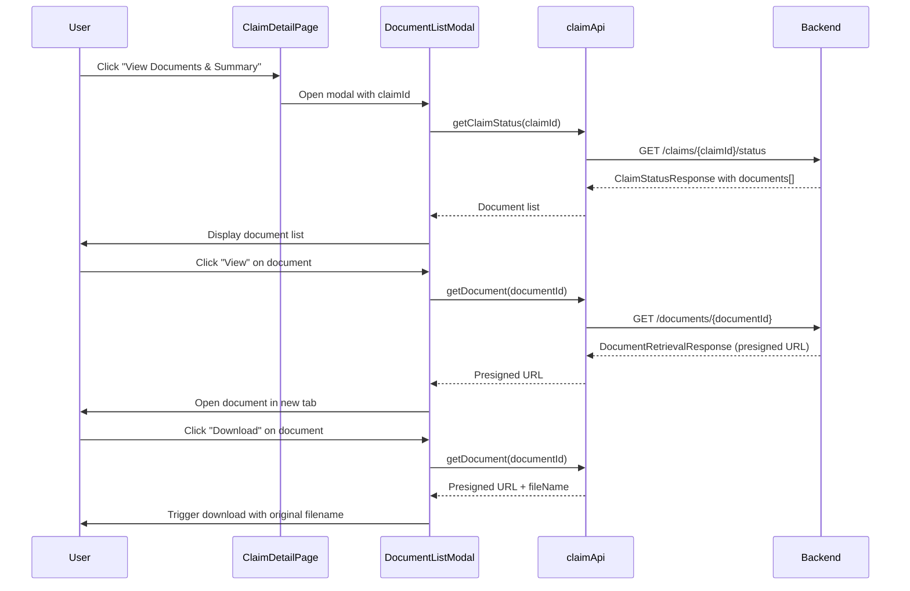

# Design Document: Document Listing UI

## Overview

This design describes the implementation of a document listing modal for the Insurance Claim Portal. The feature replaces the placeholder alert in `ClaimDetailPage.tsx` with a functional UI that allows claims processors to view, download, and manage documents associated with completed claims.

The implementation follows React best practices with TypeScript, integrating with the existing `claimApi.ts` service layer and leveraging the platform's document-retrieval Lambda for presigned URL generation.

## Architecture

### Component Hierarchy

```
ClaimDetailPage
└── DocumentListModal (new)
    ├── Modal Header (title + close button)
    ├── Loading State
    ├── Error State (with retry)
    ├── Empty State
    └── Document List
        └── DocumentListItem (new, multiple)
            ├── Document Info (name, type, status, date)
            ├── Status Indicator
            └── Action Buttons (View, Download)
```

### Data Flow



## Components and Interfaces

### New Components

#### 1. DocumentListModal

A modal component that displays the list of documents for a claim.

```typescript
interface DocumentListModalProps {
  isOpen: boolean;
  onClose: () => void;
  claimId: string;
  documents: ClaimDocument[];
}
```

**Responsibilities:**
- Render modal overlay with proper accessibility (focus trap, escape key handling)
- Display loading, error, and empty states
- Manage document action states (view/download loading)
- Handle keyboard navigation (Escape to close)

#### 2. DocumentListItem

A list item component for individual documents within the modal.

```typescript
interface DocumentListItemProps {
  document: ClaimDocument;
  onView: (documentId: string) => void;
  onDownload: (documentId: string) => void;
  isViewLoading: boolean;
  isDownloadLoading: boolean;
}
```

**Responsibilities:**
- Display document metadata (name, type, status, date)
- Render status indicator with appropriate color/icon
- Handle view and download button clicks
- Disable actions for non-completed documents

### Type Definitions

```typescript
// Document within a claim (extends existing ClaimStatusResponse)
interface ClaimDocument {
  documentId: string;
  fileName: string;
  documentType?: string;
  processingStatus: 'completed' | 'processing' | 'queued' | 'failed';
  createdAt: string;
  updatedAt?: string;
}

// Extended ClaimStatusResponse to include documents array
interface ClaimStatusResponseWithDocuments extends ClaimStatusResponse {
  documents: ClaimDocument[];
}

// Action state for tracking loading states per document
interface DocumentActionState {
  [documentId: string]: {
    isViewLoading: boolean;
    isDownloadLoading: boolean;
  };
}
```

### API Integration

The implementation uses existing API functions from `claimApi.ts`:

1. **getClaimStatus(claimId)** - Already exists, returns `ClaimStatusResponse`
   - Backend needs to include `documents` array in response

2. **getDocument(documentId)** - Already exists, returns `DocumentRetrievalResponse`
   - Returns `{ documentUrl, contentType, fileName }`

### State Management

State is managed locally within components using React hooks:

```typescript
// DocumentListModal state
const [isLoading, setIsLoading] = useState(true);
const [error, setError] = useState<string | null>(null);
const [actionStates, setActionStates] = useState<DocumentActionState>({});
```

## Data Models

### ClaimDocument

| Field | Type | Description |
|-------|------|-------------|
| documentId | string | Unique identifier for the document |
| fileName | string | Original file name |
| documentType | string? | Type of document (e.g., "radiology_report", "lab_result") |
| processingStatus | enum | One of: 'completed', 'processing', 'queued', 'failed' |
| createdAt | string | ISO 8601 timestamp of document creation |
| updatedAt | string? | ISO 8601 timestamp of last update |

### DocumentRetrievalResponse (existing)

| Field | Type | Description |
|-------|------|-------------|
| documentUrl | string | Presigned S3 URL for document access |
| contentType | string | MIME type of the document |
| fileName | string | Original file name for download |

### Status Indicator Mapping

| Status | Color | Icon | Actions Enabled |
|--------|-------|------|-----------------|
| completed | Green (#28a745) | ✅ | View, Download |
| processing | Amber (#ffc107) | ⏳ | None |
| queued | Blue (#17a2b8) | ⏸️ | None |
| failed | Red (#dc3545) | ❌ | None |


## Correctness Properties

*A property is a characteristic or behavior that should hold true across all valid executions of a system — essentially, a formal statement about what the system should do. Properties serve as the bridge between human-readable specifications and machine-verifiable correctness guarantees.*

### Property 1: Document count rendering

*For any* list of ClaimDocument objects (including empty lists), when the DocumentListModal renders with that list, the number of DocumentListItem components rendered should equal the length of the input list.

**Validates: Requirements 1.1**

### Property 2: Document metadata display

*For any* ClaimDocument with a fileName, documentType, and processingStatus, the rendered DocumentListItem should contain the document's fileName, documentType (when present), and processingStatus text in its output.

**Validates: Requirements 1.2, 1.3, 1.4, 4.5**

### Property 3: Date formatting produces human-readable output

*For any* valid ISO 8601 date string, the formatDate function should return a non-empty string that does not equal the raw ISO input, and should contain recognizable date components (month name, day number, year).

**Validates: Requirements 1.5**

### Property 4: Action buttons enabled only for completed documents

*For any* ClaimDocument, the View and Download buttons should be enabled if and only if the document's processingStatus is "completed". For all other statuses ("processing", "queued", "failed"), both buttons should be disabled.

**Validates: Requirements 2.1, 2.6, 3.1**

### Property 5: Status indicator mapping is total and correct

*For any* valid processingStatus value ("completed", "processing", "queued", "failed"), the getStatusColor function should return a defined hex color string, and the getStatusIcon function should return a non-empty string. The mapping should be deterministic: the same status always produces the same icon and color.

**Validates: Requirements 4.1, 4.2, 4.3, 4.4**

### Property 6: Download preserves original filename

*For any* DocumentRetrievalResponse with a fileName, when the download function is invoked, the resulting download should use the exact fileName from the response, preserving the original name.

**Validates: Requirements 3.3**

## Error Handling

### API Errors

| Scenario | Handling | User Feedback |
|----------|----------|---------------|
| getClaimStatus fails | Catch error, set error state | Error message with retry button |
| getDocument fails (view) | Catch error, reset action state | Inline error toast/message |
| getDocument fails (download) | Catch error, reset action state | Inline error toast/message |
| Network timeout | Handled by existing `apiRequest` timeout (30s) | "Request timeout - please try again" |
| Auth token missing | Handled by existing `apiRequest` auth check | "Authentication required - please sign in again" |

### Edge Cases

- **Empty documents array**: Render empty state with informative message
- **Missing documentType**: Render "Unknown" or omit the type field gracefully
- **Long file names**: Truncate with ellipsis via CSS `text-overflow`
- **Rapid button clicks**: Disable button during loading to prevent duplicate API calls
- **Modal open during navigation**: Cleanup effect closes modal and cancels pending requests
- **Presigned URL expiration**: URLs are valid for 1 hour (set by backend); if user waits too long, they'll get an error on access and can retry

### Accessibility

- Modal traps focus when open
- Close button is keyboard-accessible
- Escape key dismisses modal
- Status indicators include text labels (not just color/icon)
- Action buttons have descriptive `aria-label` attributes
- Loading states announced via `aria-live` regions

## Testing Strategy

### Property-Based Testing

**Library**: [fast-check](https://github.com/dubzzz/fast-check) for TypeScript/React property-based testing.

Each correctness property from the design will be implemented as a single property-based test with a minimum of 100 iterations. Tests will be tagged with the format:

```
Feature: document-listing-ui, Property {number}: {property_text}
```

**Property tests to implement:**

1. **Property 1** - Generate arbitrary arrays of ClaimDocument objects, render DocumentListModal, assert rendered item count equals input length
2. **Property 2** - Generate arbitrary ClaimDocument objects with random metadata, render DocumentListItem, assert all metadata fields appear in output
3. **Property 3** - Generate arbitrary valid ISO date strings, call formatDate, assert output is non-empty and differs from raw input
4. **Property 4** - Generate arbitrary ClaimDocument objects with random statuses, render DocumentListItem, assert button disabled state matches status !== "completed"
5. **Property 5** - Generate arbitrary status values from the valid set, call getStatusColor and getStatusIcon, assert non-empty deterministic results
6. **Property 6** - Generate arbitrary file names, simulate download flow, assert the download uses the exact original file name

### Unit Testing

Unit tests complement property tests by covering specific examples, integration points, and edge cases:

- **Modal open/close**: Verify modal renders when isOpen=true, doesn't render when false
- **Escape key handling**: Verify onClose is called when Escape is pressed
- **View button click**: Mock getDocument, verify window.open is called with presigned URL
- **Download button click**: Mock getDocument, verify download is triggered with correct filename
- **Loading states**: Verify loading indicators appear during API calls
- **Error states**: Verify error messages appear when API calls fail, retry button works
- **Empty state**: Verify empty state message when documents array is empty
- **Focus management**: Verify focus returns to trigger element on modal close

### Test Configuration

- Tests located in `unit_tests/` directory per project guidelines
- Use React Testing Library for component rendering
- Use fast-check for property-based tests (minimum 100 iterations per property)
- Mock `claimApi` service functions for isolated component testing
- Mock `window.open` and download mechanisms for action tests
