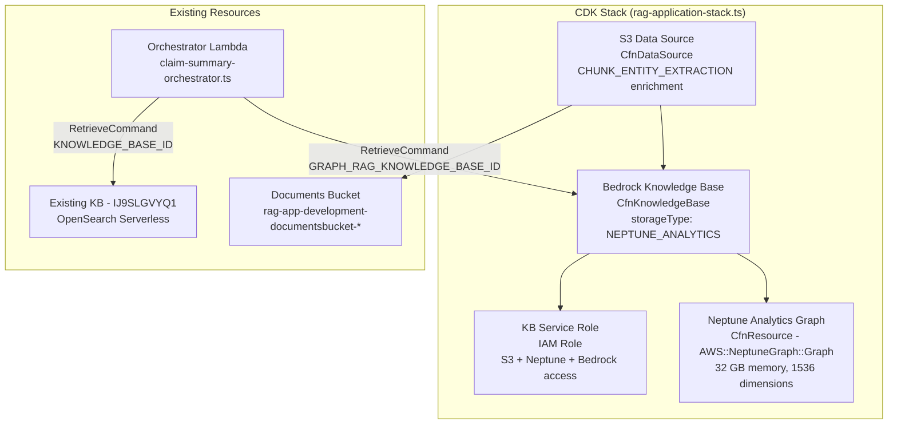
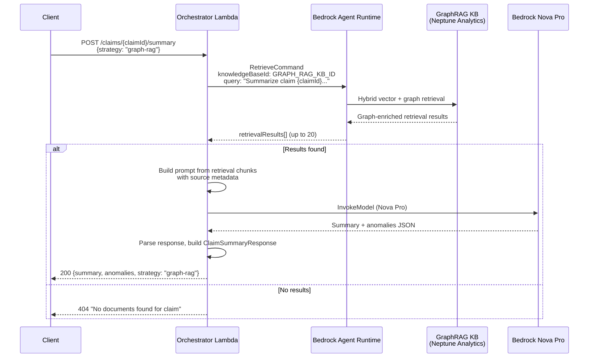
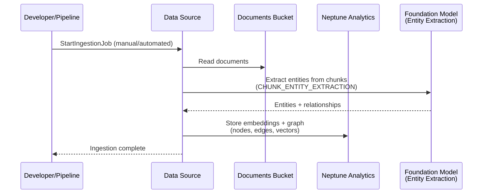

# Design Document: Graph RAG Strategy (Neptune Analytics)

## Overview

This feature replaces the placeholder `executeGraphRagStrategy()` function in the claim summary orchestrator Lambda with a real GraphRAG implementation backed by AWS managed services. The current function is identical to `executeFullContextStrategy()` — it concatenates all document text and sends it to Bedrock Nova Pro. The new implementation uses a Bedrock Knowledge Base backed by Amazon Neptune Analytics, which automatically extracts entities, builds a knowledge graph, and combines vector similarity search with graph traversal for relationship-aware retrieval.

No custom graph code is written in TypeScript. Neptune Analytics handles entity extraction and graph construction automatically during data source ingestion. The orchestrator Lambda simply queries the GraphRAG Knowledge Base via the Bedrock Agent Runtime `Retrieve` API — the same pattern already used by `executeRagStrategy()` for the existing OpenSearch-backed KB.

### Key Design Decisions

1. **Fully Managed GraphRAG**: Neptune Analytics handles entity extraction, graph construction, and hybrid vector+graph retrieval. No custom TypeScript graph data structures, regex entity extraction, or in-memory graph traversal. This eliminates maintenance burden and leverages AWS-optimized graph algorithms.

2. **Same Retrieval Pattern as RAG Strategy**: `executeGraphRagStrategy()` follows the identical `RetrieveCommand` pattern as `executeRagStrategy()`, but targets a different Knowledge Base ID (`GRAPH_RAG_KNOWLEDGE_BASE_ID` env var). This keeps the orchestrator code simple and consistent.

3. **Separate Knowledge Base**: The GraphRAG KB is a distinct resource from the existing OpenSearch Serverless KB (`IJ9SLGVYQ1`). Both point to the same S3 documents bucket but use different storage backends, ensuring the strategy comparison view shows genuinely different retrieval approaches.

4. **L1 CfnGraph for Neptune Analytics**: CDK does not yet have L2 constructs for Neptune Analytics graphs. We use `CfnResource` with type `AWS::NeptuneGraph::Graph` (L1) to provision the graph.

5. **L1 CfnKnowledgeBase for GraphRAG KB**: The existing Bedrock KB L1 construct (`CfnKnowledgeBase`) supports `NEPTUNE_ANALYTICS` storage configuration. We use this with `CHUNK_ENTITY_EXTRACTION` context enrichment on the data source.

6. **Signature Change**: `executeGraphRagStrategy()` changes from `(documents: DocumentRecord[])` to `(claimId: string, useReranker: boolean)` since it queries the KB by claim ID rather than using pre-fetched documents. The handler routing for `graph-rag` is updated accordingly.

7. **Graceful Fallback**: If the GraphRAG KB query fails, the orchestrator falls back to full-context strategy behavior and logs the error, consistent with the existing error handling pattern.

8. **Optional Reranker**: The `RetrieveCommand` optionally includes a `rerankingConfiguration` with Cohere Rerank 3.5 (`cohere.rerank-v3-5:0`) when `useReranker` is true. This lets users compare graph-rag results with and without reranking in the strategy comparison view. The reranker reorders retrieval results by relevance before they're sent to the LLM, potentially improving summary quality.

## Architecture

### Infrastructure Components



### Data Flow for Graph RAG Strategy



### Ingestion Flow (Out of Band)



## Components and Interfaces

### CDK Infrastructure Changes (rag-application-stack.ts)

#### 1. Neptune Analytics Graph

```typescript
// L1 construct — no L2 available for Neptune Analytics
const neptuneGraph = new cdk.CfnResource(this, 'NeptuneAnalyticsGraph', {
  type: 'AWS::NeptuneGraph::Graph',
  properties: {
    GraphName: `${applicationName}-graph-${environment}`,
    ProvisionedMemory: 32,           // Minimum 32 GB for dev
    VectorSearchConfiguration: {
      VectorSearchDimension: 1024,   // Match embedding model dimensions
    },
    PublicConnectivity: false,
    ReplicaCount: 0,                 // Dev: no replicas
    DeletionProtection: environment === 'prod',
  },
});
```

#### 2. KB Service Role

```typescript
const graphRagKbRole = new iam.Role(this, 'GraphRagKbRole', {
  assumedBy: new iam.ServicePrincipal('bedrock.amazonaws.com'),
  inlinePolicies: {
    BedrockKbPolicy: new iam.PolicyDocument({
      statements: [
        // S3 read access to documents bucket
        new iam.PolicyStatement({
          actions: ['s3:GetObject', 's3:ListBucket'],
          resources: [
            documentsBucket.bucketArn,
            `${documentsBucket.bucketArn}/*`,
          ],
        }),
        // Neptune Analytics access
        new iam.PolicyStatement({
          actions: [
            'neptune-graph:GetGraph',
            'neptune-graph:ReadDataViaQuery',
            'neptune-graph:WriteDataViaQuery',
            'neptune-graph:DeleteDataViaQuery',
          ],
          resources: [neptuneGraph.getAtt('GraphArn').toString()],
        }),
        // Bedrock model access for embeddings + entity extraction
        new iam.PolicyStatement({
          actions: ['bedrock:InvokeModel'],
          resources: [
            `arn:aws:bedrock:${this.region}::foundation-model/amazon.titan-embed-text-v2:0`,
            `arn:aws:bedrock:${this.region}::foundation-model/amazon.nova-micro-v1:0`,
          ],
        }),
      ],
    }),
  },
});
```

#### 3. Bedrock Knowledge Base with Neptune Analytics

```typescript
const graphRagKb = new cdk.aws_bedrock.CfnKnowledgeBase(this, 'GraphRagKnowledgeBase', {
  name: `${applicationName}-graphrag-kb-${environment}`,
  roleArn: graphRagKbRole.roleArn,
  knowledgeBaseConfiguration: {
    type: 'VECTOR',
    vectorKnowledgeBaseConfiguration: {
      embeddingModelArn: `arn:aws:bedrock:${this.region}::foundation-model/amazon.titan-embed-text-v2:0`,
    },
  },
  storageConfiguration: {
    type: 'NEPTUNE_ANALYTICS',
    neptuneAnalyticsConfiguration: {
      graphArn: neptuneGraph.getAtt('GraphArn').toString(),
    },
  },
});
graphRagKb.node.addDependency(neptuneGraph);
```

#### 4. S3 Data Source with Entity Extraction

```typescript
const graphRagDataSource = new cdk.aws_bedrock.CfnDataSource(this, 'GraphRagDataSource', {
  knowledgeBaseId: graphRagKb.attrKnowledgeBaseId,
  name: `${applicationName}-graphrag-ds-${environment}`,
  dataSourceConfiguration: {
    type: 'S3',
    s3Configuration: {
      bucketArn: documentsBucket.bucketArn,
    },
  },
  contextEnrichmentConfiguration: {
    type: 'BEDROCK_FOUNDATION_MODEL',
    bedrockFoundationModelConfiguration: {
      enrichmentStrategyConfiguration: {
        method: 'CHUNK_ENTITY_EXTRACTION',
      },
      modelArn: `arn:aws:bedrock:${this.region}::foundation-model/amazon.nova-micro-v1:0`,
    },
  },
});
graphRagDataSource.node.addDependency(graphRagKb);
```

#### 5. Lambda Environment Variable + Permissions

```typescript
// Add GRAPH_RAG_KNOWLEDGE_BASE_ID to orchestrator Lambda env vars
// (alongside existing KNOWLEDGE_BASE_ID)

// Additional IAM permissions for orchestrator Lambda:
claimSummaryOrchestratorFunction.addToRolePolicy(new iam.PolicyStatement({
  effect: iam.Effect.ALLOW,
  actions: ['bedrock:Retrieve', 'bedrock:RetrieveAndGenerate'],
  resources: [graphRagKb.attrKnowledgeBaseArn],
}));

claimSummaryOrchestratorFunction.addToRolePolicy(new iam.PolicyStatement({
  effect: iam.Effect.ALLOW,
  actions: ['neptune-graph:ReadDataViaQuery', 'neptune-graph:GetQueryResults'],
  resources: [neptuneGraph.getAtt('GraphArn').toString()],
}));

// Reranker model access (Cohere Rerank 3.5)
claimSummaryOrchestratorFunction.addToRolePolicy(new iam.PolicyStatement({
  effect: iam.Effect.ALLOW,
  actions: ['bedrock:InvokeModel'],
  resources: [`arn:aws:bedrock:${this.region}::foundation-model/cohere.rerank-v3-5:0`],
}));
```

### Orchestrator Lambda Changes (claim-summary-orchestrator.ts)

#### New Environment Variable

```typescript
const GRAPH_RAG_KNOWLEDGE_BASE_ID = process.env.GRAPH_RAG_KNOWLEDGE_BASE_ID || '';
```

#### Updated `executeGraphRagStrategy()`

The function signature changes from `(documents: DocumentRecord[])` to `(claimId: string, useReranker: boolean)` to match the KB retrieval pattern:

```typescript
async function executeGraphRagStrategy(
  claimId: string,
  useReranker: boolean = false
): Promise<{ summary: string; anomalies: DataAnomaly[]; documentCount: number }> {
  // 1. Build RetrieveCommand with optional reranking
  const retrieveInput: any = {
    knowledgeBaseId: GRAPH_RAG_KNOWLEDGE_BASE_ID,
    retrievalQuery: {
      text: `Summarize insurance claim ${claimId} including patient information, diagnoses, procedures, service dates, provider details, and amounts. Identify any data anomalies.`,
    },
    retrievalConfiguration: {
      vectorSearchConfiguration: {
        numberOfResults: 20,
      },
    },
  };

  // Optional reranker (Cohere Rerank 3.5)
  if (useReranker) {
    retrieveInput.retrievalConfiguration.rerankingConfiguration = {
      type: 'BEDROCK_RERANKING_MODEL',
      bedrockRerankingConfiguration: {
        modelConfiguration: {
          modelArn: `arn:aws:bedrock:${process.env.AWS_REGION || 'us-east-1'}::foundation-model/cohere.rerank-v3-5:0`,
        },
      },
    };
  }

  const retrieveCommand = new RetrieveCommand(retrieveInput);

  const retrievalResponse = await bedrockAgentClient.send(retrieveCommand);
  const chunks = retrievalResponse.retrievalResults || [];

  if (chunks.length === 0) {
    return { summary: '', anomalies: [], documentCount: 0 };
  }

  // 2. Build context from graph-enriched retrieval chunks
  const chunksText = chunks
    .map((chunk, i) => {
      const source = chunk.location?.s3Location?.uri || `Chunk ${i + 1}`;
      return `--- Chunk from: ${source} ---\n${chunk.content?.text || ''}`;
    })
    .join('\n\n');

  // 3. Count unique source documents
  const uniqueSources = new Set(
    chunks.map((c) => c.location?.s3Location?.uri).filter(Boolean)
  );

  // 4. Invoke Bedrock with graph-rag identified prompt
  const prompt = buildSummaryPrompt(chunksText, 'graph-rag (Neptune Analytics GraphRAG)');
  const responseText = await invokeBedrockNovaPro(prompt);
  const parsed = parseSummaryResponse(responseText);

  return {
    ...parsed,
    documentCount: uniqueSources.size || chunks.length,
  };
}
```

#### Updated Handler Routing

The `graph-rag` branch in `handlePostSummary` changes to call `executeGraphRagStrategy(claimId, useReranker)` directly instead of fetching documents first:

```typescript
// In handlePostSummary, the graph-rag case moves to the KB-retrieval path:
if (request.strategy === 'rag') {
  // ... existing RAG logic unchanged ...
} else if (request.strategy === 'graph-rag') {
  const useReranker = request.useReranker ?? false;
  console.log('Executing graph-rag strategy for claimId:', claimId, 'useReranker:', useReranker);
  try {
    const graphRagResult = await executeGraphRagStrategy(claimId, useReranker);
    if (graphRagResult.documentCount === 0) {
      return errorResponse(404, `No documents found for claim ${claimId}`);
    }
    summary = graphRagResult.summary;
    anomalies = graphRagResult.anomalies;
    documentCount = graphRagResult.documentCount;
  } catch (error) {
    // Fallback to full-context on GraphRAG failure
    console.error('Graph RAG failed, falling back to full-context:', error);
    const documents = await queryClaimDocuments(claimId);
    if (documents.length === 0) {
      return errorResponse(404, `No documents found for claim ${claimId}`);
    }
    const summarizable = documents.filter(d => d.extractedText?.trim());
    if (summarizable.length === 0) {
      return errorResponse(400, 'No summarizable content available.');
    }
    documentIds = summarizable.map(d => d.documentId);
    documentCount = summarizable.length;
    const result = await executeFullContextStrategy(summarizable);
    summary = result.summary;
    anomalies = result.anomalies;
  }
} else {
  // full-context strategy ... existing logic unchanged ...
}
```


## Data Models

### Type Changes (claim-summary.ts)

The `ClaimSummaryRequest` interface gets a new optional field:

```typescript
export interface ClaimSummaryRequest {
  strategy: SummaryStrategy;
  chunkingMethod?: ChunkingMethod;
  forceRegenerate?: boolean;
  includeEvaluation?: boolean;
  /** When true and strategy is 'graph-rag', enables Cohere Rerank 3.5 on retrieval results. */
  useReranker?: boolean;
}
```

The `ClaimSummaryResponse` interface gets a new optional field to reflect what was used:

```typescript
export interface ClaimSummaryResponse {
  // ... existing fields unchanged ...
  /** Whether reranking was enabled for this summary (graph-rag only). */
  useReranker?: boolean;
}
```

### Cache Key Update

The cache key for graph-rag summaries includes the reranker setting:

```typescript
// Existing: "{claimId}#graph-rag"
// New:      "{claimId}#graph-rag#reranker" (when useReranker=true)
//           "{claimId}#graph-rag" (when useReranker=false/omitted)
```

### No Other New TypeScript Data Models

The orchestrator continues to use existing types:

- **`ClaimSummaryRequest`** / **`ClaimSummaryResponse`** — unchanged, already supports `strategy: 'graph-rag'`
- **`DataAnomaly`** — unchanged, anomalies are detected by the LLM from retrieval context
- **`DocumentRecord`** — unchanged, only used by full-context fallback path

The knowledge graph data model (entities, relationships, embeddings) lives entirely within Neptune Analytics and is managed by the Bedrock KB ingestion pipeline. No application code interacts with the graph directly.

### CDK Resource Configuration

| Resource | Type | Key Properties |
|----------|------|----------------|
| Neptune Analytics Graph | `AWS::NeptuneGraph::Graph` | `GraphName: {app}-graph-{env}`, `ProvisionedMemory: 32`, `VectorSearchDimension: 1024` |
| GraphRAG Knowledge Base | `AWS::Bedrock::KnowledgeBase` | `storageType: NEPTUNE_ANALYTICS`, `embeddingModel: amazon.titan-embed-text-v2:0` |
| GraphRAG Data Source | `AWS::Bedrock::DataSource` | `type: S3`, `contextEnrichment: CHUNK_ENTITY_EXTRACTION`, `enrichmentModel: amazon.nova-micro-v1:0` |
| KB Service Role | `AWS::IAM::Role` | S3 read, Neptune Analytics read/write, Bedrock InvokeModel |

### Environment Variables

| Variable | Value | Used By |
|----------|-------|---------|
| `GRAPH_RAG_KNOWLEDGE_BASE_ID` | `graphRagKb.attrKnowledgeBaseId` | Orchestrator Lambda |
| `KNOWLEDGE_BASE_ID` | Existing `IJ9SLGVYQ1` (unchanged) | Orchestrator Lambda |

### Deployment Notes

- After initial CDK deployment, the GraphRAG data source must be synced manually via `aws bedrock-agent start-ingestion-job` or the Bedrock console. Sync is not automatic on creation.
- The Neptune Analytics graph takes a few minutes to provision. The KB and data source depend on it via CDK `addDependency`.
- The same S3 documents bucket is shared between the existing OpenSearch KB and the new Neptune Analytics KB. Both ingest from the same source.


## Correctness Properties

*A property is a characteristic or behavior that should hold true across all valid executions of a system — essentially, a formal statement about what the system should do. Properties serve as the bridge between human-readable specifications and machine-verifiable correctness guarantees.*

### Property 1: GraphRAG KB Routing

*For any* claim ID and a graph-rag strategy request, the `RetrieveCommand` sent to Bedrock Agent Runtime SHALL use `GRAPH_RAG_KNOWLEDGE_BASE_ID` (not `KNOWLEDGE_BASE_ID`) and request `numberOfResults: 20`.

**Validates: Requirements 3.1, 3.2, 6.2**

### Property 2: Prompt Construction from Retrieval Results

*For any* non-empty array of retrieval results (each with text content and an S3 location URI), the prompt built by `executeGraphRagStrategy` SHALL contain every chunk's text content, every chunk's S3 source URI, and the strategy identifier string `"graph-rag (Neptune Analytics GraphRAG)"`.

**Validates: Requirements 3.3, 6.1, 6.3**

### Property 3: LLM Response Parsing Round Trip

*For any* valid JSON string containing a `summary` field (string) and an `anomalies` field (array of objects with description, severity, sourceDocument, dataValues), `parseSummaryResponse` SHALL return the summary text and all anomalies with correct severity values (one of "critical", "warning", "info").

**Validates: Requirements 3.4**

### Property 4: Graph-RAG Response Structure

*For any* successful `executeGraphRagStrategy` invocation that returns non-empty retrieval results, the resulting `ClaimSummaryResponse` SHALL have `strategy` equal to `"graph-rag"` and `documentCount` equal to the number of unique S3 source URIs in the retrieval results.

**Validates: Requirements 3.5**

### Property 5: Reranker Configuration Toggle

*For any* claim ID, when `useReranker` is true the `RetrieveCommand` SHALL include a `rerankingConfiguration` with model ARN containing `cohere.rerank-v3-5:0`. When `useReranker` is false or omitted, the `RetrieveCommand` SHALL NOT include a `rerankingConfiguration`.

**Validates: Requirements 7.2, 7.3**

## Error Handling

### GraphRAG KB Query Failure

If the `RetrieveCommand` to the GraphRAG KB throws an error (network failure, permission denied, throttling), the orchestrator catches the exception, logs the error, and falls back to `executeFullContextStrategy()` by querying documents from DynamoDB. This matches Requirement 3.7.

### Zero Retrieval Results

If the GraphRAG KB returns an empty `retrievalResults` array, `executeGraphRagStrategy` returns `{ summary: '', anomalies: [], documentCount: 0 }`. The handler detects `documentCount === 0` and returns a 404 error response. This matches Requirement 3.6.

### Missing Environment Variable

If `GRAPH_RAG_KNOWLEDGE_BASE_ID` is empty or unset, the `RetrieveCommand` will fail with a validation error from the Bedrock Agent Runtime SDK. This is caught by the fallback handler and treated as a KB query failure.

### LLM Response Parse Failure

If the Bedrock Nova Pro response is not valid JSON or doesn't match the expected structure, `parseSummaryResponse` returns the raw text as the summary with an empty anomalies array. This is existing behavior shared across all strategies.

### Existing Error Handling Unchanged

All existing error handling in the orchestrator (400 for missing strategy, 404 for no documents, 502 for Bedrock failures, cache read/write failures) remains unchanged.

## Frontend Changes

### StrategyComparisonView.tsx — Reranker Toggle

A "Use Reranker" checkbox is added below the chunking method selector, scoped to the graph-rag strategy:

```typescript
const [useReranker, setUseReranker] = useState(false);

// In the JSX, after the chunking method selector:
<div style={{ marginBottom: '12px', textAlign: 'center' }}>
  <label style={{ fontSize: '14px', cursor: 'pointer' }}>
    <input
      type="checkbox"
      checked={useReranker}
      onChange={() => setUseReranker(!useReranker)}
      style={{ marginRight: '4px' }}
    />
    Graph RAG: Use Reranker (Cohere Rerank 3.5)
  </label>
</div>
```

### claimApi.ts — Pass useReranker

`buildSummaryRequest` and `getClaimSummary` accept an optional `useReranker` parameter:

```typescript
function buildSummaryRequest(
  claimId: string,
  strategy: string,
  chunkingMethod?: string,
  forceRegenerate?: boolean,
  includeEvaluation?: boolean,
  useReranker?: boolean
) {
  return {
    endpoint: `/claims/${encodeURIComponent(claimId)}/summary`,
    method: 'POST' as const,
    body: {
      strategy,
      ...(chunkingMethod && { chunkingMethod }),
      ...(forceRegenerate !== undefined && { forceRegenerate }),
      ...(includeEvaluation !== undefined && { includeEvaluation }),
      ...(useReranker !== undefined && { useReranker }),
    },
  };
}
```

The `StrategyComparisonView` passes `useReranker` only for the `graph-rag` strategy config.

## Testing Strategy

### Unit Tests

Unit tests verify specific examples and edge cases using mocked AWS SDK clients:

1. **CDK Synthesis Tests**: Verify the synthesized CloudFormation template contains:
   - Neptune Analytics graph with correct properties (name, memory, vector dimension)
   - Bedrock Knowledge Base with NEPTUNE_ANALYTICS storage type
   - S3 data source with CHUNK_ENTITY_EXTRACTION enrichment
   - IAM role with correct permissions (S3, Neptune, Bedrock)
   - Lambda environment variable `GRAPH_RAG_KNOWLEDGE_BASE_ID`
   - Stack output for Neptune graph ARN

2. **Orchestrator Unit Tests**:
   - Graph-rag strategy calls `RetrieveCommand` with correct KB ID
   - Zero retrieval results returns 404
   - GraphRAG KB failure falls back to full-context strategy
   - Successful retrieval builds prompt and invokes Bedrock
   - Response includes strategy "graph-rag" and correct document count

3. **Edge Cases**:
   - Empty `GRAPH_RAG_KNOWLEDGE_BASE_ID` env var
   - Retrieval results with missing S3 location URIs
   - LLM response that is not valid JSON

### Property-Based Tests

Property-based tests verify universal properties across randomly generated inputs. Use `fast-check` as the property-based testing library (already available in the project's test dependencies).

Each property test MUST:
- Run a minimum of 100 iterations
- Reference the design document property via a tag comment
- Be implemented as a single property-based test per correctness property

**Test Configuration:**

```typescript
import fc from 'fast-check';

// Feature: graph-rag-strategy, Property 1: GraphRAG KB Routing
fc.assert(fc.property(
  fc.string({ minLength: 1 }),
  async (claimId) => {
    // Mock BedrockAgentRuntimeClient, invoke executeGraphRagStrategy(claimId, false)
    // Assert: RetrieveCommand.knowledgeBaseId === GRAPH_RAG_KNOWLEDGE_BASE_ID
    // Assert: numberOfResults === 20
  }
), { numRuns: 100 });

// Feature: graph-rag-strategy, Property 2: Prompt Construction from Retrieval Results
fc.assert(fc.property(
  fc.array(
    fc.record({
      text: fc.string({ minLength: 1 }),
      s3Uri: fc.string({ minLength: 1 }),
    }),
    { minLength: 1, maxLength: 20 }
  ),
  (chunks) => {
    // Build prompt from chunks, verify all text and URIs are present
    // Verify "graph-rag (Neptune Analytics GraphRAG)" appears in prompt
  }
), { numRuns: 100 });

// Feature: graph-rag-strategy, Property 3: LLM Response Parsing Round Trip
fc.assert(fc.property(
  fc.record({
    summary: fc.string({ minLength: 1 }),
    anomalies: fc.array(fc.record({
      description: fc.string(),
      severity: fc.constantFrom('critical', 'warning', 'info'),
      sourceDocument: fc.string(),
      dataValues: fc.dictionary(fc.string(), fc.string()),
    })),
  }),
  (input) => {
    const result = parseSummaryResponse(JSON.stringify(input));
    // Assert: result.summary === input.summary
    // Assert: result.anomalies.length === input.anomalies.length
  }
), { numRuns: 100 });

// Feature: graph-rag-strategy, Property 4: Graph-RAG Response Structure
fc.assert(fc.property(
  fc.array(fc.string({ minLength: 1 }), { minLength: 1, maxLength: 20 }),
  async (s3Uris) => {
    // Mock retrieval to return chunks with these S3 URIs
    // Assert: response.strategy === 'graph-rag'
    // Assert: response.documentCount === new Set(s3Uris).size
  }
), { numRuns: 100 });

// Feature: graph-rag-strategy, Property 5: Reranker Configuration Toggle
fc.assert(fc.property(
  fc.string({ minLength: 1 }),  // claimId
  fc.boolean(),                  // useReranker
  async (claimId, useReranker) => {
    // Mock BedrockAgentRuntimeClient, invoke executeGraphRagStrategy(claimId, useReranker)
    // If useReranker: Assert rerankingConfiguration present with cohere.rerank-v3-5:0
    // If !useReranker: Assert rerankingConfiguration absent
  }
), { numRuns: 100 });
```

### Test File Organization

- `unit_tests/graph-rag-cdk.test.ts` — CDK synthesis tests for Neptune Analytics + KB resources + reranker IAM
- `unit_tests/graph-rag-orchestrator.test.ts` — Unit tests for `executeGraphRagStrategy` and handler routing (with/without reranker)
- `unit_tests/graph-rag-strategy.property.test.ts` — Property-based tests for Properties 1–5
