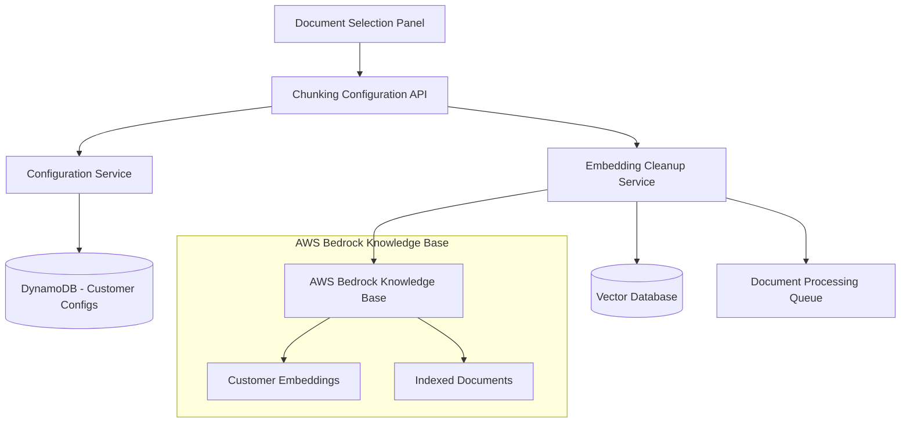

# Design Document: Knowledge Base Chunking Configuration

## Overview

This design implements a knowledge base chunking configuration system that allows per-customer selection of AWS Bedrock Knowledge Base chunking methods. The system provides a dropdown interface in the document selection panel, automatically cleans up previous embeddings when methods change, and ensures data consistency across the knowledge base.

## Architecture

### High-Level Architecture



### Component Interaction Flow

1. **Configuration Selection**: User selects chunking method in UI dropdown
2. **Validation**: System validates method against AWS Bedrock supported options
3. **Cleanup Initiation**: System identifies existing embeddings for customer
4. **Embedding Removal**: Batch deletion of embeddings from knowledge base and vector database
5. **Configuration Update**: New chunking method saved to customer configuration
6. **Document Re-processing**: Existing documents queued for re-processing with new chunking method

## Components and Interfaces

### 1. Frontend Components

#### ChunkingMethodSelector Component
```typescript
interface ChunkingMethodSelectorProps {
  customerUUID: string;
  currentMethod: ChunkingMethod;
  onMethodChange: (method: ChunkingMethod, requiresCleanup: boolean) => void;
  isLoading: boolean;
  isCleanupInProgress: boolean;
}

interface ChunkingMethod {
  id: string;
  name: string;
  description: string;
  parameters: ChunkingParameters;
}

interface ChunkingParameters {
  chunkSize?: number;
  chunkOverlap?: number;
  strategy: 'fixed_size' | 'semantic' | 'hierarchical' | 'default';
  maxTokens?: number;
}
```

#### Integration with DocumentSelectionPanel
- Add chunking method dropdown to panel header
- Display current method and allow selection
- Show cleanup progress when in progress
- Handle method change confirmations

### 2. Backend Services

#### ChunkingConfigurationService
```typescript
class ChunkingConfigurationService {
  async getCustomerChunkingConfig(customerUUID: string, tenantId: string): Promise<ChunkingMethod>
  async updateCustomerChunkingConfig(customerUUID: string, tenantId: string, method: ChunkingMethod): Promise<void>
  async validateChunkingMethod(method: ChunkingMethod): Promise<boolean>
  async getAvailableChunkingMethods(): Promise<ChunkingMethod[]>
  
  // Uses existing CustomerRecord table with new fields
  private async updateCustomerRecord(customerUUID: string, updates: Partial<CustomerRecord>): Promise<void>
}
```

#### EmbeddingCleanupService
```typescript
class EmbeddingCleanupService {
  async cleanupCustomerEmbeddings(customerUUID: string, tenantId: string): Promise<CleanupResult>
  async identifyCustomerEmbeddings(customerUUID: string): Promise<string[]>
  async removeEmbeddingsFromKnowledgeBase(embeddingIds: string[]): Promise<void>
  async removeEmbeddingsFromVectorDB(embeddingIds: string[]): Promise<void>
  async triggerDocumentReprocessing(customerUUID: string, tenantId: string): Promise<void>
  
  // Uses existing DocumentRecord table to track embedding IDs
  private async updateDocumentEmbeddingStatus(documentId: string, customerUUID: string, status: string): Promise<void>
  private async getCustomerDocuments(customerUUID: string, tenantId: string): Promise<DocumentRecord[]>
}

interface CleanupResult {
  success: boolean;
  embeddingsRemoved: number;
  documentsQueued: number;
  errors: string[];
  duration: number;
}
```

### 3. API Endpoints

#### GET /customers/{customerUUID}/chunking-config
- Retrieve current chunking configuration for customer
- Returns current method and available options

#### PUT /customers/{customerUUID}/chunking-config
- Update chunking method for customer
- Triggers embedding cleanup if method changes
- Returns cleanup status and progress

#### GET /chunking-methods
- List all available chunking methods
- Returns method details and parameters

#### POST /customers/{customerUUID}/chunking-config/cleanup
- Manually trigger embedding cleanup
- Returns cleanup job ID for progress tracking

#### GET /customers/{customerUUID}/chunking-config/cleanup/{jobId}
- Get cleanup job status and progress
- Returns completion status and results

## Data Models

### DynamoDB Schema

#### Existing CustomerRecord Table (Enhanced)
```typescript
interface CustomerRecord {
  uuid: string;                // Partition Key (existing)
  tenantId: string;            // For ABAC enforcement (existing)
  customerId: string;          // Unique within tenant (existing)
  email: string;               // (existing)
  createdAt: string;           // (existing)
  updatedAt: string;           // (existing)
  documentCount: number;       // (existing)
  
  // NEW: Chunking configuration fields
  chunkingMethod?: ChunkingMethod;
  chunkingConfigVersion?: number;
  lastChunkingUpdate?: string;
  chunkingCleanupStatus?: 'none' | 'in_progress' | 'completed' | 'failed';
  lastCleanupAt?: string;
}
```

#### Existing DocumentRecord Table (Enhanced)
```typescript
interface DocumentRecord {
  id: string;                  // Document ID (partition key) (existing)
  customerUuid: string;        // Sort key for DynamoDB (existing)
  tenantId: string;           // For ABAC enforcement (existing)
  fileName: string;           // (existing)
  s3Key: string;              // (existing)
  contentType: string;        // (existing)
  processingStatus: ProcessingStatus; // (existing)
  extractedText?: string;     // (existing)
  textLength?: number;        // (existing)
  processingMetadata?: ProcessingMetadata; // (existing)
  retryCount?: number;        // (existing)
  maxRetries?: number;        // (existing)
  createdAt: string;          // (existing)
  updatedAt: string;          // (existing)
  processingStartedAt?: string; // (existing)
  processingCompletedAt?: string; // (existing)
  errorMessage?: string;      // (existing)
  
  // NEW: Chunking-related fields
  chunkingMethod?: ChunkingMethod;
  embeddingIds?: string[];    // References to embeddings in knowledge base
  lastEmbeddingUpdate?: string;
  embeddingStatus?: 'none' | 'pending' | 'completed' | 'failed';
}
```

#### Optional: Cleanup Jobs Tracking (Use existing or add minimal tracking)
If we need detailed cleanup job tracking, we can add a simple field to CustomerRecord:
```typescript
interface CleanupJobInfo {
  jobId: string;
  status: 'pending' | 'in_progress' | 'completed' | 'failed';
  startedAt: string;
  progress: number;           // 0-100
  embeddingsToRemove: number;
  embeddingsRemoved: number;
  errors: string[];
}

// Add to CustomerRecord:
currentCleanupJob?: CleanupJobInfo;
```

### AWS Bedrock Knowledge Base Integration

#### Supported Chunking Methods
```typescript
const SUPPORTED_CHUNKING_METHODS: ChunkingMethod[] = [
  {
    id: 'default',
    name: 'Default Chunking',
    description: 'AWS Bedrock default chunking strategy',
    parameters: { strategy: 'default' }
  },
  {
    id: 'fixed_size_512',
    name: 'Fixed Size (512 tokens)',
    description: 'Fixed-size chunks with 512 token limit',
    parameters: { 
      strategy: 'fixed_size', 
      chunkSize: 512, 
      chunkOverlap: 50 
    }
  },
  {
    id: 'fixed_size_1024',
    name: 'Fixed Size (1024 tokens)',
    description: 'Fixed-size chunks with 1024 token limit',
    parameters: { 
      strategy: 'fixed_size', 
      chunkSize: 1024, 
      chunkOverlap: 100 
    }
  },
  {
    id: 'semantic',
    name: 'Semantic Chunking',
    description: 'Chunks based on semantic boundaries',
    parameters: { 
      strategy: 'semantic', 
      maxTokens: 800 
    }
  },
  {
    id: 'hierarchical',
    name: 'Hierarchical Chunking',
    description: 'Multi-level chunking for complex documents',
    parameters: { 
      strategy: 'hierarchical', 
      chunkSize: 1024, 
      chunkOverlap: 200 
    }
  }
];
```

## Correctness Properties

*A property is a characteristic or behavior that should hold true across all valid executions of a system-essentially, a formal statement about what the system should do. Properties serve as the bridge between human-readable specifications and machine-verifiable correctness guarantees.*

### Property 1: Configuration Consistency
*For any* customer and chunking method selection, the stored configuration should always match the method used for document processing
**Validates: Requirements 3.1, 3.2, 6.2**

### Property 2: Embedding Cleanup Completeness
*For any* customer chunking method change, all previous embeddings for that customer should be removed before new embeddings are created
**Validates: Requirements 4.1, 4.2, 4.3**

### Property 3: Tenant Isolation
*For any* chunking configuration operation, only data belonging to the authenticated tenant should be accessible or modifiable
**Validates: Requirements 3.1, 6.2**

### Property 4: Method Validation
*For any* chunking method selection, the method should be validated against AWS Bedrock supported options before being saved
**Validates: Requirements 2.5, 6.1**

### Property 5: Cleanup Atomicity
*For any* embedding cleanup operation, either all embeddings are successfully removed or the operation fails completely without partial cleanup
**Validates: Requirements 4.1, 4.5, 7.4**

### Property 6: Configuration Persistence
*For any* successfully saved chunking configuration, retrieving the configuration should return the same method and parameters
**Validates: Requirements 6.2, 6.3**

## Error Handling

### Error Categories

1. **Validation Errors**
   - Invalid chunking method selection
   - Unsupported parameter combinations
   - Missing required configuration fields

2. **AWS Service Errors**
   - Bedrock Knowledge Base API failures
   - Vector database connection issues
   - Embedding deletion failures

3. **System Errors**
   - DynamoDB operation failures
   - Concurrent modification conflicts
   - Resource exhaustion during cleanup

4. **Business Logic Errors**
   - Attempting to change method during active cleanup
   - Configuration conflicts with existing documents
   - Tenant access violations

### Error Recovery Strategies

1. **Retry with Exponential Backoff**
   - AWS service temporary failures
   - Network connectivity issues
   - Rate limiting responses

2. **Rollback Operations**
   - Failed configuration updates
   - Partial cleanup failures
   - Invalid method applications

3. **Graceful Degradation**
   - Use default chunking when configuration unavailable
   - Continue with existing embeddings if cleanup fails
   - Provide manual cleanup options

## Testing Strategy

### Unit Testing
- Test chunking method validation logic
- Test configuration persistence operations
- Test embedding cleanup service methods
- Test error handling and recovery mechanisms

### Property-Based Testing
- Test configuration consistency across all supported methods
- Test embedding cleanup completeness with random customer data
- Test tenant isolation with concurrent operations
- Test method validation with various input combinations
- Test cleanup atomicity with simulated failures

### Integration Testing
- Test AWS Bedrock Knowledge Base integration
- Test vector database operations
- Test document re-processing pipeline
- Test end-to-end chunking method changes

### Performance Testing
- Test cleanup operations with large embedding sets
- Test concurrent chunking method changes
- Test system responsiveness during cleanup operations
- Test memory usage during batch operations

## Security Considerations

### Authentication and Authorization
- Validate tenant access for all chunking operations
- Ensure customer-specific configuration isolation
- Implement proper API authentication

### Data Protection
- Encrypt chunking configurations at rest
- Secure embedding cleanup operations
- Audit all configuration changes

### Access Control
- Restrict chunking method changes to authorized users
- Implement rate limiting for configuration updates
- Log all administrative operations

## Performance Considerations

### Scalability
- Use batch operations for embedding cleanup
- Implement cleanup job queuing for concurrent operations
- Optimize DynamoDB queries with proper indexing

### Efficiency
- Cache available chunking methods
- Use pagination for large embedding sets
- Implement progress tracking for long-running operations

### Resource Management
- Limit concurrent cleanup operations
- Monitor memory usage during batch operations
- Implement cleanup timeouts and cancellation