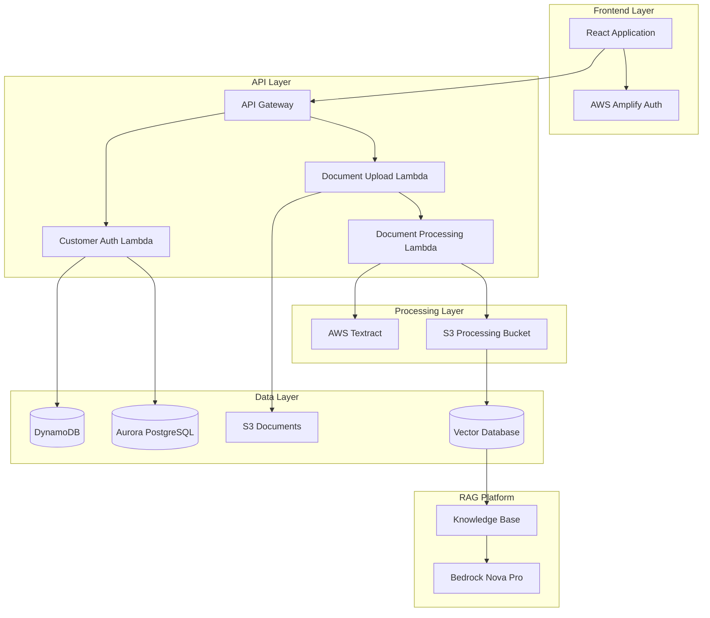

# Design Document: Multi-Tenant Document Manager

## Overview

The Multi-Tenant Document Manager is a React-based web application that enables secure document upload and processing within a multi-tenant RAG platform. The system provides tenant-isolated document management with automatic text extraction, customer management, and seamless integration with the existing RAG platform infrastructure.

## Architecture

The system follows a serverless architecture pattern with clear separation between frontend, API, and data layers:



## Components and Interfaces

### Frontend Components

#### 1. DocumentUploadForm
**Purpose**: Main upload interface for documents
**Props**:
- `onUploadSuccess: (result: UploadResult) => void`
- `onUploadError: (error: Error) => void`

**State**:
```typescript
interface UploadFormState {
  tenantId: string;
  customerEmail: string;
  selectedFile: File | null;
  isUploading: boolean;
  uploadProgress: number;
  processingStatus: ProcessingStatus;
}
```

#### 2. AuthenticationWrapper
**Purpose**: Handles Cognito authentication and tenant context
**Props**:
- `children: React.ReactNode`

**Context**:
```typescript
interface AuthContext {
  user: CognitoUser | null;
  tenantId: string;
  isAuthenticated: boolean;
  signIn: () => Promise<void>;
  signOut: () => Promise<void>;
}
```

#### 3. ProcessingStatusIndicator
**Purpose**: Shows real-time document processing status
**Props**:
- `status: ProcessingStatus`
- `progress: number`

### Backend Components

#### 1. Customer Manager Lambda
**Purpose**: Handle customer creation and UUID generation
**Environment Variables**:
- `DYNAMODB_TABLE_NAME`
- `AURORA_CLUSTER_ENDPOINT`
- `USER_POOL_ID`

**Interface**:
```typescript
interface CustomerManagerEvent {
  tenantId: string;
  customerEmail: string;
}

interface CustomerManagerResponse {
  customerUUID: string;
  customerId: string;
  isNewCustomer: boolean;
}
```

#### 2. Document Upload Lambda
**Purpose**: Handle file uploads and initiate processing
**Environment Variables**:
- `DOCUMENTS_BUCKET`
- `PROCESSING_QUEUE_URL`

**Interface**:
```typescript
interface DocumentUploadEvent {
  tenantId: string;
  customerUUID: string;
  fileData: string; // base64 encoded
  fileName: string;
  contentType: string;
}

interface DocumentUploadResponse {
  documentId: string;
  s3Key: string;
  processingStatus: 'queued' | 'processing' | 'completed' | 'failed';
}
```

#### 3. Document Processing Lambda
**Purpose**: Extract text using Textract and prepare for RAG platform
**Environment Variables**:
- `BEDROCK_REGION`
- `KNOWLEDGE_BASE_ID`
- `VECTOR_DB_ENDPOINT`

**Interface**:
```typescript
interface DocumentProcessingEvent {
  s3Bucket: string;
  s3Key: string;
  customerUUID: string;
  tenantId: string;
  documentType: string;
}

interface DocumentProcessingResponse {
  extractedText: string;
  processingStatus: 'completed' | 'failed';
  errorMessage?: string;
}
```

## Data Models

### DynamoDB Schema

#### Customers Table
```typescript
interface CustomerRecord {
  PK: string; // Customer UUID (partition key)
  tenantId: string; // GSI-1 partition key
  customerId: string;
  email: string; // GSI-2 partition key
  createdAt: string;
  updatedAt: string;
  documentCount: number;
}

// Global Secondary Indexes
// GSI-1: tenant-id-index (tenantId, customerId)
// GSI-2: email-index (email)
```

#### Documents Table
```typescript
interface DocumentRecord {
  PK: string; // Document ID (partition key)
  SK: string; // Customer UUID (sort key)
  tenantId: string; // GSI-1 partition key
  fileName: string;
  s3Key: string;
  contentType: string;
  processingStatus: 'queued' | 'processing' | 'completed' | 'failed';
  extractedText?: string;
  createdAt: string;
  updatedAt: string;
}

// Global Secondary Indexes
// GSI-1: tenant-documents-index (tenantId, createdAt)
```

### Aurora PostgreSQL Schema

```sql
-- Customers table with row-level security
CREATE TABLE customers (
    uuid UUID PRIMARY KEY,
    tenant_id VARCHAR(50) NOT NULL,
    customer_id VARCHAR(50) NOT NULL,
    email VARCHAR(255) NOT NULL,
    created_at TIMESTAMP DEFAULT CURRENT_TIMESTAMP,
    updated_at TIMESTAMP DEFAULT CURRENT_TIMESTAMP,
    document_count INTEGER DEFAULT 0,
    UNIQUE(tenant_id, customer_id),
    UNIQUE(tenant_id, email)
);

-- Documents table with row-level security
CREATE TABLE documents (
    id UUID PRIMARY KEY DEFAULT gen_random_uuid(),
    customer_uuid UUID REFERENCES customers(uuid),
    tenant_id VARCHAR(50) NOT NULL,
    file_name VARCHAR(255) NOT NULL,
    s3_key VARCHAR(500) NOT NULL,
    content_type VARCHAR(100) NOT NULL,
    processing_status VARCHAR(20) DEFAULT 'queued',
    extracted_text TEXT,
    created_at TIMESTAMP DEFAULT CURRENT_TIMESTAMP,
    updated_at TIMESTAMP DEFAULT CURRENT_TIMESTAMP
);

-- Row-level security policies
CREATE POLICY tenant_isolation_customers ON customers
    FOR ALL TO application_role
    USING (tenant_id = current_setting('app.current_tenant_id'));

CREATE POLICY tenant_isolation_documents ON documents
    FOR ALL TO application_role
    USING (tenant_id = current_setting('app.current_tenant_id'));

-- Enable RLS
ALTER TABLE customers ENABLE ROW LEVEL SECURITY;
ALTER TABLE documents ENABLE ROW LEVEL SECURITY;
```

## Correctness Properties

*A property is a characteristic or behavior that should hold true across all valid executions of a system-essentially, a formal statement about what the system should do. Properties serve as the bridge between human-readable specifications and machine-verifiable correctness guarantees.*

Based on the prework analysis, here are the key correctness properties that must hold for this system:

### Property 1: File Type Validation
*For any* file upload attempt, the system should accept files with supported extensions (PDF, DOC, DOCX, TXT, JPG, PNG) and reject files with unsupported extensions
**Validates: Requirements 1.2**

### Property 2: Customer UUID Determinism
*For any* given tenant_id and customer_id combination, the generated Customer_UUID should always be identical across multiple invocations
**Validates: Requirements 2.2**

### Property 3: Dual Database Consistency
*For any* customer record creation, the same customer data should be retrievable from both DynamoDB and Aurora PostgreSQL using the Customer_UUID
**Validates: Requirements 2.3**

### Property 4: Customer Lookup Idempotence
*For any* existing tenant_id and customer email combination, repeated lookups should always return the same Customer_UUID
**Validates: Requirements 2.4**

### Property 5: Tenant ID Inclusion
*For any* customer record stored in either database, the tenant_id field should always be present and non-empty
**Validates: Requirements 2.5**

### Property 6: Document Processing Routing
*For any* uploaded document, text files (TXT) should bypass Textract processing while non-text files should be routed through Textract
**Validates: Requirements 3.1, 3.2**

### Property 7: S3 Metadata Completeness
*For any* document uploaded to S3, the object metadata should contain both Customer_UUID and tenant_id
**Validates: Requirements 3.4**

### Property 8: JWT Tenant Extraction
*For any* valid JWT token with custom attributes, the tenant_id should be correctly extracted and available for ABAC enforcement
**Validates: Requirements 4.2**

### Property 9: Database Query Tenant Filtering
*For any* database query operation, the query should include tenant_id filtering to ensure data isolation
**Validates: Requirements 4.3, 5.3**

### Property 10: DynamoDB Schema Compliance
*For any* record stored in DynamoDB, it should use Customer_UUID as partition key and have tenant_id available for GSI queries
**Validates: Requirements 5.1**

### Property 11: PostgreSQL Tenant Context
*For any* Aurora PostgreSQL connection, the tenant context should be set before executing queries to enable row-level security
**Validates: Requirements 4.5**

### Property 12: UUID Stability During Updates
*For any* customer email update operation, the Customer_UUID should remain unchanged while the email field is updated
**Validates: Requirements 5.5**

### Property 13: Error Logging Completeness
*For any* error that occurs in the system, the log entry should contain tenant_id, customer_id (if available), and detailed error information
**Validates: Requirements 6.1**

### Property 14: Textract Retry Logic
*For any* Textract processing failure, the system should attempt exactly 3 retries before marking the document as failed
**Validates: Requirements 6.2**

### Property 15: Resource Cleanup on Failure
*For any* failed upload operation, no partial resources should remain in S3, DynamoDB, or Aurora PostgreSQL
**Validates: Requirements 6.5**

## Error Handling

### Error Categories

1. **Authentication Errors**
   - Invalid JWT tokens
   - Missing tenant_id in token
   - Expired authentication

2. **Validation Errors**
   - Unsupported file types
   - Missing required fields
   - Invalid email formats

3. **Processing Errors**
   - Textract service failures
   - S3 upload failures
   - Database connection issues

4. **Business Logic Errors**
   - Duplicate customer creation attempts
   - Tenant isolation violations
   - Resource quota exceeded

### Error Response Format

```typescript
interface ErrorResponse {
  error: {
    code: string;
    message: string;
    details?: Record<string, any>;
    timestamp: string;
    requestId: string;
  };
}
```

### Retry Strategies

- **Textract Operations**: Exponential backoff, 3 retries
- **Database Operations**: Immediate retry once, then fail
- **S3 Operations**: Exponential backoff, 2 retries

## Testing Strategy

### Dual Testing Approach

The system will use both unit tests and property-based tests to ensure comprehensive coverage:

#### Unit Tests
- Specific examples demonstrating correct behavior
- Edge cases and error conditions
- Integration points between components
- UI component rendering and interaction

#### Property-Based Tests
- Universal properties across all inputs using **fast-check** library
- Minimum 100 iterations per property test
- Each property test tagged with: **Feature: multi-tenant-document-manager, Property {number}: {property_text}**

### Test Configuration

```typescript
// Property test configuration
import fc from 'fast-check';

const propertyTestConfig = {
  numRuns: 100,
  timeout: 5000,
  seed: 42 // for reproducible tests
};

// Example property test structure
describe('Feature: multi-tenant-document-manager', () => {
  it('Property 1: File Type Validation', () => {
    fc.assert(fc.property(
      fc.string(), // filename
      fc.oneof(...supportedExtensions, ...unsupportedExtensions),
      (filename, extension) => {
        const file = createMockFile(filename + extension);
        const result = validateFileType(file);
        return supportedExtensions.includes(extension) ? 
          result.isValid : !result.isValid;
      }
    ), propertyTestConfig);
  });
});
```

### Testing Framework Selection

- **Frontend**: Jest + React Testing Library + fast-check
- **Backend**: Jest + AWS SDK mocks + fast-check
- **Integration**: Testcontainers for local DynamoDB/PostgreSQL testing

<function_calls>
<invoke name="prework">
<parameter name="featureName">multi-tenant-document-manager