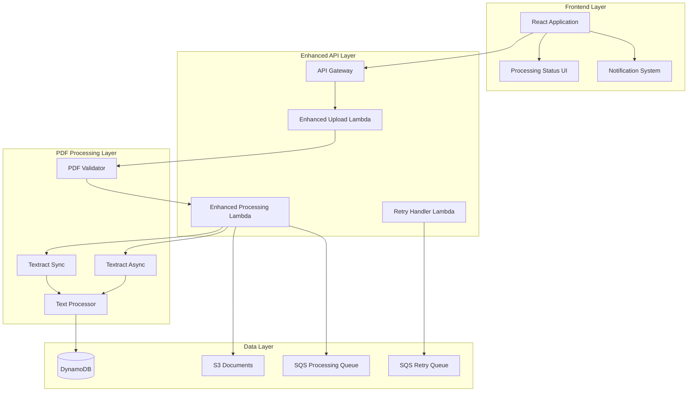

# Design Document: PDF Processing Enhancement

## Overview

This design enhances the existing multi-tenant document management system to provide robust, reliable PDF processing with improved error handling, user feedback, and performance optimization. The enhancement focuses on fixing current PDF processing failures while maintaining the existing architecture and adding new capabilities for better document processing reliability.

## Architecture

The enhanced PDF processing system extends the existing serverless architecture with improved components:



## Components and Interfaces

### Enhanced Frontend Components

#### 1. ProcessingStatusTracker
**Purpose**: Real-time tracking of document processing status
**Props**:
```typescript
interface ProcessingStatusTrackerProps {
  documentId: string;
  onStatusUpdate: (status: ProcessingStatus) => void;
}

interface ProcessingStatus {
  status: 'queued' | 'processing' | 'completed' | 'failed';
  progress: number;
  startTime?: string;
  completionTime?: string;
  errorMessage?: string;
  textPreview?: string;
  processingDuration?: number;
}
```

#### 2. PDFProcessingNotifications
**Purpose**: User notifications for PDF processing events
**Props**:
```typescript
interface PDFProcessingNotificationsProps {
  notifications: ProcessingNotification[];
  onDismiss: (id: string) => void;
  onRetry: (documentId: string) => void;
}

interface ProcessingNotification {
  id: string;
  type: 'success' | 'error' | 'warning' | 'info';
  title: string;
  message: string;
  documentId?: string;
  actions?: NotificationAction[];
}
```

#### 3. DocumentListWithStatus
**Purpose**: Enhanced document list showing processing status
**Props**:
```typescript
interface DocumentListWithStatusProps {
  documents: DocumentWithStatus[];
  onRetryProcessing: (documentId: string) => void;
  onViewDetails: (documentId: string) => void;
}

interface DocumentWithStatus {
  id: string;
  fileName: string;
  contentType: string;
  processingStatus: ProcessingStatus;
  textLength?: number;
  errorDetails?: string;
  retryCount: number;
  canRetry: boolean;
}
```

### Enhanced Backend Components

#### 1. PDF Validator Service
**Purpose**: Comprehensive PDF validation before processing
**Interface**:
```typescript
interface PDFValidatorService {
  validatePDF(fileBuffer: Buffer, fileName: string): Promise<PDFValidationResult>;
}

interface PDFValidationResult {
  isValid: boolean;
  pdfVersion?: string;
  isEncrypted: boolean;
  hasTextContent: boolean;
  pageCount: number;
  fileSizeBytes: number;
  errors: ValidationError[];
  warnings: ValidationWarning[];
}

interface ValidationError {
  code: string;
  message: string;
  severity: 'error' | 'warning';
  suggestedAction?: string;
}
```

#### 2. Enhanced Textract Service
**Purpose**: Optimized Textract integration with retry logic
**Interface**:
```typescript
interface EnhancedTextractService {
  extractText(params: TextractExtractionParams): Promise<TextractResult>;
  extractWithRetry(params: TextractExtractionParams, retryConfig: RetryConfig): Promise<TextractResult>;
}

interface TextractExtractionParams {
  s3Bucket: string;
  s3Key: string;
  documentType: 'simple' | 'forms' | 'tables';
  processingMode: 'sync' | 'async';
  maxPages?: number;
}

interface TextractResult {
  extractedText: string;
  confidence: number;
  pageCount: number;
  processingTime: number;
  textBlocks: TextBlock[];
  forms?: FormData[];
  tables?: TableData[];
}

interface RetryConfig {
  maxRetries: number;
  baseDelayMs: number;
  maxDelayMs: number;
  backoffMultiplier: number;
}
```

#### 3. Processing Status Manager
**Purpose**: Centralized status tracking and updates
**Interface**:
```typescript
interface ProcessingStatusManager {
  updateStatus(documentId: string, status: ProcessingStatusUpdate): Promise<void>;
  getStatus(documentId: string): Promise<ProcessingStatus>;
  subscribeToUpdates(documentId: string, callback: StatusUpdateCallback): void;
}

interface ProcessingStatusUpdate {
  status: 'queued' | 'processing' | 'completed' | 'failed';
  progress?: number;
  errorMessage?: string;
  metadata?: Record<string, any>;
  timestamp: string;
}
```

## Data Models

### Enhanced Document Record
```typescript
interface EnhancedDocumentRecord {
  id: string;
  customerUuid: string;
  tenantId: string;
  fileName: string;
  s3Key: string;
  contentType: string;
  processingStatus: ProcessingStatus;
  extractedText?: string;
  textLength?: number;
  processingMetadata: ProcessingMetadata;
  retryCount: number;
  maxRetries: number;
  createdAt: string;
  updatedAt: string;
  processingStartedAt?: string;
  processingCompletedAt?: string;
}

interface ProcessingMetadata {
  pdfVersion?: string;
  pageCount?: number;
  isEncrypted: boolean;
  hasTextContent: boolean;
  textractJobId?: string;
  processingMode: 'sync' | 'async';
  confidence?: number;
  errorDetails?: ErrorDetails;
  retryHistory: RetryAttempt[];
}

interface ErrorDetails {
  errorCode: string;
  errorMessage: string;
  errorType: 'validation' | 'textract' | 'processing' | 'system';
  suggestedAction: string;
  isRetryable: boolean;
}

interface RetryAttempt {
  attemptNumber: number;
  timestamp: string;
  errorMessage: string;
  nextRetryAt?: string;
}
```

### Processing Queue Messages
```typescript
interface ProcessingQueueMessage {
  documentId: string;
  customerUuid: string;
  tenantId: string;
  s3Bucket: string;
  s3Key: string;
  contentType: string;
  processingMode: 'sync' | 'async';
  retryCount: number;
  priority: 'high' | 'normal' | 'low';
}

interface RetryQueueMessage extends ProcessingQueueMessage {
  originalError: string;
  retryAfter: string;
  backoffDelay: number;
}
```

## Correctness Properties

*A property is a characteristic or behavior that should hold true across all valid executions of a system-essentially, a formal statement about what the system should do. Properties serve as the bridge between human-readable specifications and machine-verifiable correctness guarantees.*

### Property 1: PDF Validation Consistency
*For any* uploaded file claiming to be a PDF, the PDF validator should correctly identify whether it's a valid PDF format and provide consistent validation results
**Validates: Requirements 1.1, 4.1**

### Property 2: Status Progression Correctness
*For any* document processing workflow, status transitions should follow the correct sequence: queued → processing → (completed | failed), with proper timestamps
**Validates: Requirements 3.1, 3.2, 3.3, 3.4**

### Property 3: Textract Configuration Appropriateness
*For any* valid PDF document, the system should select the appropriate Textract method (DetectDocumentText vs AnalyzeDocument) based on document content analysis
**Validates: Requirements 5.1, 5.2**

### Property 4: Retry Logic Reliability
*For any* failed processing attempt due to transient errors, the retry mechanism should implement exponential backoff with proper delay calculations and maximum retry limits
**Validates: Requirements 2.2, 5.5**

### Property 5: Text Extraction Completeness
*For any* successfully processed PDF, the extracted text should be non-empty (unless the PDF contains no text) and properly ordered from Textract blocks
**Validates: Requirements 1.4, 5.3**

### Property 6: Error Handling Specificity
*For any* processing failure, the error handler should provide specific error messages and appropriate suggested actions based on the failure type
**Validates: Requirements 2.1, 2.3, 2.4, 2.5**

### Property 7: Processing Mode Selection
*For any* PDF document, the system should choose synchronous processing for files under 5MB and asynchronous processing for larger files
**Validates: Requirements 7.2, 7.3**

### Property 8: Status Display Completeness
*For any* document in the system, the UI should display all required processing metadata including status, duration, and error information when applicable
**Validates: Requirements 3.5, 6.4**

### Property 9: Summary Integration Accuracy
*For any* document summary generation, only documents with successfully extracted text should be included, with failed documents clearly excluded
**Validates: Requirements 8.1, 8.2**

### Property 10: Notification Appropriateness
*For any* processing completion or failure event, the system should display appropriate notifications with correct content and available actions
**Validates: Requirements 6.1, 6.2, 6.5**

### Property 11: Validation Boundary Enforcement
*For any* PDF upload, the system should enforce size limits (500MB), version compatibility (1.0-2.0), and encryption restrictions consistently
**Validates: Requirements 4.2, 4.3, 4.4**

### Property 12: Concurrency Management
*For any* multiple document upload scenario, the system should process documents in parallel while respecting concurrency limits and resource constraints
**Validates: Requirements 7.4**

### Property 13: Cache Consistency
*For any* successfully processed document, the extracted text should be cached and reused for subsequent operations without reprocessing
**Validates: Requirements 7.5**

### Property 14: Multi-page Processing Completeness
*For any* multi-page PDF document, the system should process all pages and combine text in correct reading order
**Validates: Requirements 5.4**

### Property 15: Text Quality Validation
*For any* extracted text, the system should validate text quality and length before including it in summaries or other operations
**Validates: Requirements 8.5**

## Error Handling

### Error Categories
1. **Validation Errors**: Invalid PDF format, encryption, size limits
2. **Textract Errors**: Service unavailable, throttling, processing failures
3. **System Errors**: Database failures, S3 errors, network issues
4. **Business Logic Errors**: Empty text extraction, unsupported content

### Error Recovery Strategies
- **Immediate Retry**: For transient network or service errors
- **Exponential Backoff**: For rate limiting and service throttling
- **Manual Retry**: For user-correctable issues (file format, encryption)
- **Graceful Degradation**: Continue processing other documents when one fails

### User Communication
- **Specific Error Messages**: Clear explanation of what went wrong
- **Suggested Actions**: Concrete steps the user can take
- **Progress Indicators**: Show processing status and estimated completion
- **Retry Options**: Allow users to retry failed processing

## Testing Strategy

### Unit Testing
- PDF validation logic with various file types and corruption scenarios
- Textract service integration with mocked responses
- Status update mechanisms and state transitions
- Error handling for different failure scenarios
- Retry logic with various backoff configurations

### Property-Based Testing
- Each correctness property implemented as a property-based test
- Minimum 100 iterations per property test
- Test tags: **Feature: pdf-processing-enhancement, Property {number}: {property_text}**
- Focus on edge cases and boundary conditions
- Comprehensive input generation for PDF validation scenarios

### Integration Testing
- End-to-end PDF processing workflows
- Real Textract service integration testing
- Database consistency during processing failures
- UI notification and status update integration
- Multi-document concurrent processing scenarios

### Performance Testing
- Large PDF processing performance
- Concurrent document processing limits
- Memory usage during text extraction
- Database query performance with enhanced metadata
- UI responsiveness during bulk operations

The testing approach ensures both specific examples work correctly (unit tests) and universal properties hold across all inputs (property tests), providing comprehensive coverage for the enhanced PDF processing system.