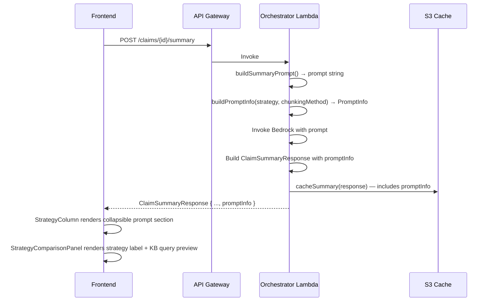

# Design Document: Prompt Visibility

## Overview

This feature adds prompt visibility to the claim summary API and comparison UI. Currently, the orchestrator builds LLM prompts internally and discards the metadata after invocation. This design introduces a `PromptInfo` type that captures the prompt template (with documents replaced by a placeholder), the strategy label, and the optional retrieval query. The orchestrator populates this on every summary generation, includes it in cached responses, and the frontend renders it in both the detailed `StrategyColumn` (collapsible section) and the `StrategyComparisonPanel` (compact preview).

The change is additive and backward-compatible: `promptInfo` is optional on `ClaimSummaryResponse`, so older clients and cached responses without it continue to work.

## Architecture



The data flow is straightforward:

1. The orchestrator already calls `buildSummaryPrompt(documentsText, strategyLabel)`. A new helper `buildPromptInfo(strategyLabel, retrievalQuery?)` constructs the `PromptInfo` object using the same prompt template but with `[DOCUMENTS]` as a placeholder instead of actual document text.
2. Each strategy execution function (`executeFullContextStrategy`, `executeRagStrategy`, `executeGraphRagStrategy`) returns the `PromptInfo` alongside the existing summary/anomalies.
3. `handlePostSummary` attaches `promptInfo` to the `ClaimSummaryResponse` before caching and returning.
4. The cache stores the full response object (including `promptInfo`) in S3 — no cache schema changes needed.
5. Frontend components read `response.promptInfo` and render accordingly.

## Components and Interfaces

### Backend Changes

#### New `buildPromptInfo` helper (claim-summary-orchestrator.ts)

```typescript
function buildPromptInfo(
  strategyLabel: string,
  retrievalQuery?: string
): PromptInfo {
  const promptTemplate = buildSummaryPrompt('[DOCUMENTS]', strategyLabel);
  return {
    promptTemplate,
    strategyLabel,
    ...(retrievalQuery !== undefined && { retrievalQuery }),
  };
}
```

This reuses the existing `buildSummaryPrompt` function with a placeholder string, ensuring the template always stays in sync with the actual prompt.

#### Strategy function return type changes

Each strategy function's return type gains a `promptInfo` field:

- `executeFullContextStrategy` → calls `buildPromptInfo('full-context')` (no retrieval query)
- `executeRagStrategy` → calls `buildPromptInfo('rag ({chunkingMethod} chunking)', retrievalQueryText)`
- `executeGraphRagStrategy` → calls `buildPromptInfo('graph-rag (Neptune Analytics GraphRAG)', retrievalQueryText)`

The retrieval query text is the same string already used in the `RetrieveCommand` input: `"Summarize insurance claim {claimId} including patient information, diagnoses, procedures, service dates, provider details, and amounts. Identify any data anomalies."`

#### `handlePostSummary` changes

After receiving the strategy result, attach `promptInfo` to the `ClaimSummaryResponse` object before caching and returning. For the graph-rag fallback-to-full-context path, use the full-context prompt info.

### Frontend Changes

#### StrategyColumn.tsx — Collapsible Prompt Section

A new collapsible section rendered between evaluation scores and summary text:

```tsx
// Collapsed by default, toggled via local state
const [promptExpanded, setPromptExpanded] = useState(false);

{response.promptInfo && (
  <div data-testid={`prompt-section-${strategyKey}`}>
    <button onClick={() => setPromptExpanded(!promptExpanded)}>
      {promptExpanded ? '▼' : '▶'} LLM Prompt
    </button>
    {promptExpanded && (
      <div>
        {response.promptInfo.retrievalQuery && (
          <div data-testid={`retrieval-query-${strategyKey}`}>
            <strong>Retrieval Query:</strong>
            <pre>{response.promptInfo.retrievalQuery}</pre>
          </div>
        )}
        <pre style={{ maxHeight: '200px', overflow: 'auto', fontFamily: 'monospace' }}>
          {response.promptInfo.promptTemplate}
        </pre>
      </div>
    )}
  </div>
)}
```

#### StrategyComparisonPanel.tsx — Prompt Preview in Cards

Below the metadata row in each comparison card:

```tsx
{resp.promptInfo && (
  <div>
    <span>🏷️ {resp.promptInfo.strategyLabel}</span>
    {resp.promptInfo.retrievalQuery && (
      <span>🔍 KB Query: {resp.promptInfo.retrievalQuery.slice(0, 80)}…</span>
    )}
  </div>
)}
```

The local `ClaimSummaryResponse` interface in this file also gets the optional `promptInfo` field.

#### claimApi.ts — parseClaimSummaryResponse update

Add optional validation for `promptInfo`:

```typescript
if (data.promptInfo !== undefined) {
  if (typeof data.promptInfo !== 'object' || data.promptInfo === null) {
    errors.push('promptInfo must be object');
  } else {
    if (typeof data.promptInfo.promptTemplate !== 'string')
      errors.push('promptInfo.promptTemplate must be string');
    if (typeof data.promptInfo.strategyLabel !== 'string')
      errors.push('promptInfo.strategyLabel must be string');
    if (data.promptInfo.retrievalQuery !== undefined &&
        typeof data.promptInfo.retrievalQuery !== 'string')
      errors.push('promptInfo.retrievalQuery must be string');
  }
}
```

## Data Models

### New PromptInfo Interface

```typescript
// src/types/claim-summary.ts
export interface PromptInfo {
  /** The full prompt template with "[DOCUMENTS]" placeholder instead of actual document text */
  promptTemplate: string;
  /** The strategy label string embedded in the prompt */
  strategyLabel: string;
  /** The retrieval query sent to KB Retrieve API (rag and graph-rag only) */
  retrievalQuery?: string;
}
```

### Updated ClaimSummaryResponse

```typescript
// Added field to existing interface
export interface ClaimSummaryResponse {
  // ... existing fields ...
  /** Prompt metadata for transparency. Present on all successful summaries. */
  promptInfo?: PromptInfo;
}
```

### Frontend Type Mirrors

The same `PromptInfo` shape is added to:
- `frontend/src/services/claimApi.ts` — `ClaimSummaryResponse` interface
- `frontend/src/components/StrategyComparisonPanel.tsx` — local `ClaimSummaryResponse` interface

### Cache Impact

No schema changes to `CachedSummary` or S3 storage format. The `cacheSummary` function stores the full `ClaimSummaryResponse` as JSON in S3, so `promptInfo` is automatically persisted and retrieved. Older cached entries without `promptInfo` remain valid since the field is optional.


## Correctness Properties

*A property is a characteristic or behavior that should hold true across all valid executions of a system — essentially, a formal statement about what the system should do. Properties serve as the bridge between human-readable specifications and machine-verifiable correctness guarantees.*

### Property 1: buildPromptInfo produces correct template and label

*For any* strategy label string, calling `buildPromptInfo(strategyLabel)` should return a `PromptInfo` where:
- `promptTemplate` equals `buildSummaryPrompt('[DOCUMENTS]', strategyLabel)` (the placeholder is embedded, not actual document text)
- `strategyLabel` equals the input strategy label exactly

This is a round-trip property: the template is derived from the same `buildSummaryPrompt` function used during actual generation, ensuring they never drift apart.

**Validates: Requirements 1.2, 1.3**

### Property 2: retrievalQuery presence matches strategy type

*For any* strategy type, the `promptInfo.retrievalQuery` field should be present (defined and non-empty) if and only if the strategy is `rag` or `graph-rag`. For `full-context`, `retrievalQuery` must be `undefined`.

**Validates: Requirements 1.4, 1.5**

### Property 3: Cache round-trip preserves promptInfo

*For any* valid `ClaimSummaryResponse` containing a `promptInfo` field, serializing it to JSON (as the cache does) and then deserializing it should produce an object with an identical `promptInfo` — same `promptTemplate`, same `strategyLabel`, and same `retrievalQuery` (or absence thereof).

**Validates: Requirements 2.1, 2.2**

### Property 4: StrategyColumn renders prompt section when promptInfo is present

*For any* `ClaimSummaryResponse` with a non-null `promptInfo`, the `StrategyColumn` component should render a prompt section element. Additionally, if `promptInfo.retrievalQuery` is defined, the rendered output should contain the retrieval query text within a labeled subsection.

**Validates: Requirements 5.1, 5.3**

### Property 5: StrategyColumn prompt section toggle behavior

*For any* sequence of N clicks on the prompt section header (starting from collapsed), the prompt content should be visible when N is odd and hidden when N is even.

**Validates: Requirements 5.4, 5.5**

### Property 6: ComparisonPanel displays prompt preview

*For any* comparison card whose response includes `promptInfo`, the card should display the `strategyLabel` text. If `promptInfo.retrievalQuery` is also present, the card should display a truncated preview containing the first 80 characters of the retrieval query.

**Validates: Requirements 6.1, 6.2**

### Property 7: parseClaimSummaryResponse validates promptInfo correctly

*For any* response object, `parseClaimSummaryResponse` should:
- Return valid when `promptInfo` is absent (backward compatibility)
- Return valid when `promptInfo` has string `promptTemplate`, string `strategyLabel`, and optionally string `retrievalQuery`
- Return invalid (with errors) when `promptInfo` is present but `promptTemplate` or `strategyLabel` is not a string, or when `retrievalQuery` is present but not a string

**Validates: Requirements 7.1, 7.2, 7.3**

## Error Handling

| Scenario | Handling |
|---|---|
| `buildPromptInfo` called with empty strategy label | Allowed — the function is deterministic and will produce a valid `PromptInfo` with an empty `strategyLabel`. Validation is the caller's responsibility. |
| Cached response missing `promptInfo` (old cache entries) | Frontend treats `promptInfo` as optional. The prompt section simply doesn't render. No errors. |
| `parseClaimSummaryResponse` receives malformed `promptInfo` | Returns `{ valid: false, errors: [...] }` with specific field-level error messages. Does not throw. |
| Bedrock invocation fails after `buildPromptInfo` is constructed | The existing 502 error path in `handlePostSummary` returns before attaching `promptInfo` to the response. No partial prompt data is leaked. |
| Graph-RAG fallback to full-context | `promptInfo` is rebuilt using the full-context strategy label, accurately reflecting what was actually sent to the LLM. |

## Testing Strategy

### Unit Tests (Jest)

Unit tests cover specific examples and edge cases:

- `buildPromptInfo` returns expected shape for each concrete strategy (`full-context`, `rag (semantic chunking)`, `graph-rag (Neptune Analytics GraphRAG)`)
- `buildPromptInfo` with `rag` strategy includes `retrievalQuery`; `full-context` omits it
- `parseClaimSummaryResponse` accepts a response without `promptInfo` (backward compat)
- `parseClaimSummaryResponse` rejects `promptInfo` with numeric `promptTemplate`
- `StrategyColumn` renders prompt section collapsed by default when `promptInfo` is present
- `StrategyColumn` does not render prompt section when `promptInfo` is absent
- `StrategyComparisonPanel` shows strategy label and truncated KB query in card
- `StrategyComparisonPanel` omits KB query indicator when `retrievalQuery` is absent

### Property-Based Tests (fast-check + Jest)

Each property test uses `fast-check` for input generation and runs a minimum of 100 iterations. Tests are tagged with the feature and property number.

- **Feature: prompt-visibility, Property 1: buildPromptInfo produces correct template and label** — Generate arbitrary strategy label strings, verify template equals `buildSummaryPrompt('[DOCUMENTS]', label)` and `strategyLabel` equals input.
- **Feature: prompt-visibility, Property 2: retrievalQuery presence matches strategy type** — Generate random strategy from `['full-context', 'rag', 'graph-rag']` and optional retrieval query, verify presence/absence rules.
- **Feature: prompt-visibility, Property 3: Cache round-trip preserves promptInfo** — Generate random `PromptInfo` objects, embed in `ClaimSummaryResponse`, serialize to JSON and deserialize, verify deep equality of `promptInfo`.
- **Feature: prompt-visibility, Property 4: StrategyColumn renders prompt section when promptInfo is present** — Generate random `promptInfo` with/without `retrievalQuery`, render `StrategyColumn`, verify prompt section presence and retrieval query rendering.
- **Feature: prompt-visibility, Property 5: StrategyColumn prompt section toggle behavior** — Generate random click count (1-20), simulate clicks, verify visibility matches parity.
- **Feature: prompt-visibility, Property 6: ComparisonPanel displays prompt preview** — Generate random `promptInfo` with varying `retrievalQuery` lengths, render `StrategyComparisonPanel`, verify label display and truncation to 80 chars.
- **Feature: prompt-visibility, Property 7: parseClaimSummaryResponse validates promptInfo correctly** — Generate random objects with valid/invalid `promptInfo` shapes, verify validation results match expected valid/invalid status.
