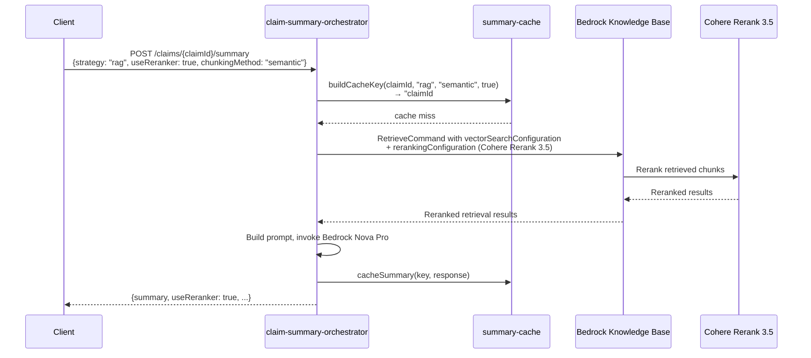

# Design Document: RAG Reranker Support

## Overview

This feature extends the existing Cohere Rerank 3.5 support from the `graph-rag` strategy to also cover the `rag` strategy in the Claim Summary Orchestrator. The reranker improves retrieval quality by reordering Knowledge Base chunks by relevance before they are passed to the LLM for summarization.

The implementation is intentionally minimal: the `graph-rag` strategy already has a working reranker pattern, and this feature replicates that same pattern in the `rag` strategy path. The changes touch the orchestrator Lambda, the cache key builder, the type definitions, and the response builder.

## Architecture

The change is confined to the existing orchestrator Lambda and its supporting modules. No new services, infrastructure, or API endpoints are introduced.



### Design Decision: Reuse existing pattern

The `executeGraphRagStrategy` function already conditionally adds `rerankingConfiguration` to the `RetrieveCommand` when `useReranker` is true. Rather than abstracting this into a shared utility (which would add complexity for two call sites), we replicate the same conditional block in `executeRagStrategy`. This keeps each strategy function self-contained and easy to reason about.

## Components and Interfaces

### Modified Files

| File | Change |
|------|--------|
| `src/lambda/claim-summary-orchestrator.ts` | Add `useReranker` param to `executeRagStrategy`, apply reranking config, pass `useReranker` in handler routing, update response builder |
| `src/services/summary-cache.ts` | Extend `buildCacheKey` to append `#reranker` for `rag` strategy too |
| `src/types/claim-summary.ts` | Update JSDoc on `useReranker` fields to say "rag and graph-rag" |

### Function Signature Changes

#### `executeRagStrategy`

Current:
```typescript
async function executeRagStrategy(
  claimId: string,
  chunkingMethod: string,
  patientId?: string | null
): Promise<{ summary: string; anomalies: DataAnomaly[]; documentCount: number }>
```

Proposed:
```typescript
async function executeRagStrategy(
  claimId: string,
  chunkingMethod: string,
  useReranker: boolean = false,
  patientId?: string | null
): Promise<{ summary: string; anomalies: DataAnomaly[]; documentCount: number }>
```

#### `buildCacheKey`

Current logic:
```typescript
return strategy === 'graph-rag' && useReranker ? `${key}#reranker` : key;
```

Proposed logic:
```typescript
return (strategy === 'graph-rag' || strategy === 'rag') && useReranker ? `${key}#reranker` : key;
```

### Handler Routing Changes

In `handlePostSummary`, the `rag` branch currently calls:
```typescript
const ragResult = await executeRagStrategy(claimId, request.chunkingMethod || 'semantic', patientId);
```

It will change to:
```typescript
const useReranker = request.useReranker ?? false;
const ragResult = await executeRagStrategy(claimId, request.chunkingMethod || 'semantic', useReranker, patientId);
```

### Response Builder Changes

Current:
```typescript
useReranker: request.strategy === 'graph-rag' ? request.useReranker : undefined,
```

Proposed:
```typescript
useReranker: (request.strategy === 'graph-rag' || request.strategy === 'rag') ? request.useReranker : undefined,
```

## Data Models

No new data models are introduced. The existing types are updated in documentation only:

### `ClaimSummaryRequest.useReranker`

Current JSDoc: `"When true and strategy is 'graph-rag', enables Cohere Rerank 3.5 on retrieval results."`

Updated JSDoc: `"When true and strategy is 'rag' or 'graph-rag', enables Cohere Rerank 3.5 on retrieval results."`

### `ClaimSummaryResponse.useReranker`

Current JSDoc: `"Whether reranking was enabled for this summary (graph-rag only)."`

Updated JSDoc: `"Whether reranking was enabled for this summary (rag and graph-rag strategies)."`

### Cache Key Format

| Strategy | useReranker | Cache Key |
|----------|-------------|-----------|
| `rag` | `false` | `{claimId}#rag#{chunkingMethod}` |
| `rag` | `true` | `{claimId}#rag#{chunkingMethod}#reranker` |
| `graph-rag` | `false` | `{claimId}#graph-rag#none` |
| `graph-rag` | `true` | `{claimId}#graph-rag#none#reranker` |
| `full-context` | any | `{claimId}#full-context#none` |


## Correctness Properties

*A property is a characteristic or behavior that should hold true across all valid executions of a system — essentially, a formal statement about what the system should do. Properties serve as the bridge between human-readable specifications and machine-verifiable correctness guarantees.*

### Property 1: RAG RetrieveCommand includes rerankingConfiguration iff useReranker is true

*For any* valid RAG strategy request with any boolean value of `useReranker`, the `RetrieveCommand` sent to the Bedrock Knowledge Base SHALL include a `rerankingConfiguration` block if and only if `useReranker` is `true`. When `useReranker` is `false` or absent, the `RetrieveCommand` SHALL NOT contain a `rerankingConfiguration`.

**Validates: Requirements 1.1, 1.2, 2.1, 2.2**

### Property 2: RAG and GraphRAG use identical rerankingConfiguration structure

*For any* request where `useReranker` is `true`, the `rerankingConfiguration` applied by the RAG strategy SHALL be structurally identical to the one applied by the GraphRAG strategy: type `"BEDROCK_RERANKING_MODEL"` with model ARN `arn:aws:bedrock:{region}::foundation-model/cohere.rerank-v3-5:0`.

**Validates: Requirements 2.3**

### Property 3: Cache key reranker suffix

*For any* claimId, chunkingMethod, and strategy in `{"rag", "graph-rag"}`, `buildCacheKey` SHALL append `#reranker` to the cache key if and only if `useReranker` is `true`. *For any* request with strategy `"full-context"`, the cache key SHALL never contain `#reranker` regardless of the `useReranker` value.

**Validates: Requirements 3.1, 3.2, 3.3**

### Property 4: Response useReranker field reflects request

*For any* successful summary response where strategy is `"rag"` or `"graph-rag"`, the response `useReranker` field SHALL equal the request's `useReranker` value. *For any* successful summary response where strategy is `"full-context"`, the response `useReranker` field SHALL be `undefined`.

**Validates: Requirements 5.1, 5.2, 5.3**

## Error Handling

No new error paths are introduced by this feature. The existing error handling covers all scenarios:

- **Invalid `useReranker` type**: The `validateRequest` function already coerces `useReranker` via `request.useReranker === true`, so non-boolean values default to `false`. No validation error is needed.
- **Reranker service failure**: If the Cohere Rerank model fails during KB retrieval, the existing `BedrockAgentRuntimeClient` error propagates up and is caught by the `try/catch` in `handlePostSummary`, returning a 502 response. No change needed.
- **Cache key mismatch**: The `buildCacheKey` change is purely additive (appending `#reranker` for `rag` strategy). Existing cached entries without the suffix remain valid and are served for non-reranker requests.

## Testing Strategy

### Property-Based Testing

Property-based tests use `fast-check` with a minimum of 100 iterations per property. Each test references its design document property.

| Property | Test Approach |
|----------|--------------|
| Property 1: RAG rerankingConfiguration | Generate random valid RAG requests with `useReranker` in `{true, false}`. Mock the `RetrieveCommand` constructor and assert the presence/absence of `rerankingConfiguration` in the command input. |
| Property 2: Structural consistency | Generate random regions. Invoke both RAG and GraphRAG with `useReranker=true` and compare the `rerankingConfiguration` blocks for structural equality. |
| Property 3: Cache key suffix | Generate random `(claimId, strategy, chunkingMethod, useReranker)` tuples. Call `buildCacheKey` and assert the `#reranker` suffix is present iff `strategy ∈ {rag, graph-rag}` and `useReranker === true`. |
| Property 4: Response useReranker field | Generate random valid requests across all strategies with random `useReranker` values. Assert the response field matches expectations per strategy. |

Tag format: `Feature: rag-reranker-support, Property {N}: {title}`

### Unit Testing

Unit tests complement property tests by covering specific examples and integration points:

- RAG request with `useReranker: true` produces a response with `useReranker: true`
- RAG request with `useReranker: false` produces a response with `useReranker: false` or `undefined`
- RAG request without `useReranker` field defaults to `false`
- Graph-rag with `useReranker: true` continues to work (regression)
- Cache key for `rag` + `useReranker: true` ends with `#reranker`
- Cache key for `rag` + `useReranker: false` does NOT end with `#reranker`
- Type documentation updated (manual review)

### Testing Library

- **Property-based testing**: `fast-check` (already used in the project)
- **Unit testing**: `jest` (already used in the project)
- **Minimum iterations**: 100 per property test
