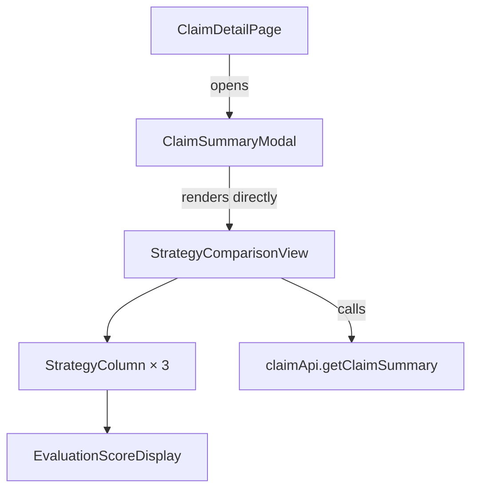

# Design Document: Remove Generate Tab

## Overview

This design describes the removal of the "Generate Summary" tab and tab bar from `ClaimSummaryModal`, making the `StrategyComparisonView` the sole content area. The change also deletes the now-dead `StrategyComparisonPanel` component, removes all dead state/handlers/imports from `ClaimSummaryModal`, and ensures the exported pure helper functions (`getAnomalySeverityColor`, `extractDisplayFields`) remain available.

The modal shell (header, close button, overlay, escape key, focus trap, ARIA attributes) is preserved unchanged. The modal dialog container switches to a fixed `maxWidth: '1200px'` since the comparison view is always shown. A `key`-based remount strategy resets `StrategyComparisonView` state each time the modal opens.

## Architecture

The change is a pure subtraction plus a small wiring adjustment. No new components or services are introduced.



### Before vs After

| Aspect | Before | After |
|---|---|---|
| Modal content | Tab bar → Generate tab / Compare tab | StrategyComparisonView only |
| Max-width | 800px (generate) / 1200px (compare) | 1200px always |
| State variables in modal | 11 (activeTab, strategy, chunkingMethod, includeEvaluation, isLoading, error, response, showComparison, comparisonData, comparisonLoading, promptExpanded) | 0 tab/generate-related state |
| Imports | EvaluationScoreDisplay, StrategyComparisonPanel, StrategyComparisonView, getClaimSummary, getClaimEvaluations | StrategyComparisonView only |
| StrategyComparisonPanel.tsx | Exists | Deleted |

## Components and Interfaces

### ClaimSummaryModal (modified)

**Props** — unchanged:
```typescript
interface ClaimSummaryModalProps {
  isOpen: boolean;
  onClose: () => void;
  claimId: string;
}
```

**Internal changes:**
- Remove `activeTab`, `strategy`, `chunkingMethod`, `includeEvaluation`, `isLoading`, `error`, `response`, `showComparison`, `comparisonData`, `comparisonLoading`, `promptExpanded` state variables.
- Remove `handleGenerate` and `handleCompareStrategies` callbacks.
- Remove imports: `getClaimSummary`, `getClaimEvaluations`, `EvaluationScoreDisplay`, `StrategyComparisonPanel`.
- Remove `STRATEGY_OPTIONS` and `CHUNKING_OPTIONS` constants.
- Remove the tab bar `<div>` and all Generate tab JSX.
- Set `maxWidth: '1200px'` unconditionally on the dialog container.
- Use a `key={claimId + '-' + String(isOpen)}` or a `mountKey` counter on `StrategyComparisonView` to force remount when `isOpen` transitions to `true`, resetting all comparison state.
- Keep the `useEffect` for focus trap and escape key handling.
- Keep the reset `useEffect` but simplify it to only manage the remount key.

**Retained exports:**
```typescript
export function getAnomalySeverityColor(severity: string): string;
export function extractDisplayFields(response: ClaimSummaryResponse): { ... };
```

The type definitions `DataAnomaly`, `EvaluationScores`, `PromptInfo`, and `ClaimSummaryResponse` remain in the file to support these exports.

### StrategyComparisonPanel (deleted)

The file `frontend/src/components/StrategyComparisonPanel.tsx` is deleted entirely. Its only consumer was `ClaimSummaryModal`.

### StrategyComparisonView (unchanged)

No modifications needed. It already manages its own state (columns, chunkingMethod, useReranker) and resets naturally on remount.

### StrategyColumn (unchanged)

No modifications needed.

## Data Models

No data model changes. All API types (`ClaimSummaryResponse`, `DataAnomaly`, `EvaluationScores`, `PromptInfo`) remain as-is. The types used only by the deleted Generate tab code (`Strategy`, `ChunkingMethod` local type aliases, `STRATEGY_OPTIONS`, `CHUNKING_OPTIONS`) are removed from `ClaimSummaryModal` but continue to exist in `StrategyComparisonView` where they are actually used.


## Correctness Properties

*A property is a characteristic or behavior that should hold true across all valid executions of a system — essentially, a formal statement about what the system should do. Properties serve as the bridge between human-readable specifications and machine-verifiable correctness guarantees.*

### Property 1: Anomaly severity color mapping is total and deterministic

*For any* string input to `getAnomalySeverityColor`, the function shall return one of the four defined hex color strings (`#dc3545`, `#ffc107`, `#17a2b8`, `#6c757d`), and for the three known severities (`critical`, `warning`, `info`) it shall always return the same specific color.

**Validates: Requirements 5.1**

### Property 2: extractDisplayFields preserves all response fields

*For any* valid `ClaimSummaryResponse` object, calling `extractDisplayFields` shall return an object where every field matches the corresponding field on the input, and `hasEvaluation` equals `!!response.evaluation`.

**Validates: Requirements 5.2**

### Property 3: StrategyComparisonView resets to idle on each modal open

*For any* sequence of modal open/close cycles with arbitrary claim IDs, each time `isOpen` transitions to `true`, the `StrategyComparisonView` shall be in its initial idle state (all three strategy columns showing `status: 'idle'`).

**Validates: Requirements 6.1**

## Error Handling

This feature is a code removal / simplification. No new error paths are introduced.

- **Existing error handling preserved**: The `StrategyComparisonView` already handles API errors per-column (showing error state with message). This behavior is unchanged.
- **Modal shell error handling preserved**: Escape key, overlay click, and close button all invoke `onClose` — no changes to these paths.
- **Missing StrategyComparisonPanel import**: After deletion, any stale import would cause a compile-time error. The import is removed from `ClaimSummaryModal` as part of this change.

## Testing Strategy

### Property-Based Tests

Use `fast-check` (already in the project) with minimum 100 iterations per property.

| Property | Test Description | Library |
|---|---|---|
| Property 1 | Generate random strings (including known severities), verify `getAnomalySeverityColor` returns correct color | fast-check |
| Property 2 | Generate random `ClaimSummaryResponse` objects, verify `extractDisplayFields` output matches input fields | fast-check |
| Property 3 | Generate random open/close sequences, verify `StrategyComparisonView` remounts fresh each time (via `key` prop change) | fast-check |

Each property test must be tagged with:
- **Feature: remove-generate-tab, Property {N}: {title}**

### Unit Tests (Examples and Edge Cases)

| Test | Validates |
|---|---|
| Modal renders StrategyComparisonView without tab bar or tab buttons | Req 1.1, 1.2 |
| Modal dialog container has maxWidth 1200px | Req 1.3 |
| Header displays claim ID and close button | Req 2.1 |
| Close button click invokes onClose | Req 2.2 |
| Escape key invokes onClose | Req 2.3 |
| Overlay click invokes onClose | Req 2.4 |
| Dialog receives focus on open | Req 2.5 |
| Overlay has role="dialog" and aria-modal="true" | Req 2.6 |
| No strategy radio buttons, chunking selectors, or generate buttons rendered | Req 3.6 |

### What Is NOT Tested

- Source code static analysis (Req 3.1–3.5, 5.3) — verified by TypeScript compiler and code review
- File deletion (Req 4.1) — verified by CI build (missing file = compile error if imported)

### Test Configuration

- Property tests: `fast-check` with `{ numRuns: 100 }` minimum
- Unit tests: Jest with `@testing-library/react` for component rendering
- All tests in `unit_tests/` directory per project guidelines
