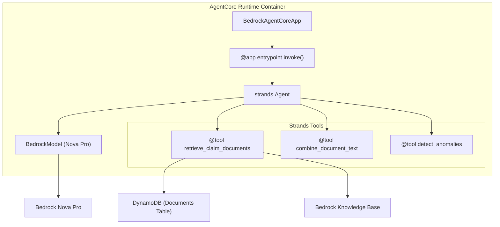

# Design Document: Strands Agent Migration

## Overview

This design covers the migration of three insurance claim summary agents (Full Context, RAG, Graph RAG) from a custom class-based architecture to the Strands Agents SDK. Each agent currently uses a Python class with manual `boto3` calls to Bedrock `invoke_model`, OpenTelemetry tracing, and an `async def invoke()` entry point. The migration converts each agent to use:

- `@tool` decorated standalone functions for business logic (document retrieval, anomaly detection, text combination, knowledge graph construction)
- `strands.Agent` with `BedrockModel` for LLM orchestration (replacing manual `invoke_model` calls)
- `BedrockAgentCoreApp` with `@app.entrypoint` for the AgentCore Runtime deployment entry point
- Strands SDK built-in tracing (replacing OpenTelemetry)

The key design decision is to use **module-level functions with closures** over AWS clients rather than classes. Each agent module (`agent.py`) will contain: (1) module-level AWS client initialization, (2) `@tool` decorated functions that capture those clients via closure, (3) a configured `Agent` instance, and (4) a `BedrockAgentCoreApp` entry point. This preserves testability because `@tool` decorated functions remain directly callable, and AWS clients can be patched at the module level in tests.

### Migration Scope

| Component | Current | After Migration |
|---|---|---|
| Agent orchestration | Manual `boto3` `invoke_model` calls | `strands.Agent` with `BedrockModel` |
| Business logic | Class methods | `@tool` decorated module functions |
| Tracing | OpenTelemetry SDK | Strands SDK built-in tracing |
| Entry point | Custom `__main__` block | `BedrockAgentCoreApp` + `@app.entrypoint` |
| Dependencies | `opentelemetry-*` packages | `strands-agents`, `strands-agents-builder` |

### What Does NOT Change

- Response format (same dict keys and value types)
- Anomaly detection logic (same date parsing, same severity levels, same anomaly categories)
- Environment variables (same names, same defaults)
- Docker container deployment model
- DynamoDB scan patterns and Knowledge Base retrieval logic
- networkx graph construction logic in Graph RAG agent

## Architecture



Each agent follows the same structural pattern but with different tool sets:

- **Full Context Agent**: `retrieve_claim_documents` → `combine_document_text` → `detect_anomalies` → Agent generates summary
- **RAG Agent**: `retrieve_chunks` → `detect_anomalies` → Agent generates summary
- **Graph RAG Agent**: `retrieve_claim_documents` → `build_knowledge_graph` → `extract_entities` → `detect_graph_anomalies` → Agent generates summary

### Module Structure (per agent)

```
agents/{agent_name}/
├── agent.py          # All code in single file: tools + agent + entrypoint
├── requirements.txt  # Updated dependencies
└── Dockerfile        # Minimal changes
```

Each `agent.py` follows this layout:

```python
# 1. Imports and environment config
# 2. AWS client initialization (module-level)
# 3. @tool decorated functions (business logic)
# 4. Agent configuration (model + tools + system prompt)
# 5. BedrockAgentCoreApp entry point
# 6. if __name__ == "__main__": app.run()
```

## Components and Interfaces

### Full Context Agent Tools

| Tool Function | Input | Output | AWS Dependency |
|---|---|---|---|
| `retrieve_claim_documents(claim_id: str)` | Claim ID string | `list[dict]` of document records | DynamoDB scan |
| `combine_document_text(documents: str)` | JSON string of document list | `str` combined text | None |
| `detect_anomalies(documents: str)` | JSON string of document list | `str` JSON array of anomaly dicts | None |

### RAG Agent Tools

| Tool Function | Input | Output | AWS Dependency |
|---|---|---|---|
| `retrieve_chunks(claim_id: str, chunking_method: str)` | Claim ID, chunking method | `str` JSON array of chunk dicts | Bedrock Agent Runtime |
| `detect_anomalies(chunks: str)` | JSON string of chunk list | `str` JSON array of anomaly dicts | None |

### Graph RAG Agent Tools

| Tool Function | Input | Output | AWS Dependency |
|---|---|---|---|
| `retrieve_claim_documents(claim_id: str)` | Claim ID string | `list[dict]` of document records | DynamoDB scan |
| `build_knowledge_graph(documents: str)` | JSON string of document list | `str` JSON graph summary | None (networkx) |
| `extract_entities(graph_json: str)` | JSON string of graph data | `str` JSON array of entity dicts | None |
| `detect_graph_anomalies(graph_json: str)` | JSON string of graph data | `str` JSON array of anomaly dicts | None |

### Tool Parameter Design Decision

Strands tools receive parameters from the LLM as strings or primitive types. For tools that need complex data (lists of documents), the design uses **JSON string parameters** that the tool parses internally. This is because the Strands Agent passes tool arguments as serialized values from the LLM's tool-call output. The tool functions will parse JSON input and return JSON string output for complex types, while the system prompt instructs the agent to chain tool outputs correctly.

However, the **underlying business logic** (date parsing, anomaly detection algorithms, graph construction) will be implemented as regular helper functions within the module that the `@tool` functions call. This keeps the business logic directly testable without going through JSON serialization:

```python
# Testable business logic (no decorator)
def _detect_anomalies_impl(documents: list[dict]) -> list[dict]:
    ...

# Strands tool wrapper
@tool
def detect_anomalies(documents: str) -> str:
    """Detect anomalies in claim documents. ..."""
    docs = json.loads(documents)
    result = _detect_anomalies_impl(docs)
    return json.dumps(result)
```

### Agent Configuration

Each agent is configured with:

```python
from strands import Agent
from strands.models import BedrockModel

model = BedrockModel(
    model_id=f"us.{BEDROCK_MODEL_ID}",
    region_name=BEDROCK_REGION,
    temperature=0.3,
    max_tokens=2000,
)

agent = Agent(
    model=model,
    tools=[retrieve_claim_documents, combine_document_text, detect_anomalies],
    system_prompt=SYSTEM_PROMPT,
)
```

The model ID is prefixed with `us.` for cross-region inference as specified in the Strands SDK patterns (`us.amazon.nova-pro-v1:0`).

### Entry Point Pattern

```python
from bedrock_agentcore.runtime import BedrockAgentCoreApp

app = BedrockAgentCoreApp()

@app.entrypoint
def invoke(payload):
    claim_id = payload.get("claim_id")
    result = agent(f"Process claim {claim_id} and return the structured JSON response")
    # Parse structured response from agent output
    return parse_agent_response(result)

if __name__ == "__main__":
    app.run()
```

### System Prompts

Each agent gets a system prompt that:
1. Describes the agent's role as an insurance claims analyst
2. Lists the available tools and the order to call them
3. Specifies the exact JSON response format expected
4. Instructs the agent to always call all tools before generating the final response

Example (Full Context):
```
You are an insurance claims analyst agent. For each claim, you MUST:
1. Call retrieve_claim_documents with the claim_id
2. Call combine_document_text with the retrieved documents
3. Call detect_anomalies with the retrieved documents
4. Generate a comprehensive summary of the claim

Return your final response as JSON with these exact keys:
- "summary": your generated summary text
- "anomalies": the anomalies from detect_anomalies
- "documentCount": number of documents retrieved
- "strategy": "full-context"
```

## Data Models

### Anomaly Dict (unchanged)

```python
{
    "description": str,      # Human-readable anomaly description
    "severity": str,         # "critical" or "warning"
    "sourceDocument": str,   # Source file name(s)
    "dataValues": dict,      # At least one key-value pair with relevant data
}
```

### Full Context Agent Response (unchanged)

```python
{
    "summary": str,          # Generated summary text
    "anomalies": list[dict], # List of Anomaly dicts
    "documentCount": int,    # Number of documents processed
    "strategy": "full-context",
}
```

### RAG Agent Response (unchanged)

```python
{
    "summary": str,
    "anomalies": list[dict],
    "documentCount": int,
    "strategy": "rag",
    "chunkingMethod": str,   # "full-document" or "semantic"
}
```

### Graph RAG Agent Response (unchanged)

```python
{
    "summary": str,
    "anomalies": list[dict],
    "documentCount": int,
    "strategy": "graph-rag",
    "entityCount": int,      # Number of entities in knowledge graph
}
```

### Document Record (from DynamoDB, unchanged)

```python
{
    "documentId": str,
    "fileName": str,
    "extractedText": str,
    "processingStatus": str,
    "claimMetadata": {
        "claimId": str,
        "documentType": str,
    },
    "tenantId": str,
    "createdAt": str,
}
```

### Knowledge Graph Node (Graph RAG, unchanged)

```python
# networkx node attributes
{
    "type": str,        # "patient", "provider", "diagnosis", "procedure", "date", "amount", "document"
    "label": str,       # Human-readable label
    "properties": dict, # Type-specific properties (name, code, date, amount, etc.)
}
```

### Dependencies Changes

**Added** (all agents):
- `strands-agents>=0.1.0`
- `strands-agents-builder>=0.1.0`
- `bedrock-agentcore>=0.1.0`

**Removed** (all agents):
- `opentelemetry-api>=1.20.0`
- `opentelemetry-sdk>=1.20.0`
- `opentelemetry-exporter-otlp>=1.20.0`

**Preserved**:
- `boto3>=1.34.0`, `botocore>=1.34.0` (still needed for DynamoDB, Bedrock Agent Runtime)
- `networkx>=3.2.0` (Graph RAG agent only)
- `pytest>=7.4.0`, `pytest-asyncio>=0.21.0`, `hypothesis>=6.92.0`, `moto>=4.2.0` (testing)


## Correctness Properties

*A property is a characteristic or behavior that should hold true across all valid executions of a system — essentially, a formal statement about what the system should do. Properties serve as the bridge between human-readable specifications and machine-verifiable correctness guarantees.*

### Property 1: Combined text includes all documents and preserves order

*For any* list of N documents with non-empty `extractedText` and unique `fileName` values, calling `combine_document_text` shall produce a string that (a) contains every document's `extractedText` verbatim, (b) contains a `--- Document: {fileName} ---` separator for each document, and (c) the separators appear in the same order as the input list.

**Validates: Requirements 1.4, 10.4**

### Property 2: Anomaly dict structure invariant

*For any* list of documents (or chunks) that triggers at least one anomaly, every anomaly dict returned by `detect_anomalies` (or `detect_graph_anomalies`) shall contain exactly the keys `description` (non-empty str), `severity` (one of `"critical"` or `"warning"`), `sourceDocument` (str), and `dataValues` (dict with at least one entry).

**Validates: Requirements 1.3, 2.4, 7.4, 10.7**

### Property 3: Chronological impossibility detection (service before birth)

*For any* document containing a birth date B and a service date S where S < B (both in ISO `YYYY-MM-DD` format), calling `detect_anomalies` shall return at least one anomaly with `severity` equal to `"critical"` and `description` containing both date strings.

**Validates: Requirements 4.1, 10.5**

### Property 4: Payment-before-service detection

*For any* document containing a service date S and a payment date P where P < S (both in ISO `YYYY-MM-DD` format), calling `detect_anomalies` shall return at least one anomaly with `severity` equal to `"critical"` and `description` containing both date strings.

**Validates: Requirements 4.2, 10.5**

### Property 5: Conflicting patient names detection

*For any* set of two or more documents where each document contains a distinct patient name (via `Patient Name: X` pattern), calling `detect_anomalies` shall return at least one anomaly with `severity` equal to `"warning"` and `description` containing all distinct patient names.

**Validates: Requirements 4.3**

### Property 6: Graph RAG entity extraction completeness

*For any* document containing a patient name (matching `Patient Name: X`), an ICD-10 code, a CPT code, a service date (via `Date of Service: X`), a dollar amount (via `$X`), and a provider name (via `Provider Name: X`), calling `build_knowledge_graph` shall produce a graph containing at least one node of each type: `patient`, `diagnosis`, `procedure`, `date`, `amount`, and `provider`.

**Validates: Requirements 3.3, 10.6**

### Property 7: Graph entity extraction round-trip

*For any* knowledge graph produced by `build_knowledge_graph`, calling `extract_entities` shall return a list where every node in the graph appears exactly once, and each entity dict contains the keys `id`, `type`, `label`, and `properties`.

**Validates: Requirements 3.5**

### Property 8: Conflicting DOBs detection in graph

*For any* set of documents where the same patient name appears with two or more distinct dates of birth, calling `build_knowledge_graph` followed by `detect_graph_anomalies` shall return at least one anomaly with `severity` equal to `"critical"` and `description` containing the conflicting DOB values.

**Validates: Requirements 4.4**

### Property 9: Date parsing across formats and labels

*For any* valid date D representable in ISO format (`YYYY-MM-DD`) and *for any* label from the set {`birth date`, `dob`, `date of birth`, `service date`, `date of service`, `dos`, `payment date`, `paid date`, `date paid`}, a text string `"{Label}: {D}"` shall cause the date finder to return D in its results.

**Validates: Requirements 4.5**

### Property 10: No false positive anomalies for consistent documents

*For any* set of documents where all patient names are identical, all birth dates are identical and precede all service dates, and all payment dates follow all service dates, calling `detect_anomalies` shall return an empty list.

**Validates: Requirements 4.6**

## Error Handling

### Document Retrieval Errors

| Condition | Error | Status Code | Agent(s) |
|---|---|---|---|
| No documents found for claim ID | `DocumentRetrievalError` / tool raises error | 404 | Full Context, Graph RAG |
| Documents exist but none have `extractedText` | `DocumentRetrievalError` / tool raises error | 400 | Full Context, Graph RAG |
| DynamoDB scan fails | `DocumentRetrievalError` / tool raises error | 500 | Full Context, Graph RAG |
| Knowledge Base returns no results | `KnowledgeBaseRetrievalError` / tool raises error | 404 | RAG |
| Knowledge Base API call fails | `KnowledgeBaseRetrievalError` / tool raises error | 500 | RAG |

### Agent Orchestration Errors

When a `@tool` function raises an exception, the Strands Agent will receive the error and can either retry or report the failure. The `@app.entrypoint` function wraps the agent call in a try/except to return structured error responses:

```python
@app.entrypoint
def invoke(payload):
    try:
        claim_id = payload.get("claim_id")
        if not claim_id:
            return {"error": "claim_id is required", "statusCode": 400}
        result = agent(f"Process claim {claim_id}...")
        return parse_agent_response(result)
    except Exception as e:
        logger.error(f"Agent invocation failed: {e}")
        return {"error": str(e), "statusCode": 500}
```

### Response Parsing Errors

The agent's natural language output must be parsed into the structured response dict. If the agent doesn't produce valid JSON, the entry point falls back to returning the raw text as the summary with empty anomalies:

```python
def parse_agent_response(result, strategy, default_count=0):
    try:
        # Try to extract JSON from agent response
        response_text = result.message
        parsed = json.loads(response_text)
        return parsed
    except (json.JSONDecodeError, AttributeError):
        return {
            "summary": str(result),
            "anomalies": [],
            "documentCount": default_count,
            "strategy": strategy,
        }
```

## Testing Strategy

### Dual Testing Approach

Testing uses both unit tests (specific examples and edge cases) and property-based tests (universal properties across generated inputs). Both are required for comprehensive coverage.

### Property-Based Testing Configuration

- **Library**: `hypothesis` (Python)
- **Minimum iterations**: 100 per property test (`@settings(max_examples=100)`)
- **Test location**: `unit_tests/` directory
- **Import method**: `importlib.util.spec_from_file_location` to avoid path conflicts
- **Each property test MUST reference its design property via comment tag**
- **Tag format**: `Feature: strands-agent-migration, Property {number}: {property_text}`
- **Each correctness property MUST be implemented by a SINGLE property-based test**

### Test File Organization

| Test File | Tests | Agent |
|---|---|---|
| `unit_tests/test_full_context_agent.py` | Properties 1-5, 9-10 + edge cases | Full Context |
| `unit_tests/test_graph_rag_agent.py` | Properties 6-8 + edge cases | Graph RAG |

### What to Test with Property-Based Tests

Each of the 10 correctness properties above maps to a single `@given` decorated test function. The tests call the `@tool` decorated functions (or their `_impl` helpers) directly, without invoking the full Strands Agent. This validates business logic independently of LLM orchestration.

### What to Test with Unit Tests (Examples)

- Agent initialization creates `BedrockModel` with correct config (Req 1.1, 2.1, 3.1)
- Entry point extracts `claim_id` from payload (Req 5.4)
- `@tool` decorator is applied to all tool functions (Req 8.3)
- RAG agent `retrieve_chunks` uses correct `numberOfResults` per chunking method (Req 2.3)
- Edge cases: empty document list, missing `extractedText`, missing `fileName` (Req 1.5, 1.6, 2.5)
- Response format validation with mocked agent (Req 7.1, 7.2, 7.3)

### What NOT to Test

- Full agent orchestration with real LLM calls (integration test, platform team responsibility)
- Docker container builds (deployment pipeline responsibility)
- Strands SDK internals (third-party library)

### Hypothesis Strategies (reused across tests)

- `date_strategy`: Random ISO dates between 1900-2030
- `patient_name_strategy`: Random first+last name combinations
- `icd10_strategy`: Random valid ICD-10 code patterns
- `cpt_strategy`: Random 5-digit CPT codes
- `amount_strategy`: Random dollar amounts
- `doc_id_strategy`: Random alphanumeric document IDs
- `file_name_strategy`: Random file names with `.pdf` extension
- `extracted_text_strategy`: Random non-empty text strings
