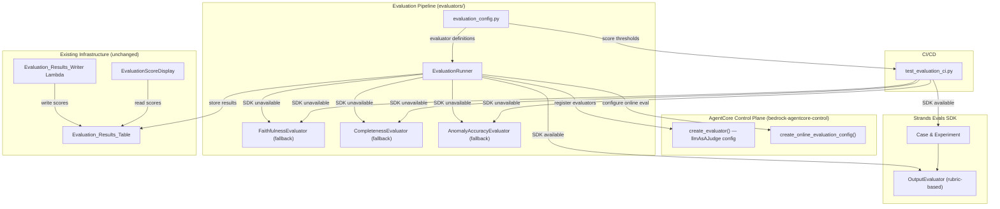

# Design Document: Strands Evals SDK Migration

## Overview

This design covers migrating the existing evaluation pipeline from custom evaluator classes and a hypothetical `bedrock-agentcore` boto3 client to the `strands-agents-evals` SDK and the real `bedrock-agentcore-control` boto3 client.

The migration touches three areas:

1. **Offline/CI evaluation** (`evaluate_direct()` and `test_evaluation_ci.py`): Replace direct Bedrock `InvokeModel` calls via custom evaluator classes with the Strands Evals SDK's `OutputEvaluator`, `Case`, and `Experiment` classes. Since `HelpfulnessEvaluator` and `FaithfulnessEvaluator` from the SDK are trace-level evaluators requiring OpenTelemetry sessions, offline/CI evaluation uses `OutputEvaluator` with the existing prompts as rubrics for all four metrics.
2. **AgentCore control plane** (`register_evaluators()`, `configure_online_evaluation()`): Switch from `boto3.client('bedrock-agentcore')` to `boto3.client('bedrock-agentcore-control')` and adopt the real API's `evaluatorConfig.llmAsAJudge` structure for `create_evaluator()` and `create_online_evaluation_config()`.
3. **Dependency management**: Add `strands-agents-evals` to agent `requirements.txt` files with graceful fallback when the package is unavailable.

### Key Design Decisions

- **Use `OutputEvaluator` for all offline metrics**: The SDK's `HelpfulnessEvaluator` and `FaithfulnessEvaluator` require OpenTelemetry trace sessions. For offline/CI evaluation where we have summary text and source documents (not traces), we use `OutputEvaluator` with custom rubrics for helpfulness, faithfulness, completeness, and anomaly accuracy. This gives us SDK-consistent scoring while working without trace infrastructure.
- **Preserve custom evaluator classes as fallback**: The existing `FaithfulnessEvaluator`, `CompletenessEvaluator`, and `AnomalyAccuracyEvaluator` classes remain unchanged. When `strands-agents-evals` is not installed, `evaluate_direct()` and the CI script fall back to these classes with a logged warning.
- **Conditional import pattern**: Use a try/except at module level to detect SDK availability, setting a `_STRANDS_EVALS_AVAILABLE` flag that gates SDK vs. fallback code paths.
- **Score normalization is trivial**: The SDK's `EvaluationOutput.score` is already 0-1, so no complex normalization is needed. We just clamp to `[0.0, 1.0]` as a safety measure.
- **`evaluatorConfig.llmAsAJudge` structure**: The real `bedrock-agentcore-control` API uses a nested `evaluatorConfig` with `llmAsAJudge.instructions`, `llmAsAJudge.ratingScale`, and `llmAsAJudge.modelConfig` — not the flat `evaluationCriteria`/`scoringSchema` structure the current code uses.
- **Online eval config uses `evaluatorId`**: The `create_online_evaluation_config()` API takes `evaluatorId` strings (e.g., `"Builtin.Helpfulness"`) in its `evaluators` list, plus `dataSourceConfig`, `rule`, and `evaluationExecutionRoleArn`.

### What Does NOT Change

- `evaluators/faithfulness_evaluator.py` — custom class with `FAITHFULNESS_PROMPT` (kept as fallback)
- `evaluators/completeness_evaluator.py` — custom class with `COMPLETENESS_PROMPT` (kept as fallback)
- `evaluators/anomaly_accuracy_evaluator.py` — custom class with `ANOMALY_ACCURACY_PROMPT` (kept as fallback)
- `src/lambda/evaluation-results-writer.ts` — Lambda that writes to DynamoDB
- CDK infrastructure in `infrastructure/rag-application-stack.ts`
- Agent entry points with OTel span attributes
- Frontend `EvaluationScoreDisplay` component
- DynamoDB `Evaluation_Results_Table` schema (`claimId` PK, `strategyKey` SK)
- `evaluators/__init__.py` exports (`AnomalyAccuracyEvaluator`, `EvaluationRunner`)

## Architecture



### Data Flow: Offline Evaluation (SDK Path)

1. `EvaluationRunner.evaluate_direct(summary, source_documents, anomalies)` is called
2. Four `OutputEvaluator` instances are created with rubrics from `FAITHFULNESS_PROMPT`, `COMPLETENESS_PROMPT`, `ANOMALY_ACCURACY_PROMPT`, and a helpfulness rubric
3. Each evaluator's `evaluate()` is called with the input/expected_output, returning `EvaluationOutput` with `score` (0-1), `test_pass`, `reason`, `label`
4. Scores are extracted, clamped to [0, 1], and returned in the existing dict format
5. Caller optionally writes to DynamoDB via `store_results()`

### Data Flow: Offline Evaluation (Fallback Path)

1. Same entry point, but `_STRANDS_EVALS_AVAILABLE` is `False`
2. Warning logged: "strands-agents-evals not installed, using custom evaluator fallback"
3. Existing `FaithfulnessEvaluator`, `CompletenessEvaluator`, `AnomalyAccuracyEvaluator` are invoked directly (unchanged behavior)

### Data Flow: CI/CD Evaluation (SDK Path)

1. `pytest` runs `unit_tests/test_evaluation_ci.py`
2. Test loads test cases from `evaluators/test_data/test_cases.json`
3. For each test case, a `Case` object is constructed with `name=id`, `input=source_documents`, `expected_output=summary`, `metadata={anomalies, strategy}`
4. An `Experiment` is created with the cases and four `OutputEvaluator` instances
5. `experiment.run_evaluations(task_function)` is called where `task_function` returns the expected_output (summary) directly
6. Scores are extracted from evaluation reports and compared against thresholds
7. JSON report is written with per-test-case scores and `overall_status`

### Data Flow: Evaluator Registration (bedrock-agentcore-control)

1. `EvaluationRunner.register_evaluators()` calls `get_evaluator_definitions()`
2. For each definition, builds a `create_evaluator()` payload with:
   - `evaluatorName`: e.g., `"Faithfulness"`
   - `level`: `"TRACE"`
   - `evaluatorConfig.llmAsAJudge.instructions`: the evaluation prompt
   - `evaluatorConfig.llmAsAJudge.ratingScale.numerical`: two-point scale (0="Very Poor", 1="Very Good")
   - `evaluatorConfig.llmAsAJudge.modelConfig.bedrockEvaluatorModelConfig`: model ID + inference config
3. On 409 conflict, retrieves existing evaluator via `get_evaluator()`
4. Stores returned evaluator IDs in `_evaluator_ids` dict

### Data Flow: Online Evaluation Configuration

1. `configure_online_evaluation(agent_id)` calls `create_online_evaluation_config()` with:
   - `onlineEvaluationConfigName`: derived from agent_id (underscores, not hyphens)
   - `evaluators`: `[{"evaluatorId": "Builtin.Helpfulness"}, {"evaluatorId": custom_id}, ...]`
   - `dataSourceConfig.cloudWatchLogs`: log group names and service names
   - `rule.samplingConfig.samplingPercentage`: configurable (default 80.0)
   - `evaluationExecutionRoleArn`: from environment variable
   - `enableOnCreate`: `True`

## Components and Interfaces

### EvaluationRunner (`evaluators/evaluation_runner.py`) — Modified

| Method | Change | Input | Output |
|---|---|---|---|
| `__init__()` | Client name changes from `bedrock-agentcore` to `bedrock-agentcore-control` | Same | Same |
| `register_evaluators()` | Payload changes to `evaluatorConfig.llmAsAJudge` structure; adds `level` param | None | `dict[str, str]` (name → evaluator ID) |
| `configure_online_evaluation(agent_id)` | Switches to `create_online_evaluation_config()` with `evaluatorId`, `dataSourceConfig`, `rule`, `evaluationExecutionRoleArn`, `enableOnCreate` | agent_id | config name (str) |
| `evaluate_direct(summary, source_documents, anomalies)` | Uses `OutputEvaluator` from strands_evals SDK when available; falls back to custom classes | Same | Same dict format |
| `store_results()` | Unchanged | Same | Same |
| `evaluate_trace()` | Unchanged (still calls AgentCore on-demand eval) | Same | Same |

### evaluation_config.py (`evaluators/evaluation_config.py`) — Modified

| Function | Change |
|---|---|
| `get_evaluator_definitions()` | Returns definitions with both the existing flat fields (for backward compat) AND the new `evaluatorConfig` structure for `bedrock-agentcore-control` registration. Adds `level: "TRACE"` field. |
| `get_score_thresholds()` | Unchanged |
| `EvaluationConfig` class | Unchanged |

### test_evaluation_ci.py (`unit_tests/test_evaluation_ci.py`) — Modified

| Function | Change |
|---|---|
| `_evaluate_test_case()` | Uses `Case`, `Experiment`, and `OutputEvaluator` from strands_evals when available; falls back to custom evaluator classes |
| `_check_pass_fail()` | Unchanged |
| `_build_report()` | Unchanged |
| `TestEvaluationCI.test_evaluation_pipeline()` | Unchanged orchestration; underlying evaluator calls change |

### Agent requirements.txt Files — Modified

| File | Change |
|---|---|
| `agents/full_context_agent/requirements.txt` | Add `strands-agents-evals` |
| `agents/rag_agent/requirements.txt` | Add `strands-agents-evals` |
| `agents/graph_rag_agent/requirements.txt` | Add `strands-agents-evals` |

## Data Models

### Evaluator Registration Payload (NEW — bedrock-agentcore-control)

```python
{
    "evaluatorName": "Faithfulness",
    "level": "TRACE",
    "evaluatorConfig": {
        "llmAsAJudge": {
            "modelConfig": {
                "bedrockEvaluatorModelConfig": {
                    "modelId": "global.anthropic.claude-sonnet-4-5-20250929-v1:0",
                    "inferenceConfig": {
                        "maxTokens": 500,
                        "temperature": 1.0
                    }
                }
            },
            "instructions": "<FAITHFULNESS_PROMPT text with {context} and {assistant_turn} placeholders>",
            "ratingScale": {
                "numerical": [
                    {"value": 1, "label": "Very Good", "definition": "Summary is fully faithful to source documents"},
                    {"value": 0, "label": "Very Poor", "definition": "Summary contains hallucinations or unsupported claims"}
                ]
            }
        }
    }
}
```

### Online Evaluation Configuration Payload (NEW — bedrock-agentcore-control)

```python
{
    "onlineEvaluationConfigName": "full_context_agent_eval",
    "description": "Online evaluation for full-context agent",
    "rule": {
        "samplingConfig": {
            "samplingPercentage": 80.0
        }
    },
    "dataSourceConfig": {
        "cloudWatchLogs": {
            "logGroupNames": ["/aws/agentcore/traces"],
            "serviceNames": ["rag-app-v2-full-context-agent"]
        }
    },
    "evaluators": [
        {"evaluatorId": "Builtin.Helpfulness"},
        {"evaluatorId": "<faithfulness-evaluator-id>"},
        {"evaluatorId": "<completeness-evaluator-id>"},
        {"evaluatorId": "<anomaly-accuracy-evaluator-id>"}
    ],
    "evaluationExecutionRoleArn": "arn:aws:iam::<account>:role/rag-app-v2-evaluation-role-dev",
    "enableOnCreate": True
}
```

### Strands Evals SDK Objects (used in evaluate_direct and CI)

```python
# OutputEvaluator for offline evaluation
evaluator = OutputEvaluator(
    rubric=FAITHFULNESS_PROMPT,
    include_inputs=True
)

# Case construction from test data
case = Case[str, str](
    name="tc-001",
    input="<source_documents text>",
    expected_output="<summary text>",
    metadata={"anomalies": [...], "strategy": "full-context"}
)

# Experiment for CI batch evaluation
experiment = Experiment[str, str](
    cases=[case1, case2, ...],
    evaluators=[helpfulness_eval, faithfulness_eval, completeness_eval, anomaly_eval]
)
reports = experiment.run_evaluations(task_function)

# EvaluationOutput (returned by evaluators)
# .score: float (0-1)
# .test_pass: bool
# .reason: str
# .label: str
```

### Evaluator Definition (updated structure from get_evaluator_definitions)

```python
{
    "name": "Faithfulness",
    "prompt": FAITHFULNESS_PROMPT,  # backward compat for offline eval
    "level": "TRACE",
    "scoring_schema": {  # backward compat
        "scoreFieldName": "score",
        "reasoningFieldName": "reasoning",
        "minScore": 0.0,
        "maxScore": 1.0,
    },
    "model_id": "amazon.nova-pro-v1:0",  # backward compat
    "evaluatorConfig": {  # NEW: for bedrock-agentcore-control registration
        "llmAsAJudge": {
            "modelConfig": {
                "bedrockEvaluatorModelConfig": {
                    "modelId": "global.anthropic.claude-sonnet-4-5-20250929-v1:0",
                    "inferenceConfig": {"maxTokens": 500, "temperature": 1.0}
                }
            },
            "instructions": FAITHFULNESS_PROMPT,
            "ratingScale": {
                "numerical": [
                    {"value": 1, "label": "Very Good", "definition": "..."},
                    {"value": 0, "label": "Very Poor", "definition": "..."}
                ]
            }
        }
    }
}
```

### Evaluation Results Table Record (DynamoDB — unchanged schema)

```typescript
{
    claimId: string,           // Partition key
    strategyKey: string,       // Sort key: "{strategy}#{chunkingMethod}"
    helpfulness: string,       // "0.83" — stored as string per existing pattern
    faithfulness: string,      // "0.75"
    completeness: string,      // "0.67"
    anomalyAccuracy?: string,  // "0.50"
    evaluatedAt: string,       // ISO 8601 timestamp
    faithfulnessReasoning?: string,
    completenessReasoning?: string,
    anomalyAccuracyReasoning?: string,
    traceId?: string,
}
```

### Conditional Import Pattern

```python
# At top of evaluation_runner.py and test_evaluation_ci.py
try:
    from strands_evals import Case, Experiment
    from strands_evals.evaluators import OutputEvaluator
    _STRANDS_EVALS_AVAILABLE = True
except ImportError:
    _STRANDS_EVALS_AVAILABLE = False
    logger.warning("strands-agents-evals not installed, using custom evaluator fallback")
```


## Correctness Properties

*A property is a characteristic or behavior that should hold true across all valid executions of a system — essentially, a formal statement about what the system should do. Properties serve as the bridge between human-readable specifications and machine-verifiable correctness guarantees.*

### Property 1: Registration payload correctness

*For any* evaluator definition returned by `get_evaluator_definitions()`, the registration payload built by `_build_registration_payload()` shall (a) include `evaluatorName` matching the definition's `name`, (b) include `level` set to `"TRACE"`, (c) include `evaluatorConfig.llmAsAJudge.instructions` containing the evaluation criteria prompt from the definition, (d) include `evaluatorConfig.llmAsAJudge.modelConfig.bedrockEvaluatorModelConfig.modelId` set to `"global.anthropic.claude-sonnet-4-5-20250929-v1:0"` with `inferenceConfig.maxTokens` of 500 and `temperature` of 1.0, and (e) include `evaluatorConfig.llmAsAJudge.ratingScale.numerical` with exactly two entries: value 1 labeled "Very Good" and value 0 labeled "Very Poor".

**Validates: Requirements 3.2, 3.3, 3.4, 3.5, 3.6, 8.1, 8.2**

### Property 2: Registration idempotency

*For any* evaluator name, calling `register_evaluators()` when the evaluator already exists (409 conflict) shall retrieve the existing evaluator ID rather than raising an error, and the returned mapping shall contain the same evaluator ID as the pre-existing evaluator.

**Validates: Requirements 3.7**

### Property 3: Online evaluation config correctness

*For any* agent identifier string and any set of registered custom evaluator IDs, the `configure_online_evaluation()` call shall produce a `create_online_evaluation_config()` payload where (a) `onlineEvaluationConfigName` is derived from the agent identifier using underscores, (b) `evaluators` contains `{"evaluatorId": "Builtin.Helpfulness"}` plus one entry per registered custom evaluator ID, (c) `rule.samplingConfig.samplingPercentage` is a positive float, (d) `dataSourceConfig.cloudWatchLogs` includes `logGroupNames` and `serviceNames`, (e) `evaluationExecutionRoleArn` is a non-empty string, and (f) `enableOnCreate` is `True`.

**Validates: Requirements 4.1, 4.2, 4.3, 4.4, 4.5, 4.6, 4.7**

### Property 4: evaluate_direct output format

*For any* valid summary string, source documents string, and anomalies list, calling `evaluate_direct()` shall return a dict containing keys `helpfulness`, `faithfulness`, `completeness`, `anomalyAccuracy`, and `evaluatedAt`, where each score is a float in the range [0.0, 1.0] and `evaluatedAt` is a non-empty ISO 8601 string. This shall hold regardless of whether the Strands Evals SDK is available (SDK path) or not (fallback path).

**Validates: Requirements 2.5, 6.3**

### Property 5: Score clamping

*For any* raw evaluation score value (including values outside [0, 1]), the score stored in the result dict by `evaluate_direct()` and `store_results()` shall be clamped to the range [0.0, 1.0].

**Validates: Requirements 7.1, 7.2, 7.3**

### Property 6: Evaluation store-then-read round trip

*For any* valid evaluation scores dict produced by `evaluate_direct()`, storing the results via `store_results(claim_id, strategy, chunking_method, scores)` and then querying the DynamoDB table with the same `claimId` and `strategyKey` shall return a record containing numeric `helpfulness`, `faithfulness`, `completeness`, optional numeric `anomalyAccuracy`, and string `evaluatedAt` — satisfying the existing `EvaluationScores` TypeScript interface.

**Validates: Requirements 7.4, 7.5**

### Property 7: CI pass/fail decision correctness

*For any* set of evaluation scores and configurable thresholds, the CI evaluation script shall report a failing status if and only if at least one score is strictly below its corresponding threshold. When anomalies are absent from a test case, the anomaly_accuracy threshold check shall be skipped.

**Validates: Requirements 5.3, 5.4**

### Property 8: CI report structure completeness

*For any* list of test case evaluation results, the CI evaluation script's JSON report shall contain (a) an entry for every test case with its individual scores and status, and (b) an `overall_status` field that is `"pass"` when all test cases pass and `"fail"` when any test case fails.

**Validates: Requirements 5.5**

### Property 9: Case construction mapping

*For any* test case dict from the test dataset containing `id`, `source_documents`, `summary`, `anomalies`, and `strategy` fields, the constructed `Case` object shall have `name` equal to the test case `id`, `input` equal to `source_documents`, `expected_output` equal to `summary`, and `metadata` containing `anomalies` and `strategy`.

**Validates: Requirements 5.1**

### Property 10: Evaluator definition structure

*For any* evaluator definition returned by `get_evaluator_definitions()`, the definition shall include (a) a `prompt` field containing a non-empty string (the evaluation criteria prompt), (b) a `level` field set to `"TRACE"`, (c) an `evaluatorConfig` dict with the `llmAsAJudge` nested structure, and (d) the existing `scoring_schema` and `model_id` fields for backward compatibility.

**Validates: Requirements 8.1, 8.2, 8.3**

## Error Handling

### EvaluationRunner Errors

| Condition | Behavior |
|---|---|
| `strands-agents-evals` not installed | Set `_STRANDS_EVALS_AVAILABLE = False`, log warning, use custom evaluator fallback in `evaluate_direct()` |
| `bedrock-agentcore-control` client creation fails | Log warning, set client to `None`. Registration and online eval calls will fail with descriptive errors. |
| `create_evaluator()` returns 409 conflict | Call `get_evaluator()` to retrieve existing evaluator ID (idempotent) |
| `create_evaluator()` fails (non-409) | Raise `EvaluatorRegistrationError` with evaluator name and API error |
| `create_online_evaluation_config()` fails | Raise `EvaluationConfigError` with agent ID and API error |
| `start_evaluation()` fails (on-demand) | Return error dict `{"error": message, "evaluator": "on-demand"}` |
| `OutputEvaluator.evaluate()` raises exception | Fall back to custom evaluator class for that metric, log warning |
| Bedrock `InvokeModel` fails (fallback path) | Return `{"score": 0.0, "reasoning": "Evaluation failed: {error}"}` (existing pattern) |
| DynamoDB `PutItem` fails in `store_results()` | Log error with `claimId`, `strategyKey`, and error message; do not raise |

### CI/CD Script Errors

| Condition | Behavior |
|---|---|
| `strands-agents-evals` not installed | Log warning, fall back to custom evaluator classes |
| Test data file not found | `pytest` raises `FileNotFoundError`, test fails |
| Individual evaluator call fails during CI | Test case gets `score: 0.0` and failure message; other test cases continue |
| Score below threshold | Test assertion fails with: `"{metric} score {actual:.3f} below threshold {threshold:.3f}"` |
| `Experiment.run_evaluations()` raises exception | Fall back to per-case custom evaluator evaluation |

### Score Edge Cases

| Condition | Behavior |
|---|---|
| SDK returns score > 1.0 | Clamp to 1.0 |
| SDK returns score < 0.0 | Clamp to 0.0 |
| SDK returns `None` score | Default to 0.0 |
| Empty summary input | Return `score: 0.0` with appropriate reasoning |
| Empty source_documents input | Return `score: 0.0` with appropriate reasoning |
| Empty anomalies list | Return `anomalyAccuracy: 0.0` (no anomalies to evaluate) |

## Testing Strategy

### Dual Testing Approach

Testing uses both unit tests (specific examples and edge cases) and property-based tests (universal properties across generated inputs). Both are required for comprehensive coverage.

- Unit tests: verify specific examples, integration points, edge cases, and error conditions
- Property tests: verify universal properties across all inputs via randomized generation
- Avoid writing too many unit tests — property-based tests handle broad input coverage

### Property-Based Testing Configuration

- **Library**: `hypothesis` (Python) — already used in the project (`.hypothesis/` directory exists)
- **Minimum iterations**: 100 per property test (`@settings(max_examples=100)`)
- **Test location**: `unit_tests/` directory
- **Each property test MUST reference its design property via comment tag**
- **Tag format**: `Feature: strands-evals-migration, Property {number}: {property_text}`
- **Each correctness property MUST be implemented by a SINGLE property-based test**

### Test File Organization

| Test File | Tests | Language |
|---|---|---|
| `unit_tests/test_strands_evals_runner.py` | Properties 1, 2, 3, 4, 5 + unit tests for client creation, SDK detection, fallback | Python |
| `unit_tests/test_strands_evals_ci.py` | Properties 7, 8, 9 + unit tests for Case construction, Experiment setup, fallback | Python |
| `unit_tests/test_strands_evals_config.py` | Property 10 + unit tests for definition structure, threshold values | Python |
| `unit_tests/test_strands_evals_roundtrip.py` | Property 6 + unit tests for store_results schema, DynamoDB record format | Python |

### What to Test with Property-Based Tests

Each of the 10 correctness properties maps to a single property-based test function. Tests call business logic functions directly, mocking AWS service calls.

- **Property 1** (registration payload): Generate random evaluator definitions from `get_evaluator_definitions()`, build payloads, verify structure has `evaluatorConfig.llmAsAJudge` with correct fields.
- **Property 2** (idempotency): Mock `create_evaluator()` to raise 409, verify `get_evaluator()` is called and returns existing ID.
- **Property 3** (online eval config): Generate random agent IDs and evaluator ID sets, verify `create_online_evaluation_config()` payload structure.
- **Property 4** (evaluate_direct output): Generate random summary/source_documents/anomalies, mock SDK evaluators, verify output dict has required keys with scores in [0, 1].
- **Property 5** (score clamping): Generate random floats including out-of-range values, verify clamping to [0.0, 1.0].
- **Property 6** (round-trip): Generate random scores dicts, mock DynamoDB put/get, verify stored-then-read record matches expected schema.
- **Property 7** (CI pass/fail): Generate random score sets and thresholds, verify pass/fail decision is correct.
- **Property 8** (CI report): Generate random lists of test results, verify report has entry for each and correct `overall_status`.
- **Property 9** (Case construction): Generate random test case dicts, verify Case field mapping.
- **Property 10** (evaluator definitions): Call `get_evaluator_definitions()`, verify each definition has `prompt`, `level`, `evaluatorConfig`, and backward-compat fields.

### What to Test with Unit Tests (Examples)

- `EvaluationRunner.__init__()` creates `bedrock-agentcore-control` client (not `bedrock-agentcore`) (Req 3.1)
- `_STRANDS_EVALS_AVAILABLE` flag is `True` when SDK is installed, `False` when not (Req 1.2, 1.3)
- `evaluate_direct()` calls `OutputEvaluator` with `COMPLETENESS_PROMPT` as rubric (Req 2.3)
- `evaluate_direct()` calls `OutputEvaluator` with `ANOMALY_ACCURACY_PROMPT` as rubric (Req 2.4)
- `evaluate_direct()` falls back to custom classes when SDK unavailable and logs warning (Req 2.6)
- `evaluators/__init__.py` exports `AnomalyAccuracyEvaluator` and `EvaluationRunner` (Req 6.2)
- `FAITHFULNESS_PROMPT`, `COMPLETENESS_PROMPT`, `ANOMALY_ACCURACY_PROMPT` remain importable (Req 6.4)
- `get_score_thresholds()` returns expected default values (Req 8.4)
- CI script falls back to custom evaluators when SDK unavailable (Req 5.6)
- CI script is discoverable by pytest (Req 5.7)
- Empty summary returns score 0.0 (edge case)
- Empty anomalies list returns anomalyAccuracy 0.0 (edge case)

### What NOT to Test

- Actual LLM scoring accuracy (non-deterministic)
- Real `bedrock-agentcore-control` API behavior (third-party service)
- Strands Evals SDK internals
- Docker container builds
- CDK infrastructure (unchanged)
- Frontend components (unchanged)
- Evaluation_Results_Writer Lambda (unchanged)

### Hypothesis Strategies

```python
# Evaluator names
evaluator_name_strategy = st.sampled_from(["Faithfulness", "Completeness", "AnomalyAccuracy"])

# Claim IDs
claim_id_strategy = st.text(
    alphabet=st.characters(whitelist_categories=("L", "N")),
    min_size=1, max_size=30
).map(lambda s: f"CLM-{s}")

# Strategies
strategy_strategy = st.sampled_from(["full-context", "rag", "graph-rag"])

# Chunking methods
chunking_method_strategy = st.sampled_from(["full-document", "semantic", "none"])

# Scores in valid range
score_strategy = st.floats(min_value=0.0, max_value=1.0, allow_nan=False)

# Scores potentially out of range (for clamping tests)
out_of_range_score_strategy = st.floats(min_value=-1.0, max_value=2.0, allow_nan=False)

# Summary text
summary_strategy = st.text(min_size=1, max_size=500)

# Source documents text
source_docs_strategy = st.text(min_size=1, max_size=1000)

# Anomalies list
anomaly_strategy = st.lists(
    st.fixed_dictionaries({
        "description": st.text(min_size=1, max_size=200),
        "severity": st.sampled_from(["low", "medium", "high", "critical"]),
    }),
    min_size=0, max_size=5
)

# Agent IDs
agent_id_strategy = st.text(
    alphabet=st.characters(whitelist_categories=("L", "N"), whitelist_characters="-_"),
    min_size=1, max_size=50
)

# Threshold values
threshold_strategy = st.floats(min_value=0.0, max_value=1.0, allow_nan=False)
```
