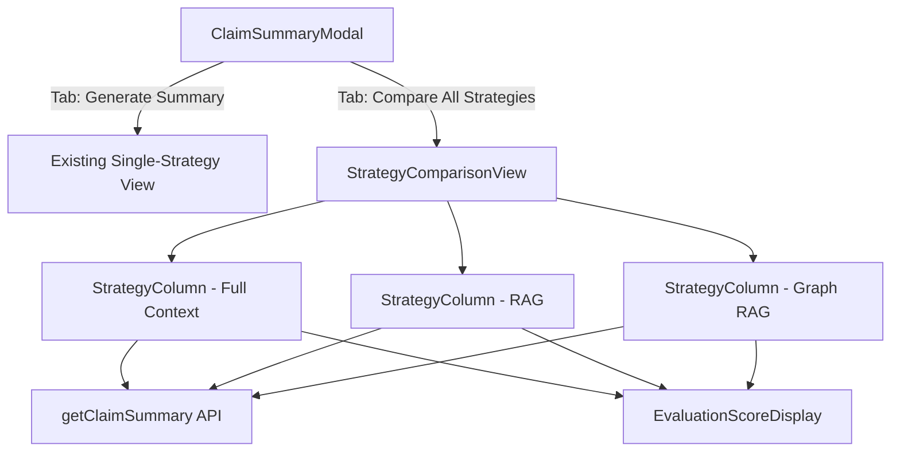
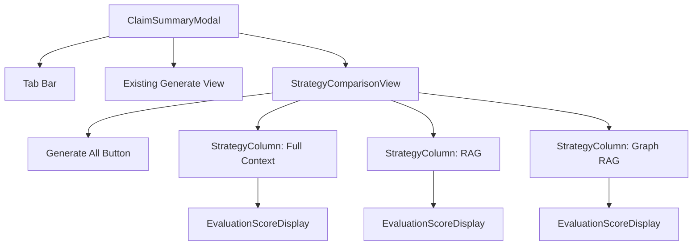

# Design Document: Strategy Comparison View

## Overview

This feature extends the existing `ClaimSummaryModal` with a dedicated comparison view that displays full, untruncated summaries from all three summarization strategies (Full Context, RAG, Graph RAG) in a side-by-side three-column layout. Currently, the modal only generates one summary at a time, and the `StrategyComparisonPanel` shows evaluation scores with truncated 200-character previews. The new comparison view enables direct qualitative comparison of complete summary content.

The design introduces a tab-based navigation within the modal to switch between the existing single-strategy generation workflow and the new comparison view. Each strategy column independently manages its own loading, error, and loaded states, allowing concurrent generation and individual regeneration.

## Architecture

The feature follows the existing component architecture: React functional components with inline styles, no CSS framework, and the existing `claimApi.ts` service layer for API calls.



### Key Design Decisions

1. **New component vs. modifying StrategyComparisonPanel**: We create a new `StrategyComparisonView` component rather than modifying the existing `StrategyComparisonPanel`. The existing panel serves a different purpose (evaluation score comparison with truncated previews from cached data). The new component manages its own API calls and displays full summaries.

2. **Tab navigation inside the modal**: Tabs are added directly inside `ClaimSummaryModal` below the header. This avoids creating a new modal and keeps the user's context within the existing workflow.

3. **Independent column state**: Each strategy column manages its own loading/error/success state independently. This allows concurrent API calls via `Promise.allSettled` and individual regeneration without affecting other columns.

4. **RAG chunking method**: The RAG strategy column uses `"semantic"` as the default chunking method, consistent with the existing modal default.

5. **Responsive stacking**: Below 900px modal width, columns stack vertically. We use a `ResizeObserver` on the modal content area to detect width changes rather than relying on `window.innerWidth`, since the modal itself has a constrained width.

## Components and Interfaces

### New Components

#### `StrategyComparisonView`
The main comparison container. Manages the "Generate All" action, holds per-strategy state, and renders three `StrategyColumn` instances.

```typescript
interface StrategyComparisonViewProps {
  claimId: string;
}
```

#### `StrategyColumn`
Renders a single strategy's full summary, metadata, anomaly counts, evaluation scores, loading state, error state, and regenerate button.

```typescript
interface StrategyColumnProps {
  strategyKey: Strategy;
  label: string;
  data: ColumnState;
  onRegenerate: () => void;
}

```

### Modified Components

#### `ClaimSummaryModal`
- Adds tab state (`'generate' | 'compare'`) to toggle between existing view and `StrategyComparisonView`
- Renders tab bar below the header
- Widens `maxWidth` from `800px` to `1200px` when the compare tab is active to accommodate three columns
- Passes `claimId` to `StrategyComparisonView`

### Existing Components (Unchanged)

- **`EvaluationScoreDisplay`**: Reused inside each `StrategyColumn` to render evaluation scores
- **`claimApi.ts`**: The existing `getClaimSummary()` function is called directly; no API changes needed

### Component Hierarchy



## Data Models

### Column State

Each strategy column tracks its own independent state:

```typescript
type Strategy = 'full-context' | 'rag' | 'graph-rag';

interface ColumnState {
  status: 'idle' | 'loading' | 'success' | 'error';
  response: ClaimSummaryResponse | null;
  error: string | null;
}
```

### Strategy Configuration

Static configuration for the three columns:

```typescript
interface StrategyConfig {
  key: Strategy;
  label: string;
  chunkingMethod?: string; // Only for 'rag'
}

const COMPARISON_STRATEGIES: StrategyConfig[] = [
  { key: 'full-context', label: 'Full Context' },
  { key: 'rag', label: 'RAG', chunkingMethod: 'semantic' },
  { key: 'graph-rag', label: 'Graph RAG' },
];
```

### Tab State

```typescript
type TabValue = 'generate' | 'compare';
```

### Anomaly Summary

Derived from `ClaimSummaryResponse.anomalies` for display:

```typescript
interface AnomalySummary {
  critical: number;
  warning: number;
  info: number;
  total: number;
}
```

### Existing Types (Reused)

- `ClaimSummaryResponse` from `claimApi.ts` — the full response including `summary`, `anomalies`, `evaluation`, `documentCount`, `processingTime`, `cached`, `cachedAt`
- `EvaluationScores` from `claimApi.ts`
- `DataAnomaly` from `claimApi.ts`


## Correctness Properties

*A property is a characteristic or behavior that should hold true across all valid executions of a system — essentially, a formal statement about what the system should do. Properties serve as the bridge between human-readable specifications and machine-verifiable correctness guarantees.*

### Property 1: Active tab has distinct styling

*For any* tab state (either "generate" or "compare"), the currently active tab element should have a different background color and border style than the inactive tab element.

**Validates: Requirements 1.4**

### Property 2: Summary text is never truncated

*For any* valid `ClaimSummaryResponse` with a non-empty summary string, when rendered in a `StrategyColumn` in success state, the displayed text content should equal the full `response.summary` string without truncation.

**Validates: Requirements 2.3**

### Property 3: Equal column width allocation

*For any* rendered `StrategyComparisonView`, all three `StrategyColumn` containers should have the same flex-basis or width style value.

**Validates: Requirements 2.4**

### Property 4: Generate All triggers exactly three concurrent API calls

*For any* claim ID, when the "Generate All" button is clicked, `getClaimSummary` should be called exactly three times — once with strategy `"full-context"`, once with `"rag"` (and `chunkingMethod: "semantic"`), and once with `"graph-rag"`.

**Validates: Requirements 3.2**

### Property 5: Successful column displays all required metadata

*For any* valid `ClaimSummaryResponse`, when rendered in a `StrategyColumn` in success state, the rendered output should contain the full summary text, the anomaly count, the document count value, and the processing time value.

**Validates: Requirements 3.3, 5.1, 5.2**

### Property 6: Loading column displays strategy-specific indicator

*For any* strategy in loading state, the corresponding `StrategyColumn` should render a loading indicator that contains the strategy's display name.

**Validates: Requirements 3.4**

### Property 7: Column state independence

*For any* combination of column states (loading, success, error), each column's displayed content should depend only on its own state. A column in error state should display its error message, while columns in success state should retain their summary data unchanged, and vice versa.

**Validates: Requirements 3.5, 4.3**

### Property 8: Regenerate button visibility follows column state

*For any* `StrategyColumn`, the "Regenerate" button should be present if and only if the column is in success state (has a loaded summary).

**Validates: Requirements 4.1**

### Property 9: Regenerate calls API with correct parameters

*For any* strategy column in success state, when the "Regenerate" button is clicked, `getClaimSummary` should be called exactly once with `forceRegenerate: true` and the correct strategy parameter, without triggering API calls for the other two strategies.

**Validates: Requirements 4.2**

### Property 10: Cache status indicator reflects response

*For any* `ClaimSummaryResponse`, when `cached` is `true` the column should display a cache indicator, and when `cached` is `false` it should not display a cache indicator.

**Validates: Requirements 5.3**

### Property 11: Evaluation scores are rendered when present

*For any* `ClaimSummaryResponse` that includes an `evaluation` object, the corresponding `StrategyColumn` should render the helpfulness, faithfulness, and completeness scores. When `evaluation` is absent, no scores should be rendered.

**Validates: Requirements 5.4**

### Property 12: Minimum column width

*For any* rendered `StrategyColumn`, the minimum width style should be at least 250 pixels.

**Validates: Requirements 6.2**

### Property 13: Anomaly counts are correctly grouped by severity

*For any* array of `DataAnomaly` objects, the `StrategyColumn` should display counts that match the actual number of anomalies per severity level (critical, warning, info). When the array is empty, a "No anomalies detected" indicator should be shown.

**Validates: Requirements 7.1, 7.2**

## Error Handling

### API Call Failures
- Each strategy column handles its own errors independently via `Promise.allSettled` during "Generate All"
- A failed column displays the error message (from `Error.message` or a fallback string) without affecting other columns
- Network timeouts are handled by the existing `apiRequest` timeout in `claimApi.ts` (30s)

### Regeneration Errors
- If a single-strategy regeneration fails, only that column transitions to error state
- The error message replaces the previous summary content in that column
- Other columns remain in their current state

### Authentication Errors
- Authentication failures from `getClaimSummary` propagate as error messages in the affected column(s)
- The existing Amplify auth flow handles token refresh; if auth fails entirely, all three columns will show auth errors

### Edge Cases
- If the modal is closed while API calls are in flight, the component unmounts and state updates are discarded (React handles this via the component lifecycle)
- Empty summary strings are displayed as-is (the backend should always return non-empty summaries for valid claims)

## Testing Strategy

### Unit Tests
Unit tests should be placed in `unit_tests/` and use Jest with React Testing Library (already configured in the project).

Focus areas:
- Tab switching renders the correct view (example tests for requirements 1.1–1.3)
- Three columns render with correct labels (example test for requirements 2.1–2.2)
- "Generate All" button presence (example test for requirement 3.1)
- Responsive stacking at 900px breakpoint (example test for requirement 6.1)
- Edge case: empty anomalies array shows "No anomalies detected" (covered by Property 13 generator)

### Property-Based Tests
Property-based tests use `fast-check` (already in `devDependencies`) with a minimum of 100 iterations per property.

Each property test must be tagged with a comment referencing the design property:
- Tag format: `Feature: strategy-comparison-view, Property {number}: {property_text}`

Properties to implement as property-based tests:
1. **Property 1**: Generate random tab states, verify active tab styling differs from inactive
2. **Property 2**: Generate random summary strings (including long, multi-line, special characters), verify full text is rendered
3. **Property 3**: Render comparison view, verify all three columns have equal flex values
4. **Property 5**: Generate random `ClaimSummaryResponse` objects, verify all metadata fields appear in rendered output
5. **Property 6**: Generate random strategy names in loading state, verify loading indicator contains strategy name
6. **Property 7**: Generate random combinations of column states (idle/loading/success/error), verify each column renders independently
7. **Property 8**: Generate random column states, verify regenerate button presence matches success state
8. **Property 9**: Generate random strategies, simulate regenerate click, verify API called with `forceRegenerate: true` for only that strategy
9. **Property 10**: Generate random `ClaimSummaryResponse` with `cached: true/false`, verify cache indicator presence
10. **Property 11**: Generate random responses with/without evaluation, verify score rendering
11. **Property 12**: Render columns, verify min-width >= 250px
12. **Property 13**: Generate random anomaly arrays, verify severity counts match and empty arrays show indicator

Properties 4 and 9 test API call behavior and should mock `getClaimSummary` to verify call counts and parameters.

### Testing Libraries
- **Jest**: Test runner (via react-scripts)
- **React Testing Library**: Component rendering and assertions
- **fast-check**: Property-based test generation (v3.15.0, already installed)

Each correctness property must be implemented by a single property-based test. Unit tests complement properties by covering specific examples, integration points, and the example-type acceptance criteria (1.1, 1.2, 1.3, 2.1, 2.2, 3.1, 6.1).
