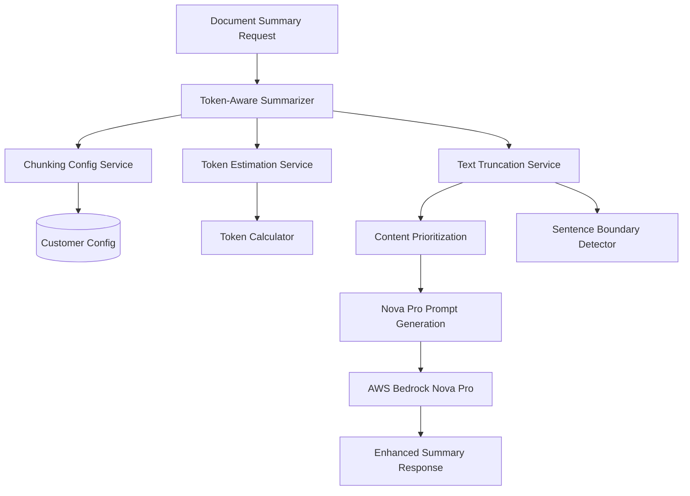

# Design Document: Token-Aware Document Summarization

## Overview

This design enhances the existing document summarization system to be aware of customer-specific chunking configuration token limits. The system will intelligently process and truncate document content to fit within the customer's configured maxTokens parameter, ensuring optimal utilization of AWS Bedrock Nova Pro while respecting chunking constraints.

## Architecture

### High-Level Architecture



### Service Integration

The token-aware summarization system integrates with existing services:
- **Chunking Configuration Service**: Retrieves customer-specific token limits
- **Document Summary Lambda**: Enhanced to use token-aware processing
- **Selective Summary Lambda**: Enhanced for multi-document token distribution
- **AWS Bedrock Nova Pro**: Receives optimally sized prompts

## Components and Interfaces

### 1. Token-Aware Summarization Service

```typescript
interface TokenAwareSummarizationService {
  generateSummary(
    documents: DocumentRecord[], 
    customerUUID: string, 
    tenantId: string,
    options?: SummarizationOptions
  ): Promise<TokenAwareSummaryResult>;
  
  generateSelectiveSummary(
    documents: DocumentRecord[], 
    customerUUID: string, 
    tenantId: string,
    documentWeights?: Map<string, number>
  ): Promise<TokenAwareSummaryResult>;
}

interface SummarizationOptions {
  maxTokensOverride?: number;
  prioritizeRecent?: boolean;
  includeMetadata?: boolean;
}

interface TokenAwareSummaryResult {
  summary: string;
  tokenUsage: TokenUsageInfo;
  truncationInfo: TruncationInfo;
  processingMetadata: SummaryProcessingMetadata;
}
```

### 2. Token Estimation Service

```typescript
interface TokenEstimationService {
  estimateTokens(text: string): number;
  calculateAvailableTokens(
    maxTokens: number, 
    promptOverhead: number
  ): number;
  
  distributeTokens(
    documents: DocumentRecord[], 
    totalTokens: number,
    weights?: Map<string, number>
  ): Map<string, number>;
}

interface TokenUsageInfo {
  maxTokensAllowed: number;
  tokensUsed: number;
  promptOverhead: number;
  contentTokens: number;
  utilizationPercentage: number;
}
```

### 3. Text Truncation Service

```typescript
interface TextTruncationService {
  truncateToTokenLimit(
    text: string, 
    tokenLimit: number,
    strategy: TruncationStrategy
  ): TruncatedText;
  
  truncateMultipleDocuments(
    documents: DocumentRecord[],
    tokenDistribution: Map<string, number>
  ): Map<string, TruncatedText>;
}

interface TruncatedText {
  content: string;
  originalLength: number;
  truncatedLength: number;
  truncationPoints: TruncationPoint[];
  preservedSentences: number;
}

enum TruncationStrategy {
  BEGINNING_AND_END = 'beginning_and_end',
  BEGINNING_ONLY = 'beginning_only',
  SMART_EXCERPT = 'smart_excerpt',
  PROPORTIONAL = 'proportional'
}
```

### 4. Content Prioritization Service

```typescript
interface ContentPrioritizationService {
  prioritizeDocuments(
    documents: DocumentRecord[],
    criteria: PrioritizationCriteria
  ): DocumentPriority[];
  
  extractKeyContent(
    document: DocumentRecord,
    tokenLimit: number
  ): KeyContentExtract;
}

interface PrioritizationCriteria {
  recencyWeight: number;
  sizeWeight: number;
  contentTypeWeight: number;
  processingQualityWeight: number;
}

interface DocumentPriority {
  documentId: string;
  priority: number;
  reasoning: string;
  recommendedTokens: number;
}
```

## Data Models

### Enhanced Summary Response Types

```typescript
interface TokenAwareSummaryResponse extends DocumentSummaryResponse {
  tokenUsage: TokenUsageInfo;
  truncationInfo: TruncationInfo;
  chunkingMethod: ChunkingMethod;
  processingMetadata: SummaryProcessingMetadata;
}

interface TruncationInfo {
  documentsProcessed: number;
  documentsTruncated: number;
  totalOriginalTokens: number;
  totalProcessedTokens: number;
  truncationStrategy: TruncationStrategy;
  truncationDetails: DocumentTruncationDetail[];
}

interface DocumentTruncationDetail {
  documentId: string;
  fileName: string;
  originalTokens: number;
  processedTokens: number;
  truncationPercentage: number;
  contentPreserved: string[];
}

interface SummaryProcessingMetadata {
  chunkingConfigRetrievalTime: number;
  tokenEstimationTime: number;
  textProcessingTime: number;
  summaryGenerationTime: number;
  totalProcessingTime: number;
  fallbacksUsed: string[];
  cacheHits: number;
}
```

## Correctness Properties

*A property is a characteristic or behavior that should hold true across all valid executions of a system-essentially, a formal statement about what the system should do. Properties serve as the bridge between human-readable specifications and machine-verifiable correctness guarantees.*

<function_calls>
<invoke name="prework">
<parameter name="featureName">token-aware-summarization

### Property Reflection

After analyzing all acceptance criteria, several properties can be consolidated to eliminate redundancy:

- **Token Limit Enforcement**: Properties 1.2, 4.1, and 4.4 all relate to respecting token limits and can be combined into a comprehensive token enforcement property
- **Fallback Behavior**: Properties 1.3, 5.1, and 5.2 all deal with fallback scenarios and can be unified
- **Logging Requirements**: Properties 1.5, 2.5, 5.5, and 6.3 all involve logging and can be consolidated
- **Token Distribution**: Properties 2.3, 7.1, and 7.2 all relate to token distribution and can be combined

### Correctness Properties

**Property 1: Chunking Configuration Retrieval**
*For any* customer and summarization request, the system should always attempt to retrieve the customer's chunking configuration before processing
**Validates: Requirements 1.1**

**Property 2: Token Limit Enforcement**
*For any* customer with a chunking configuration containing maxTokens, all text processing should never exceed this token limit, and when no maxTokens is specified, should default to 1000 tokens
**Validates: Requirements 1.2, 1.3, 4.1**

**Property 3: Content Prioritization**
*For any* set of documents that exceed token limits, more recent and important documents should receive proportionally more tokens than older or less important documents
**Validates: Requirements 1.4**

**Property 4: Sentence Boundary Preservation**
*For any* text truncation operation, the resulting text should always end at complete sentence boundaries to maintain readability
**Validates: Requirements 2.2**

**Property 5: Token Distribution Fairness**
*For any* multi-document summarization request, tokens should be distributed proportionally based on document length, with optional weighting for document importance
**Validates: Requirements 2.3, 7.1, 7.2**

**Property 6: Truncation Indicators**
*For any* text that requires truncation, the processed output should include clear indicators informing the AI model about content omission
**Validates: Requirements 2.4**

**Property 7: Token Estimation Accuracy**
*For any* text content, token estimation should use a conservative 4:1 character-to-token ratio and account for prompt overhead
**Validates: Requirements 3.1, 3.2, 3.3**

**Property 8: Conservative Estimation**
*For any* uncertain token estimation scenario, the system should provide lower estimates rather than higher ones to prevent token limit violations
**Validates: Requirements 3.4**

**Property 9: Truncation Notification**
*For any* summarization request where content is truncated, the prompt sent to Nova Pro should explicitly mention the truncation and content omission
**Validates: Requirements 4.2**

**Property 10: Summary Length Scaling**
*For any* summarization request, the requested summary length should be proportional to the available input tokens after accounting for prompt overhead
**Validates: Requirements 4.3**

**Property 11: Metadata Focus for Restrictive Limits**
*For any* customer with very low token limits (< 200 tokens), the system should prioritize document metadata and key excerpts over full content
**Validates: Requirements 4.4**

**Property 12: Fallback Behavior**
*For any* customer without chunking configuration or when configuration retrieval fails, the system should gracefully fall back to default limits without errors
**Validates: Requirements 5.1, 5.2, 5.4**

**Property 13: API Compatibility**
*For any* existing API endpoint, the enhanced system should maintain the same request/response interface while adding optional token usage information
**Validates: Requirements 5.3**

**Property 14: Performance Maintenance**
*For any* summarization request, processing time should not exceed the baseline performance of the current system by more than 20%
**Validates: Requirements 6.1**

**Property 15: Configuration Caching**
*For any* repeated requests for the same customer within a 5-minute window, chunking configuration should be retrieved from cache rather than external service
**Validates: Requirements 6.2**

**Property 16: Comprehensive Logging**
*For any* summarization request, the system should log token limits applied, truncation details, processing times, and any fallback scenarios used
**Validates: Requirements 1.5, 2.5, 5.5, 6.3**

**Property 17: Token Usage Reporting**
*For any* summarization response, detailed token usage information should be included showing allocation per document and utilization percentages
**Validates: Requirements 7.3**

**Property 18: Document Exclusion Notification**
*For any* multi-document request where token limits prevent including all documents, users should be explicitly informed which documents were excluded and why
**Validates: Requirements 7.5**

## Error Handling

### Token Limit Violations
- **Scenario**: Calculated tokens exceed customer limits
- **Response**: Implement progressive truncation with user notification
- **Fallback**: Use metadata-only summarization for extreme cases

### Configuration Service Failures
- **Scenario**: Chunking configuration service is unavailable
- **Response**: Use cached configuration if available, otherwise fall back to defaults
- **Logging**: Record all fallback scenarios for monitoring

### Token Estimation Errors
- **Scenario**: Token estimation service fails or returns invalid results
- **Response**: Use conservative default estimates (5:1 character ratio)
- **Monitoring**: Alert on estimation service failures

### Text Processing Failures
- **Scenario**: Text truncation or processing encounters errors
- **Response**: Fall back to simple character-based truncation
- **User Impact**: Inform users of processing limitations in response

## Testing Strategy

### Unit Testing Approach
- **Token Estimation Service**: Test character-to-token ratio calculations, prompt overhead accounting
- **Text Truncation Service**: Test sentence boundary preservation, truncation strategies
- **Content Prioritization**: Test document ranking algorithms, token distribution logic
- **Configuration Integration**: Test chunking config retrieval, caching, fallback behavior

### Property-Based Testing Configuration
- **Framework**: Use fast-check for TypeScript property-based testing
- **Test Iterations**: Minimum 100 iterations per property test
- **Test Data Generation**: Generate random documents, chunking configurations, and customer scenarios
- **Property Test Tags**: Each test tagged with format: **Feature: token-aware-summarization, Property {number}: {property_text}**

### Integration Testing
- **End-to-End Scenarios**: Test complete summarization workflows with various token limits
- **Performance Testing**: Measure processing times against baseline performance
- **Error Scenario Testing**: Test all fallback and error handling paths
- **Multi-Document Testing**: Test token distribution across multiple document combinations

### Test Data Strategies
- **Document Generation**: Create documents of varying lengths and content types
- **Configuration Scenarios**: Test all supported chunking methods and token limits
- **Edge Cases**: Test with minimal token limits, missing configurations, service failures
- **Performance Baselines**: Establish baseline metrics for comparison testing

The testing strategy ensures comprehensive validation of token-aware behavior while maintaining backward compatibility and performance requirements.